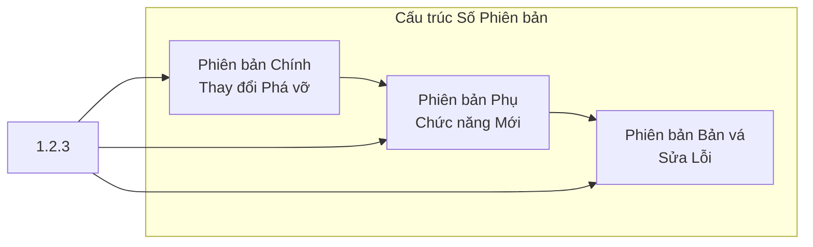
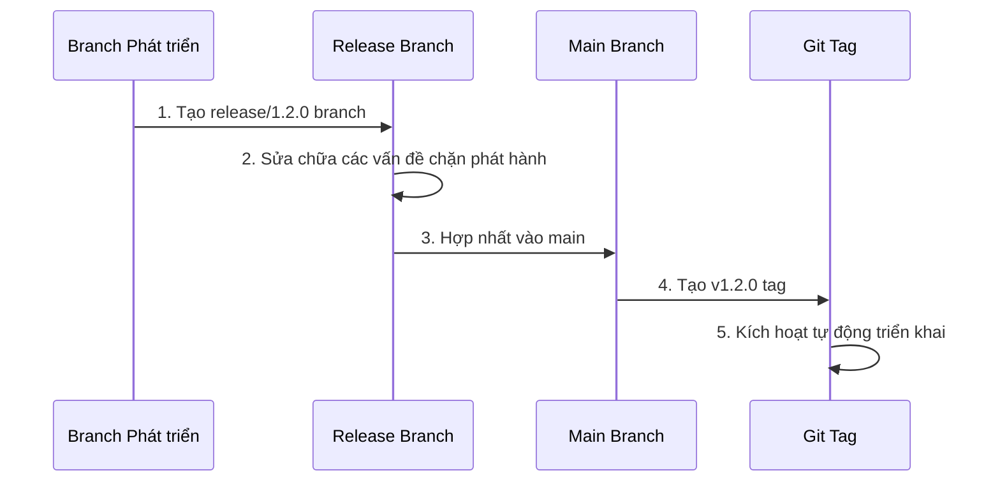

# 11.1 Semantic Versioning và Quy trình Phát hành

## Tái cấu trúc Nhận thức

Số phiên bản không phải là những con số tùy tiện, mà là một **ngôn ngữ giao tiếp với người dùng**. Thông qua số phiên bản, người dùng có thể xác định liệu bản cập nhật này có gây hỏng chức năng hiện có hay không, có cần nâng cấp ngay hay không.

## Nội dung Tiết học

| Tiết học | Câu hỏi Cốt lõi | Bạn sẽ Học được |
|------|----------|----------|
| 11.1.1 SemVer Specification | Làm cách nào để định nghĩa số phiên bản? | Ý nghĩa của Phiên bản Chính/Phụ/Bản vá |
| 11.1.2 Release Branch | Phải làm gì trước khi phát hành? | Chuẩn bị Phát hành và Quy trình Ổn định hóa |
| 11.1.3 Git Tag | Làm cách nào để đánh dấu phiên bản? | Tạo và Quản lý Thẻ Phiên bản |
| 11.1.4 Thông báo Phát hành | Làm cách nào để thông báo cho người dùng? | CHANGELOG và Hướng dẫn Nâng cấp |

## Toàn cảnh Quy trình Phát hành

## AI Collaboration Tips

Khi thực hiện phát hành phiên bản, bạn có thể hợp tác với AI theo cách này:

- "Dựa trên các commit gần đây, hãy xác định phiên bản nào nên phát hành"
- "Giúp tôi tạo CHANGELOG cho phiên bản này"
- "Kiểm tra xem bản thay đổi này có chứa breaking changes hay không"

::: tip Cam kết của Số Phiên bản
Số phiên bản là cam kết của bạn đối với người dùng. `1.0.0` đến `2.0.0` có nghĩa là "có thứ sẽ hỏng", người dùng cần nâng cấp cẩn thận; `1.0.0` đến `1.1.0` có nghĩa là "chỉ sẽ tốt hơn", người dùng có thể yên tâm cập nhật.
:::
