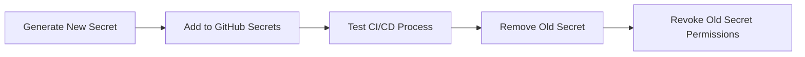

# 11.2.4 Quản lý khóa bí mật: Cấu hình CI/CD và lưu trữ bảo mật

## Giải quyết vấn đề bằng một câu

Thông tin nhạy cảm (API Key, mật khẩu cơ sở dữ liệu, SSH key, v.v.) **không bao giờ được viết trong code**, nên được lưu trữ an toàn bằng GitHub Secrets.

## Giá trị cốt lõi

Quản lý khóa bí mật đúng cách cho phép bạn:
- Tránh rò rỉ thông tin nhạy cảm
- Sử dụng khóa bí mật an toàn trong CI/CD
- Thuận tiện cho việc xoay khóa và quản lý quyền hạn

## Cấu hình GitHub Secrets

### Thêm trong cài đặt repo

```
Settings → Secrets and variables → Actions → New repository secret

Thêm:
- DATABASE_URL
- VERCEL_TOKEN
- SSH_PRIVATE_KEY
```

### Sử dụng trong Workflow

```yaml
jobs:
  deploy:
    runs-on: ubuntu-latest
    steps:
      - name: Use secret
        env:
          DATABASE_URL: ${{ secrets.DATABASE_URL }}
        run: |
          echo "Database configured"  # Không in giá trị thực!
```

## Secrets cấp độ môi trường

Sử dụng các khóa bí mật khác nhau cho các môi trường khác nhau:

```yaml
jobs:
  deploy-staging:
    environment: staging  # Sử dụng secrets của staging
    steps:
      - env:
          API_KEY: ${{ secrets.API_KEY }}  # API_KEY của staging

  deploy-production:
    environment: production  # Sử dụng secrets của production
    steps:
      - env:
          API_KEY: ${{ secrets.API_KEY }}  # API_KEY của production
```

Cấu hình trong GitHub:
```
Settings → Environments → New environment
→ Tạo staging và production
→ Thêm secrets tương ứng trong từng môi trường
```

## Loại khóa bí mật thường dùng và cách sử dụng

### SSH Key

```yaml
- name: Setup SSH
  run: |
    mkdir -p ~/.ssh
    echo "${{ secrets.SSH_PRIVATE_KEY }}" > ~/.ssh/id_rsa
    chmod 600 ~/.ssh/id_rsa
    ssh-keyscan github.com >> ~/.ssh/known_hosts
```

### Xác thực Docker Registry

```yaml
- name: Login to Docker Hub
  uses: docker/login-action@v3
  with:
    username: ${{ secrets.DOCKER_USERNAME }}
    password: ${{ secrets.DOCKER_PASSWORD }}
```

### Thông tin đăng nhập nhà cung cấp cloud

```yaml
- name: Configure AWS Credentials
  uses: aws-actions/configure-aws-credentials@v4
  with:
    aws-access-key-id: ${{ secrets.AWS_ACCESS_KEY_ID }}
    aws-secret-access-key: ${{ secrets.AWS_SECRET_ACCESS_KEY }}
    aws-region: us-east-1
```

## Thực tiễn tốt nhất cho xoay khóa bí mật



## Kiểm tra bảo mật

Ngăn chặn tình cờ commit khóa bí mật trong PR:

```yaml
- name: Check for secrets
  run: |
    # Kiểm tra thông tin nhạy cảm đơn giản
    if grep -rE "(password|secret|api.key)\s*=\s*['\"][^'\"]+['\"]" --include="*.ts" .; then
      echo "Potential secret found in code!"
      exit 1
    fi
```

Hoặc sử dụng công cụ chuyên nghiệp:

```yaml
- name: Scan for secrets
  uses: trufflesecurity/trufflehog@main
  with:
    path: ./
    base: main
    head: HEAD
```

## Hướng dẫn tránh sai lầm

::: danger Sai lầm dễ mắc phải nhất của người mới
1. In giá trị khóa bí mật trong logs (ngay cả debug)
2. Để lộ khóa bí mật trong bình luận PR hoặc thông báo lỗi
3. Sử dụng quyền hạn quá rộng
4. Không xoay khóa bí mật trong một thời gian dài
:::
