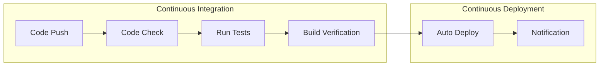

# 11.2 GitHub Actions Kiểm soát chất lượng và triển khai sản xuất

## Xây dựng lại nhận thức

CI/CD không phải là đặc quyền của các công ty lớn. Qua GitHub Actions, ngay cả các dự án cá nhân cũng có thể triển khai **tự động kiểm tra sau khi gửi code, tự động chạy test, tự động triển khai** quy trình hoàn chỉnh.



## Nội dung phần này

| Phần | Vấn đề cốt lõi | Bạn sẽ học được |
|------|----------|----------|
| 11.2.1 Workflow Configuration | Viết workflow tự động hóa như thế nào? | Điều kiện kích hoạt và môi trường thực thi |
| 11.2.2 Kiểm tra chất lượng | Tự động kiểm tra code như thế nào? | Testing, build, quét bảo mật |
| 11.2.3 Deploy Pipeline | Triển khai tự động như thế nào? | Phát hành sản xuất tự động |
| 11.2.4 Quản lý khóa bí mật | Lưu trữ mật khẩu ở đâu? | Cấu hình CI/CD và bảo mật |

## Khái niệm cốt lõi của GitHub Actions

| Khái niệm | Giải thích |
|------|------|
| **Workflow** | Quy trình tự động hóa, được định nghĩa trong `.github/workflows/*.yml` |
| **Event** | Sự kiện kích hoạt workflow, như push, pull_request |
| **Job** | Một tập hợp bước trong workflow, có thể chạy song song hoặc tuần tự |
| **Step** | Một nhiệm vụ đơn lẻ trong Job, có thể là lệnh hoặc Action |
| **Action** | Đơn vị tự động hóa có thể tái sử dụng |

## Cấu hình tối thiểu khả dụng

```yaml
# .github/workflows/ci.yml
name: CI

on:
  push:
    branches: [main]
  pull_request:
    branches: [main]

jobs:
  build:
    runs-on: ubuntu-latest
    steps:
      - uses: actions/checkout@v4
      - uses: actions/setup-node@v4
        with:
          node-version: '20'
      - run: npm ci
      - run: npm run lint
      - run: npm run build
```

## Gợi ý cộng tác với AI

Khi cấu hình CI/CD, bạn có thể cộng tác với AI như sau:

- "Hãy viết cấu hình GitHub Actions cho dự án Next.js của tôi"
- "Làm thế nào để lưu trữ node_modules trong GitHub Actions"
- "Cấu hình kiểm soát chất lượng trước khi merge PR"

::: tip Giá trị của CI/CD
Giá trị của tự động hóa không chỉ nằm ở việc tiết kiệm thời gian, mà còn ở **loại bỏ lỗi do con người gây ra**. Mỗi lần phát hành đều trải qua cùng một quy trình kiểm tra, đảm bảo tính nhất quán.
:::
