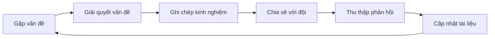

# 11.3.2 Sâu xa kiến thức: Tóm tắt kinh nghiệm và best practices

## Giải quyết vấn đề bằng một câu

**Best practices** được sàng lọc từ nhiều lần đạp cái bẫy, viết ra mới tránh được đội đạp lại lỗi tương tự.

## Giá trị cốt lõi

Sâu xa best practices giúp bạn:
- Biến kinh nghiệm cá nhân thành tài sản đội
- Nhân sự mới nhanh chóng thu được "kinh nghiệm của cọng cứng"
- Tạo thành knowledge base cải tiến liên tục

## Template tài liệu best practices

```markdown
# [Tên thực hành]

## Tình huống áp dụng
Mô tả trong trường hợp nào nên sử dụng thực hành này

## Bối cảnh vấn đề
Chúng tôi gặp phải vấn đề gì? Tại sao cần thực hành này?

## Cách làm được khuyến nghị
✅ Làm như thế này

```code example```

## Cách làm không được khuyến nghị
❌ Đừng làm như thế này

```反例 code```

## Giải thích lý do
Tại sao cách làm được khuyến nghị lại tốt hơn?

## Tài nguyên liên quan
- Liên kết đến tài liệu liên quan
- Tài liệu tham khảo
```

## Ví dụ thực hành: Xử lý lỗi API

```markdown
# Best practices xử lý lỗi API

## Tình huống áp dụng
Xử lý lỗi cho tất cả Next.js API Routes

## Bối cảnh vấn đề
Xử lý lỗi không nhất quán khiến frontend khó phân tích,
khó debug, người dùng thấy thông báo lỗi không thân thiện

## Cách làm được khuyến nghị
✅ Sử dụng định dạng phản hồi lỗi thống nhất:

```typescript
// lib/api-error.ts
export class ApiError extends Error {
  constructor(
    public statusCode: number,
    public code: string,
    message: string
  ) {
    super(message)
  }
}

// Cách sử dụng
throw new ApiError(404, 'USER_NOT_FOUND', 'Người dùng không tồn tại')
```

## Cách làm không được khuyến nghị
❌ Ném lỗi nguyên bản trực tiếp:

```typescript
throw new Error('Người dùng không tồn tại')  // Mất status code và loại lỗi
```

## Giải thích lý do
- Định dạng thống nhất giúp frontend xử lý đơn giản hơn
- Mã lỗi giúp theo dõi và quốc tế hóa
- Lỗi cấu trúc giúp phân tích log
```

## Thời điểm sâu xa kiến thức

| Thời điểm | Hành động |
|------|------|
| **Giải quyết được vấn đề khó khăn** | Ghi chép vấn đề và giải pháp |
| **Phát hiện cách làm tốt hơn** | Cập nhật hoặc thêm best practices |
| **Code Review đề cập lặp lại** | Tóm tắt thành tài liệu quy chuẩn |
| **Nhân sự mới hỏi câu hỏi tương tự** | Viết thành FAQ hoặc hướng dẫn onboarding |

## Bảo trì liên tục knowledge base



## Hướng dẫn tránh bẫy

::: danger Lỗi dễ mắc phải của người mới
1. Chỉ ghi chép "làm gì" không ghi chép "tại sao"
2. Viết xong tài liệu rồi bỏ, không cập nhật liên tục
3. Best practices quá lý thuyết, không có code example
4. Không thu thập phản hồi từ đội, tự động
:::
