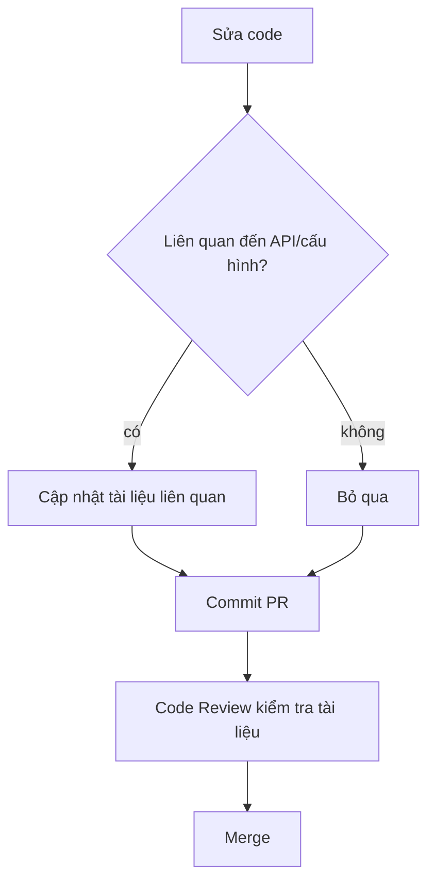

# 11.3.4 Kiểm soát phiên bản: Cập nhật đồng bộ tài liệu và code

## Giải quyết vấn đề bằng một câu

**Tài liệu lỗi thời tệ hơn không có tài liệu**——nó sẽ dẫn lạc mọi người. Tài liệu phải cập nhật cùng code.

## Giá trị cốt lõi

Giữ tài liệu đồng bộ giúp bạn:
- Tránh nhân sự mới bị dẫn lạc bởi thông tin cũ
- Đảm bảo độ tin cậy của tài liệu
- Hình thành thói quen cập nhật tài liệu

## Tài liệu và code cùng repository

```
project/
├── docs/           # Tài liệu và code trong cùng một repository
│   └── api.md
├── src/
│   └── api/
└── package.json
```

Lợi ích:
- Khi sửa code thì thuận tay sửa tài liệu
- PR có thể review cùng lúc code và tài liệu
- Lịch sử phiên bản rõ ràng

## Bắt buộc kiểm tra trong PR template

```markdown
<!-- .github/pull_request_template.md -->
## Checklist

- [ ] Code đã test
- [ ] Kiểm tra type pass
- [ ] **Tài liệu liên quan đã cập nhật**
```

## Tự động phát hiện tài liệu lỗi thời

```yaml
# .github/workflows/docs-check.yml
name: Check Docs

on:
  pull_request:
    paths:
      - 'src/api/**'

jobs:
  check:
    runs-on: ubuntu-latest
    steps:
      - uses: actions/checkout@v4

      - name: Check if docs updated
        run: |
          if ! git diff --name-only origin/main | grep -q "docs/api"; then
            echo "::warning::API code có thay đổi, vui lòng xác nhận xem có cần cập nhật docs/api"
          fi
```

## Gắn nhãn phiên bản tài liệu

Đánh dấu phiên bản code áp dụng trong tài liệu:

```markdown
<!-- docs/api/users.md -->
# API người dùng

> Phiên bản áp dụng: v2.0.0+
> Cập nhật cuối: 2024-01-15

## Mô tả giao diện
...
```

## Sử dụng TypeDoc tự động tạo API documentation

```bash
# Cài đặt
npm install -D typedoc

# Tạo tài liệu
npx typedoc --entryPoints src/index.ts --out docs/api
```

Tệp cấu hình:

```json
// typedoc.json
{
  "entryPoints": ["./src/index.ts"],
  "out": "./docs/api",
  "excludePrivate": true,
  "excludeInternal": true
}
```

## Quy trình cập nhật tài liệu



## Xử lý tài liệu bị loại bỏ

Khi tính năng bị loại bỏ, đừng xóa tài liệu trực tiếp:

```markdown
# API đăng nhập cũ

::: warning Đã bị loại bỏ
API này sẽ bị xóa trong v3.0.0, vui lòng chuyển sang [API đăng nhập phiên bản mới](./login-v2.md)
:::

## Hướng dẫn chuyển đổi
1. Thay `/api/login` thành `/api/v2/login`
2. Thêm trường `clientId` vào request body
```

## Hướng dẫn tránh bẫy

::: danger Lỗi dễ mắc phải của người mới
1. Sửa code quên sửa tài liệu
2. Tài liệu đặt ở repository riêng, khó bảo trì
3. Xóa tính năng mà xóa luôn tài liệu, không có hướng dẫn chuyển đổi
4. Tài liệu không có gắn nhãn phiên bản, không biết áp dụng phiên bản nào
:::
