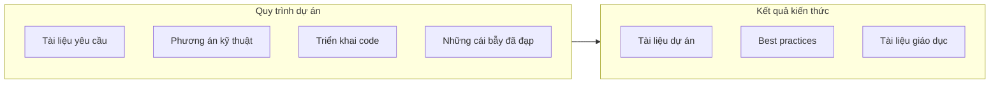

# 11.3 Sâu xa kiến thức: Kết quả sản phẩm theo hình thức khóa học

## Tái cấu trúc nhận thức

Kết thúc dự án không phải là điểm cuối cùng, **biến kinh nghiệm từ quá trình thành kiến thức có thể tái sử dụng** mới là lợi ích thực sự. Sâu xa kiến thức tốt cho phép đội tránh đạp lại cái bẫy, gia tốc onboarding của nhân sự mới.



## Nội dung chương này

| Tiểu mục | Câu hỏi cốt lõi | Bạn sẽ học được |
|------|----------|----------|
| 11.3.1 Cấu trúc tài liệu | Tài liệu đặt ở đâu? | Cách tổ chức tài liệu dự án |
| 11.3.2 Sâu xa kiến thức | Kinh nghiệm truyền lại như thế nào? | Phương pháp tóm tắt best practices |
| 11.3.3 Tài liệu giáo dục | Dạy người khác như thế nào? | Nghiên cứu trường hợp và bài tập |
| 11.3.4 Kiểm soát phiên bản | Tài liệu cập nhật như thế nào? | Đồng bộ tài liệu và code |

## Tại sao phải sâu xa kiến thức

1. **Tránh đạp lại cái bẫy**: Ghi chép vấn đề và giải pháp
2. **Gia tốc onboarding**: Có tài liệu tham khảo tin cậy hơn truyền miệng
3. **Tạo thành tài sản đội**: Kiến thức không bị mất do nhân sự chuyển công tác
4. **Thúc đẩy cải tiến liên tục**: Phục hồi tóm tắt thúc đẩy tối ưu quy trình

## Tài liệu như code

```
project/
├── docs/
│   ├── prd/           # Tài liệu yêu cầu sản phẩm
│   ├── design/        # Phương án thiết kế kỹ thuật
│   ├── api/           # API documentation
│   ├── deploy/        # Hướng dẫn triển khai
│   └── postmortem/    # Báo cáo phục hồi
├── src/
└── package.json
```

## Gợi ý hợp tác AI

Khi sâu xa kiến thức, bạn có thể hợp tác với AI như sau:

- "Tạo API documentation dựa trên đoạn code này"
- "Viết báo cáo phục hồi từ quá trình xử lý sự cố này"
- "Tổ chức kiến trúc của dự án này thành tài liệu phương án kỹ thuật"

::: tip Nguyên tắc viết tài liệu
Tài liệu tốt không được viết cho bản thân bây giờ, mà được viết cho **bản thân ba tháng sau** hoặc **đồng nghiệp mới gia nhập**. Sau khi viết, hỏi bản thân: Liệu một người hoàn toàn không hiểu bối cảnh có thể hiểu được không?
:::
