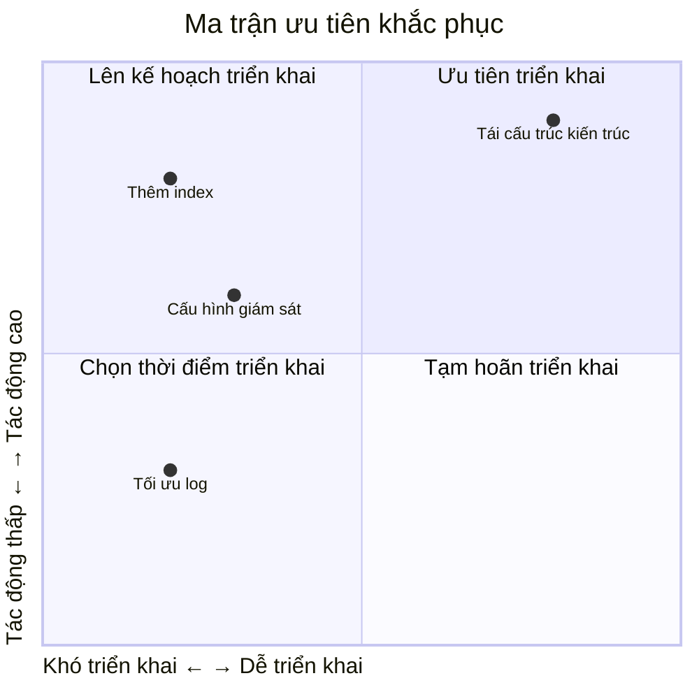

# 11.4.3 Phương án khắc phục: Khắc phục tạm thời và giải quyết căn bản

## Giải quyết vấn đề bằng một câu

Khắc phục chia thành hai bước: trước tiên **cầm máu** (phương án tạm thời khắc phục nhanh dịch vụ), sau đó **chữa lành** (phương án căn bản giải quyết hoàn toàn vấn đề).

## Giá trị cốt lõi

Phân biệt phương án tạm thời và căn bản giúp bạn:
- Khắc phục dịch vụ nhanh chóng, giảm thiểu tác động
- Không để lại nợ kỹ thuật vì vội vàng
- Có kế hoạch để giải quyết hoàn toàn vấn đề

## Phương án tạm thời vs phương án căn bản

| Hạng mục so sánh | Phương án tạm thời | Phương án căn bản |
|--------|----------|----------|
| **Mục tiêu** | Khắc phục dịch vụ nhanh | Giải quyết hoàn toàn vấn đề |
| **Thời gian** | Cấp độ phút | Cấp độ ngày/tuần |
| **Rủi ro** | Có thể có tác dụng phụ | Được kiểm thử kỹ lưỡng |
| **Áp dụng** | Cầm máu khẩn cấp | Ổn định lâu dài |

## Ví dụ phương án tạm thời

```typescript
// Vấn đề: Connection pool database bị hết

// Phương án tạm thời 1: Khởi động lại dịch vụ (nhanh nhất)
pm2 restart all

// Phương án tạm thời 2: Tăng số kết nối (cấu hình nhanh)
DATABASE_URL="...?connection_limit=50"

// Phương án tạm thời 3: Giảm cấp xử lý (bảo vệ chức năng cốt lõi)
async function login(credentials: LoginCredentials) {
  try {
    return await normalLogin(credentials)
  } catch (error) {
    if (isDatabaseOverload(error)) {
      // Giảm cấp tạm thời: sử dụng cache để xác thực
      return await fallbackLogin(credentials)
    }
    throw error
  }
}
```

## Ví dụ phương án căn bản

```typescript
// Phương án căn bản 1: Thêm database index
// prisma/migrations/xxx_add_user_email_index.sql
CREATE INDEX idx_user_email ON users(email);

// Phương án căn bản 2: Tối ưu hóa truy vấn
const user = await prisma.user.findFirst({
  where: { email },
  select: { id: true, email: true, passwordHash: true }
})

// Phương án căn bản 3: Thêm giám sát connection pool
const pool = new Pool({
  connectionString: DATABASE_URL,
  max: 20,
  idleTimeoutMillis: 30000,
  connectionTimeoutMillis: 2000,
})

pool.on('error', (err) => {
  logger.error('Database pool error', err)
  metrics.increment('db.pool.error')
})
```

## Mẫu phương án khắc phục

```markdown
## Phương án khắc phục

### Phương án tạm thời (đã thực hiện)
**Thao tác**: Khởi động lại dịch vụ database
**Thời gian**: 10:25
**Hiệu quả**: Dịch vụ phục hồi bình thường
**Rủi ro**: Có thể xảy ra lại

### Phương án căn bản (chờ triển khai)

| Biện pháp | Người phụ trách | Hoàn thành lúc | Cách xác minh |
|------|--------|----------|----------|
| Thêm index cho trường email | Trần Văn A | 1 tháng 20 | Thời gian truy vấn < 100ms |
| Cấu hình giám sát connection pool | Lý Tứ | 1 tháng 22 | Bảng điều khiển Grafana |
| Thêm cảnh báo slow query | Vương Ngũ | 1 tháng 25 | Kiểm thử kích hoạt cảnh báo |
```

## Ma trận ưu tiên khắc phục



## Kế hoạch rollback

Mỗi phương án khắc phục nên có kế hoạch rollback:

```markdown
## Kế hoạch rollback

### Khắc phục Index
- Lệnh rollback: `DROP INDEX idx_user_email;`
- Thời gian rollback: < 1 phút
- Ảnh hưởng rollback: Truy vấn chậm hơn

### Thay đổi cấu hình
- Cách rollback: Khôi phục biến môi trường cũ
- Lệnh rollback: `kubectl rollout undo deployment/api`
```

## Hướng dẫn tránh sai lầm

::: danger Lỗi dễ mắc nhất của người mới
1. Chỉ làm phương án tạm thời, quên phương án căn bản
2. Phương án căn bản quá táo bạo, gây ra vấn đề mới
3. Không chuẩn bị kế hoạch rollback
4. Sau khi khắc phục không xác minh hiệu quả
:::
