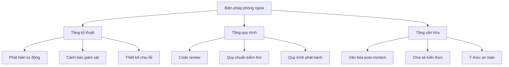
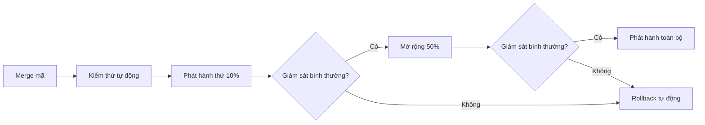

# 11.4.4 Biện pháp phòng ngừa: Cải thiện quy trình và tăng cường giám sát

## Giải quyết vấn đề bằng một câu

Biện pháp phòng ngừa tốt phải giúp **loại bỏ hoàn toàn cùng loại vấn đề**, chứ không chỉ là "lần tới hãy cẩn thận".

## Giá trị cốt lõi

Xây dựng biện pháp phòng ngừa giúp bạn:
- Biến sự cố thành cải thiện hệ thống
- Xây dựng văn hóa kỹ thuật phòng chống
- Liên tục nâng cao độ tin cậy hệ thống

## Các tầng của biện pháp phòng ngừa



## Biện pháp phòng ngừa tầng kỹ thuật

### Thêm cảnh báo giám sát

```yaml
# prometheus/rules/database.yml
groups:
  - name: database
    rules:
      - alert: HighConnectionPoolUsage
        expr: db_pool_active / db_pool_max > 0.8
        for: 5m
        labels:
          severity: warning
        annotations:
          summary: "Tỷ lệ sử dụng connection pool database cao"

      - alert: SlowQuery
        expr: db_query_duration_seconds > 1
        for: 1m
        labels:
          severity: warning
        annotations:
          summary: "Phát hiện slow query"
```

### Thêm kiểm thử tự động

```typescript
// __tests__/performance/login.test.ts
describe('Login Performance', () => {
  it('should complete login within 500ms', async () => {
    const start = Date.now()
    await login({ email: 'test@example.com', password: 'password' })
    const duration = Date.now() - start

    expect(duration).toBeLessThan(500)
  })

  it('should handle 100 concurrent logins', async () => {
    const requests = Array(100).fill(null).map(() =>
      login({ email: 'test@example.com', password: 'password' })
    )

    const results = await Promise.allSettled(requests)
    const failures = results.filter(r => r.status === 'rejected')

    expect(failures.length).toBeLessThan(5) // Cho phép 5% thất bại
  })
})
```

### Thêm thiết kế chịu lỗi

```typescript
// lib/database.ts
import { retry } from '@lifeomic/attempt'

export async function queryWithRetry<T>(
  queryFn: () => Promise<T>,
  options = { maxAttempts: 3, delay: 1000 }
): Promise<T> {
  return retry(queryFn, {
    maxAttempts: options.maxAttempts,
    delay: options.delay,
    factor: 2, // Exponential backoff
    handleError: (error, context) => {
      logger.warn(`Query failed, attempt ${context.attemptNum}`, error)
    }
  })
}
```

## Biện pháp phòng ngừa tầng quy trình

### Danh sách kiểm tra code review

```markdown
## PR Review Checklist

### Hiệu suất
- [ ] Truy vấn database có index không?
- [ ] Có vấn đề N+1 query không?
- [ ] Có thiết lập thời gian timeout không?

### Khả năng quan sát
- [ ] Có thêm log cần thiết không?
- [ ] Có thêm chỉ số giám sát không?
- [ ] Lỗi có đủ ngữ cảnh không?

### Chịu lỗi
- [ ] Khi phụ thuộc bên ngoài thất bại thì xử lý như nào?
- [ ] Có phương án fallback không?
```

### Cải thiện quy trình phát hành



## Bảng theo dõi biện pháp phòng ngừa

```markdown
## Theo dõi biện pháp cải thiện

| Biện pháp | Loại | Người phụ trách | Hạn chót | Trạng thái | Cách xác minh |
|------|------|--------|----------|------|----------|
| Thêm giám sát connection pool | Kỹ thuật | Trần Văn A | 1 tháng 20 | ✅ Hoàn thành | Bảng điều khiển Grafana |
| Thêm kiểm thử hiệu suất | Quy trình | Lý Tứ | 1 tháng 25 | 🔄 Đang thực hiện | Tích hợp CI |
| Cập nhật danh sách kiểm tra review | Quy trình | Vương Ngũ | 1 tháng 22 | ⏳ Chưa bắt đầu | Cập nhật tài liệu |
| Hội thảo chia sẻ post-mortem | Văn hóa | Triệu Lục | 1 tháng 30 | ⏳ Chưa bắt đầu | Ghi chép hội họp |
```

## Hướng dẫn tránh sai lầm

::: danger Lỗi dễ mắc nhất của người mới
1. Biện pháp phòng ngừa quá chung chung (chẳng hạn "tăng cường giám sát")
2. Không có người phụ trách cụ thể và hạn chót
3. Đề ra biện pháp nhưng không theo dõi triển khai
4. Chỉ chú ý biện pháp kỹ thuật, bỏ qua quy trình và văn hóa
:::
