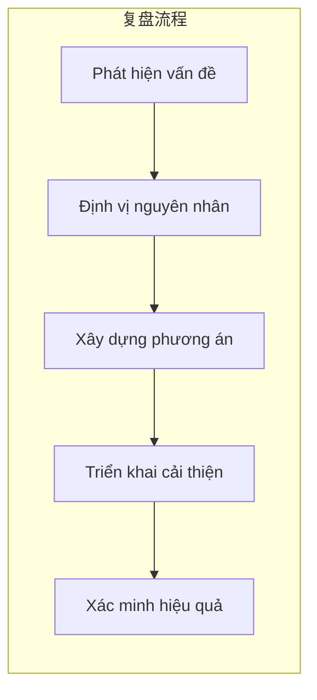

# 11.4 Mẫu post-mortem: Phân tích vấn đề và cải thiện toàn diện

## Tái cấu trúc nhận thức

Post-mortem không phải là cuộc họp trách nhiệm, mà là **cơ hội học hỏi từ những sai lầm**. Post-mortem tốt giúp team ngày càng mạnh mẽ, post-mortem tồi chỉ khiến mọi người đổ lỗi cho nhau.



## Nội dung bài này

| Phần | Câu hỏi cốt lõi | Bạn sẽ học được |
|------|----------|----------|
| 11.4.1 Xác định vấn đề | Đã xảy ra vấn đề gì? | Hiện tượng sự cố và phạm vi tác động |
| 11.4.2 Phân tích nguyên nhân | Tại sao lại xảy ra vấn đề? | Phương pháp 5-Why |
| 11.4.3 Phương án khắc phục | Làm sao để giải quyết? | Phương án tạm thời và phương án căn bản |
| 11.4.4 Biện pháp phòng ngừa | Làm sao để tránh xảy ra lần nữa? | Cải thiện quy trình và tăng cường giám sát |

## Nguyên tắc post-mortem

1. **Đối sự không đối người**: Thảo luận về hệ thống và quy trình, không truy cứu trách nhiệm cá nhân
2. **Giả định mọi người đều có ý tốt**: Quyết định khi đó dựa trên thông tin khi đó
3. **Tập trung vào cải thiện**: Mục tiêu là làm cho hệ thống mạnh hơn, không phải tìm tội phạt dâu
4. **Công khai và minh bạch**: Báo cáo post-mortem mọi người có thể xem được, thúc đẩy chia sẻ kiến thức

## Mẫu báo cáo post-mortem

```markdown
# Báo cáo post-mortem [Tên sự kiện]

## Tổng quan sự kiện
- Thời gian xảy ra:
- Thời gian kéo dài:
- Phạm vi tác động:
- Mức độ nghiêm trọng: P0/P1/P2/P3

## Dòng thời gian
| Thời gian | Sự kiện | Người thực hiện |
|------|------|--------|
| 10:00 | Người dùng phản hồi không thể đăng nhập | - |
| 10:05 | Xác nhận vấn đề tồn tại | Trần Văn A |
| 10:15 | Định vị vấn đề kết nối database | Lý Tứ |
| 10:30 | Khởi động lại database, dịch vụ phục hồi | Lý Tứ |

## Phân tích nguyên nhân
(Sử dụng phương pháp 5-Why)

## Biện pháp cải thiện
| Biện pháp | Người phụ trách | Hoàn thành lúc | Trạng thái |
|------|--------|----------|------|
| Thêm giám sát connection pool database | Trần Văn A | 2024-01-20 | Chưa bắt đầu |

## Bài học rút ra
1. ...
2. ...
```

## AI Collaboration Hints

Trong quá trình post-mortem, bạn có thể cộng tác với AI như thế này:

- "Giúp tôi phân tích nguyên nhân gốc rễ của vấn đề này bằng phương pháp 5-Why"
- "Dựa trên dòng thời gian này, giúp tôi sắp xếp thành báo cáo post-mortem"
- "Vấn đề này có những biện pháp phòng ngừa nào có thể"

::: tip Giá trị của post-mortem
Mỗi lần sự cố là một cơ hội học hỏi. Team không post-mortem sẽ mắc phải những cùng một lỗi nhiều lần, team giỏi post-mortem sẽ ngày càng mạnh mẽ.
:::
