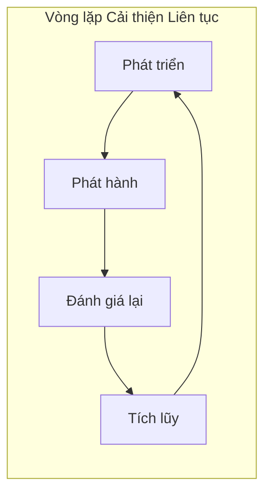

# 11 ｜Phát hành, Đánh giá lại và Tích lũy Kinh nghiệm Dạy dỗ

## Tái cấu trúc Nhận thức

Viết xong mã không phải là điểm kết thúc, **phát hành ra ngoài, học hỏi từ đó, truyền lại kinh nghiệm** mới là vòng lặp hoàn chỉnh. Chương này sẽ giúp bạn nắm vững các phương pháp phát hành và đánh giá lại áp dụng được cho cả dự án cá nhân lẫn hợp tác nhóm.

## Nội dung Chương

| Tiết học | Câu hỏi Cốt lõi | Bạn sẽ Học được |
|------|----------|----------|
| 11.1 Semantic Versioning và Quy trình Phát hành | Làm cách nào để định nghĩa số phiên bản? | SemVer Specification, Release Workflow, Git Tag |
| 11.2 GitHub Actions Deployment | Làm cách nào để tự động triển khai? | CI/CD Configuration, Quality Gates, Automatic Deployment |
| 11.3 Tích lũy Kiến thức | Làm cách nào để truyền lại kinh nghiệm? | Cấu trúc Tài liệu, Best Practices, Tài liệu Dạy dỗ |
| 11.4 Mẫu Đánh giá lại | Làm cách nào để kết thúc vấn đề? | Phân tích Nguyên nhân, Phương án Khắc phục, Biện pháp Phòng ngừa |

## Tại sao Chương này Quan trọng

Đối với Vibe Coding, chương này là chìa khóa để **chuyển đổi khả năng cá nhân thành tài sản nhóm**:

1. **Quản lý Phiên bản**: Làm cho phát hành của bạn có thể truy tìm được, có thể rollback
2. **Tự động hóa Triển khai**: Giảm lỗi con người, nâng cao hiệu quả phát hành
3. **Tích lũy Kiến thức**: Những lỗi đã mắc phải trở thành bản đồ, lần sau không tái diễn
4. **Cơ chế Đánh giá lại**: Rút ra kinh nghiệm có thể tái sử dụng từ mỗi sự cố

## AI Collaboration Tips

Khi thực hiện công việc phát hành và đánh giá lại, bạn có thể hợp tác với AI theo cách này:

- "Giúp tôi phân tích các điểm rủi ro trong lần phát hành này"
- "Viết một báo cáo đánh giá lại dựa trên sự cố này"
- "Tóm tắt kinh nghiệm của dự án này thành một mẫu tài liệu"
- "Tạo ra CHANGELOG cho phiên bản này"

::: warning Danh sách Kiểm tra Chương
1. [ ] Hiểu rõ SemVer Specification
2. [ ] Có thể cấu hình GitHub Actions cơ bản
3. [ ] Nắm vững Best Practices trong Tổ chức Tài liệu
4. [ ] Biết cách sử dụng Mẫu Đánh giá lại để Phân tích Vấn đề
:::
