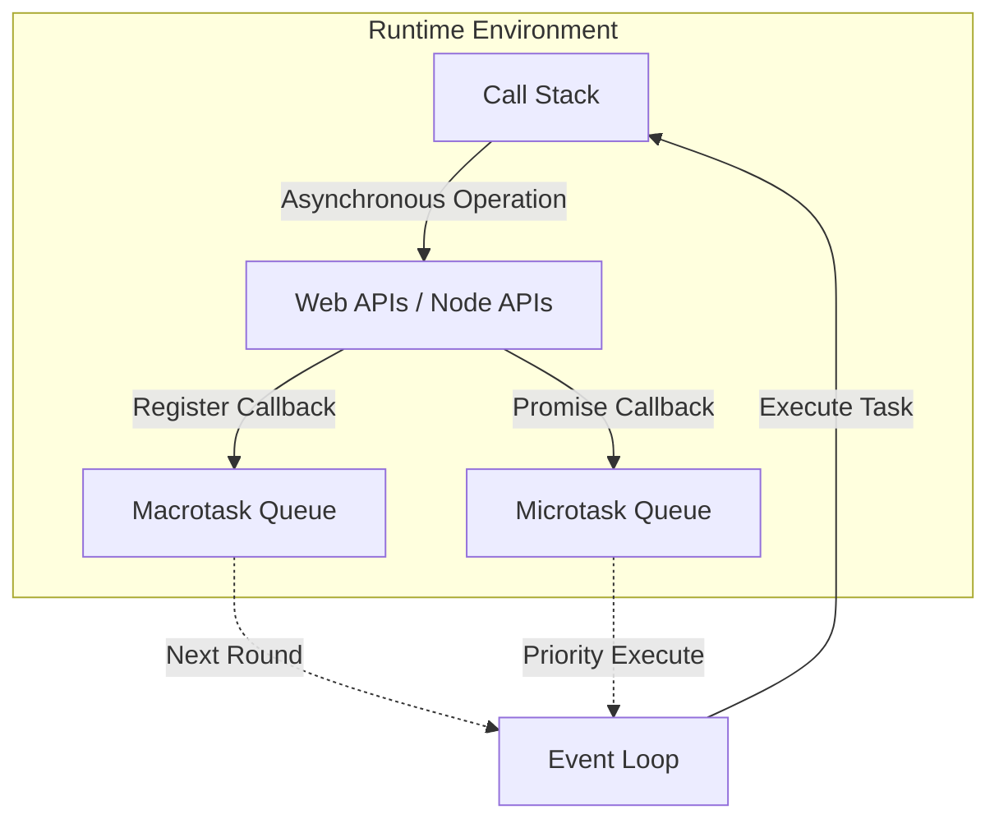
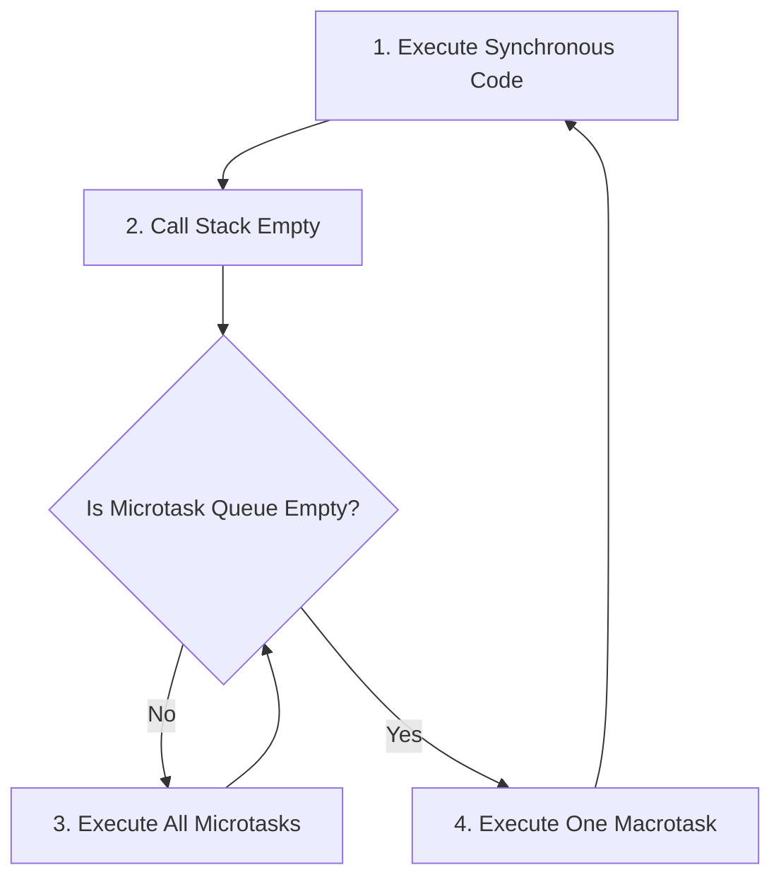

# 12.1.1 Trái tim của JS — Event Loop Mechanism: Call Stack/Event Queue/Callback Queue

### Câu hỏi nhìn thấu đáo

Event loop là "trái tim" của JavaScript engine, nó liên tục lấy các nhiệm vụ từ task queue, đặt vào call stack để thực thi, như vậy lặp đi lặp lại, cho phép JS single-threaded cũng có thể xử lý các hoạt động concurrent.

### Tái cấu trúc nhận thức: Single-threaded ≠ Chỉ có thể làm một việc

Nhiều người hiểu sai rằng "single-threaded" có nghĩa là JavaScript chỉ có thể xử lý một việc tại một thời điểm. Thực tế, JavaScript **runtime** là single-threaded, nhưng phía sau nó có một bộ máy bất đồng bộ hoàn chỉnh (được cung cấp bởi trình duyệt hoặc Node.js), cho phép nó có thể "đồng thời" khởi động nhiều hoạt động.

Giới hạn thực sự là: **JavaScript chỉ có thể thực thi một đoạn code tại một thời điểm**. Nhưng trong khoảng thời gian thực thi, các hoạt động khác (như yêu cầu mạng, timer) có thể diễn ra ở background, sau khi hoàn thành sẽ "xếp hàng" chờ thực thi.

### Trả lại bản chất: Các thành phần cốt lõi của event loop



#### 1. Call Stack (Ngăn xếp gọi hàm)

Call stack là cấu trúc dữ liệu LIFO (Last In First Out), ghi lại các hàm đang được thực thi.

```javascript
function multiply(a, b) {
    return a * b;
}

function square(n) {
    return multiply(n, n);
}

console.log(square(5)); // Call Stack: main → square → multiply → return → return → output
```

**Điểm chính**: Nếu có code đang thực thi trong call stack, event loop sẽ chờ, sẽ không lấy nhiệm vụ mới. Đó là lý do tại sao "synchronous blocking code" sẽ làm "đơ" trang.

#### 2. Macrotask và Microtask

Các nhiệm vụ bất đồng bộ được chia thành hai loại, chúng có độ ưu tiên thực thi khác nhau:

| Loại | Ví dụ | Ưu tiên |
|------|------|--------|
| **Microtask** | `Promise.then/catch/finally`、`queueMicrotask`、`MutationObserver` | Cao (thực thi ngay sau khi macrotask hiện tại kết thúc) |
| **Macrotask** | `setTimeout`、`setInterval`、`setImmediate`、I/O operations、UI rendering | Thấp (thực thi ở round event loop tiếp theo) |

#### 3. Thứ tự thực thi của event loop



**Quy tắc vàng**: Sau khi thực thi xong một macrotask, sẽ xóa sạch tất cả microtask, sau đó mới thực thi macrotask tiếp theo.

### Câu hỏi phỏng vấn điển hình: Dự đoán thứ tự output

```javascript
console.log('1'); // synchronous

setTimeout(() => {
    console.log('2'); // macrotask
}, 0);

Promise.resolve().then(() => {
    console.log('3'); // microtask
});

console.log('4'); // synchronous
```

**Output**: `1 → 4 → 3 → 2`

**Phân tích**:
1. Synchronous code thực thi trước: `1`、`4`
2. Call stack trống, thực thi microtask queue: `3`
3. Vào round event loop tiếp theo, thực thi macrotask: `2`

### Nhận thức: Các điểm kiểm tra khi review code bất đồng bộ từ AI

Khi AI viết code bất đồng bộ cho bạn, bạn cần kiểm tra:

1. **Thứ tự thực thi**: Thứ tự thực thi thực tế của code có đúng với dự kiến kinh doanh không?
2. **Rủi ro blocking**: Có tính toán đồng bộ lớn nào đang block event loop không?
3. **Tranh đua tài nguyên**: Có nhiều hoạt động bất đồng bộ sẽ tranh nhau cùng một tài nguyên không?

### Hướng dẫn tránh sai lầm

- **Không làm phép tính nặng trên main thread**: Tính toán vòng lặp hàng triệu lần sẽ block event loop, dẫn đến lag trang. Có thể dùng Web Worker hay xử lý theo từng đoạn.
- **`setTimeout(fn, 0)` không phải "thực thi ngay lập tức"**: Nó chỉ đặt callback vào macrotask queue, ít nhất phải chờ code đồng bộ hiện tại và tất cả microtask thực thi xong.
- **Microtask có thể "lồng vô hạn"**: Nếu liên tục tạo microtask mới trong microtask, sẽ block macrotask, làm UI không phản hồi.
