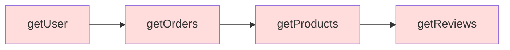

# 12.1.2 Lồng nhau như búp bê — Async Programming Pattern: Callbacks và Callback Hell

### Câu hỏi nhìn thấu đáo

Callback function là "hình dạng nguyên thủy" của lập trình bất đồng bộ JavaScript — đơn giản và trực tiếp, nhưng khi các hoạt động bất đồng bộ lồng nhau từng tầng, code sẽ trở thành một "cơn ác mộng lồng nhau".

### Giá trị cốt lõi

Callback là nền tảng để hiểu tất cả các mẫu bất đồng bộ. Ngay cả khi bạn đã quen với `async/await`, khi đọc code của dự án cũ, sử dụng một số Node.js API hay debug vấn đề bottom-level, mẫu callback vẫn xuất hiện khắp nơi.

### Trả lại bản chất: Callback function là gì

Bản chất của callback function là: **truyền một hàm như một tham số cho hàm khác, sau khi hoạt động nào đó hoàn thành, gọi nó**.

```javascript
// Ví dụ callback đơn giản nhất
function fetchData(callback) {
    setTimeout(() => {
        const data = { name: 'Vibe Coder' };
        callback(data); // Hoạt động hoàn thành, gọi callback
    }, 1000);
}

fetchData((result) => {
    console.log(result); // { name: 'Vibe Coder' }
});
```

**Quá trình thực thi**:
1. Gọi `fetchData`, truyền một anonymous function làm callback
2. `setTimeout` đăng ký một nhiệm vụ sẽ thực thi sau 1 giây
3. Main thread tiếp tục thực thi code sau (không block)
4. Sau 1 giây, callback được đặt vào macrotask queue
5. Event loop lấy callback ra và thực thi

### Callback hell: Khi lồng nhau vượt khỏi tầm kiểm soát

Khi có nhiều hoạt động bất đồng bộ có mối phụ thuộc lẫn nhau, callback sẽ lồng nhau từng tầng:

```javascript
// Ví dụ callback hell: lấy user → lấy order → lấy product
getUser(userId, (user) => {
    getOrders(user.id, (orders) => {
        getProducts(orders[0].productId, (product) => {
            getReviews(product.id, (reviews) => {
                // Cuối cùng có được comment...
                console.log(reviews);
            });
        });
    });
});
```



**Vấn đề của code như này**:

1. **Khó đọc**: Indentation càng lúc càng sâu, logic khó theo dõi
2. **Xử lý lỗi phức tạp**: Mỗi tầng cần xử lý lỗi riêng
3. **Khó tái sử dụng**: Logic bị kết dính trong cấu trúc lồng nhau
4. **Khó test**: Không thể test riêng logic của một tầng

### Error-first callback của Node.js

Node.js community đã thỏa thuận một kiểu callback: **tham số đầu tiên luôn là error object**.

```javascript
const fs = require('fs');

fs.readFile('/path/to/file', 'utf8', (err, data) => {
    if (err) {
        console.error('Read failed:', err);
        return;
    }
    console.log('File content:', data);
});
```

Mặc dù convention này thống nhất cách xử lý lỗi, nhưng không giải quyết vấn đề lồng nhau:

```javascript
fs.readFile('config.json', 'utf8', (err, config) => {
    if (err) return handleError(err);

    fs.readFile('data.json', 'utf8', (err, data) => {
        if (err) return handleError(err);

        fs.writeFile('output.json', merge(config, data), (err) => {
            if (err) return handleError(err);
            console.log('Done');
        });
    });
});
```

### Giải pháp sớm: Named functions

Trước khi Promise xuất hiện, các developer sẽ dùng named function để "làm phẳng" code:

```javascript
function handleUser(user) {
    getOrders(user.id, handleOrders);
}

function handleOrders(orders) {
    getProducts(orders[0].productId, handleProducts);
}

function handleProducts(product) {
    getReviews(product.id, handleReviews);
}

function handleReviews(reviews) {
    console.log(reviews);
}

// Entry point
getUser(userId, handleUser);
```

Cách này hạn chế lồng nhau, nhưng logic bị phân tán đến nhiều function, context cũng khó chia sẻ.

### Hướng dẫn hợp tác với AI

Khi gặp code callback trong dự án cũ, có thể hợp tác với AI như sau:

- **Mục tiêu cốt lõi**: Nói với AI bạn muốn refactor code callback sang hiện đại `async/await`.
- **Công thức định nghĩa nhu cầu**: `"Vui lòng refactor code callback style này thành async/await, giữ nguyên functionality, và thêm error handling phù hợp."`
- **Từ khóa chính**: `callback hell`、`error-first callback`、`promisify`、`util.promisify`

**Ví dụ hội thoại**:

> "Giúp tôi chuyển code callback style Node.js này thành Promise version. Tôi muốn có thể gọi nó bằng `async/await`."

AI thường sẽ dùng `util.promisify` hay tự tay wrap Promise:

```javascript
const { promisify } = require('util');
const readFile = promisify(fs.readFile);

async function processFiles() {
    const config = await readFile('config.json', 'utf8');
    const data = await readFile('data.json', 'utf8');
    await fs.promises.writeFile('output.json', merge(config, data));
    console.log('Done');
}
```

### Hướng dẫn tránh sai lầm

- **Tránh "callback pyramid"**: Nếu lồng nhau quá 3 tầng, cân nhắc refactor thành Promise hay async/await.
- **Luôn xử lý lỗi**: Lỗi trong callback nếu không xử lý, sẽ bị im lặng.
- **Chú ý binding `this`**: `this` trong callback có thể không phải object bạn mong đợi, đặc biệt trong class methods.
