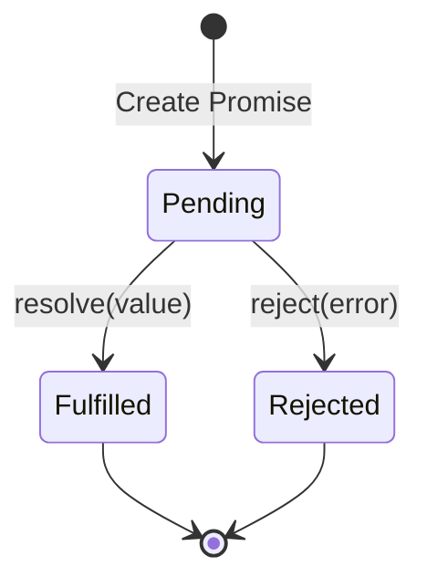
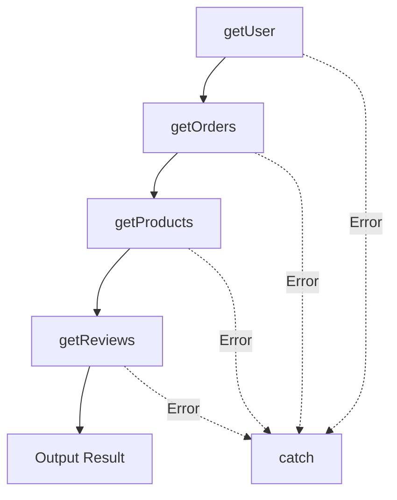

# 12.1.3 Gọi chuỗi — Promise Chaining: then/catch/finally

### Câu hỏi nhìn thấu đáo

Promise là trừu tượng hóa JavaScript về "điều gì sẽ xảy ra trong tương lai" — nó đại diện cho kết quả cuối cùng của một hoạt động bất đồng bộ, có thể thành công, có thể thất bại, nhưng dù sao thì cũng sẽ có kết quả.

### Giá trị cốt lõi

Promise giải quyết vấn đề callback hell, nó mang lại:

1. **Chain calling**: Dùng `.then()` nối nhiều hoạt động bất đồng bộ, tạm biệt lồng nhau
2. **Unified error handling**: Dùng `.catch()` bắt lỗi tập trung trên toàn bộ chain
3. **State immutability**: Khi resolve hoặc reject, state sẽ cố định, tránh callback bị gọi nhiều lần
4. **Paving the way for async/await**: Async function về bản chất là syntactic sugar của Promise

### Trả lại bản chất: Ba trạng thái của Promise



- **Pending (Chờ xử lý)**: Trạng thái ban đầu, chưa thành công cũng chưa thất bại
- **Fulfilled (Đã thực hiện)**: Hoạt động thành công hoàn tất, có giá trị kết quả
- **Rejected (Bị từ chối)**: Hoạt động thất bại, có lý do thất bại

**Điểm chính**: State chỉ có thể thay đổi từ Pending thành Fulfilled hoặc Rejected, và **không thể đảo ngược**.

### Tạo và sử dụng Promise

```javascript
// Tạo một Promise
const fetchData = new Promise((resolve, reject) => {
    setTimeout(() => {
        const success = Math.random() > 0.5;
        if (success) {
            resolve({ data: 'Lấy thành công' });
        } else {
            reject(new Error('Lấy thất bại'));
        }
    }, 1000);
});

// Sử dụng Promise
fetchData
    .then((result) => {
        console.log('Thành công:', result.data);
    })
    .catch((error) => {
        console.error('Thất bại:', error.message);
    })
    .finally(() => {
        console.log('Dù thành công hay thất bại, đều sẽ thực thi');
    });
```

### Phép thuật của chain calling

Mỗi `.then()` đều trả về một Promise mới, vì vậy có thể nối liên tục:

```javascript
getUser(userId)
    .then((user) => getOrders(user.id))        // Trả về Promise
    .then((orders) => getProducts(orders[0].productId))  // Trả về Promise
    .then((product) => getReviews(product.id)) // Trả về Promise
    .then((reviews) => {
        console.log(reviews);
    })
    .catch((error) => {
        // Bắt lỗi của bất kỳ bước nào trong chain
        console.error('Có lỗi:', error);
    });
```

So với callback hell, code thay đổi từ "lồng nhau ngang" thành "chảy dọc":



### Các static method phổ biến của Promise

| Method | Mục đích | Kịch bản ứng dụng |
|------|------|----------|
| `Promise.all([...])` | Chờ tất cả Promise hoàn thành, nếu một cái fail thì toàn bộ fail | Yêu cầu nhiều API cùng lúc, khi tất cả thành công mới render trang |
| `Promise.allSettled([...])` | Chờ tất cả Promise hoàn thành, dù thành công hay fail đều trả về kết quả | Batch operation, cần biết trạng thái của từng cái |
| `Promise.race([...])` | Trả về Promise đầu tiên hoàn thành | Timeout control |
| `Promise.any([...])` | Trả về Promise đầu tiên thành công | Multi-source data fetching, lấy cái nhanh nhất |

```javascript
// Promise.all ví dụ: yêu cầu song song
const [users, products, orders] = await Promise.all([
    fetch('/api/users'),
    fetch('/api/products'),
    fetch('/api/orders')
]);

// Promise.race ví dụ: timeout control
const timeout = new Promise((_, reject) =>
    setTimeout(() => reject(new Error('Timeout')), 5000)
);

const result = await Promise.race([
    fetch('/api/slow-endpoint'),
    timeout
]);
```

### Cạm bẫy phổ biến

#### 1. Quên return

```javascript
// ❌ Sai: then không return, then tiếp theo nhận undefined
getUser(userId)
    .then((user) => {
        getOrders(user.id); // Quên return
    })
    .then((orders) => {
        console.log(orders); // undefined!
    });

// ✅ Đúng:
getUser(userId)
    .then((user) => {
        return getOrders(user.id);
    })
    .then((orders) => {
        console.log(orders);
    });
```

#### 2. Lỗi bị im lặng

```javascript
// ❌ Sai: không có catch, lỗi sẽ bị bỏ qua
fetchData.then((data) => {
    throw new Error('Xử lý có lỗi');
});

// ✅ Đúng: luôn thêm catch
fetchData
    .then((data) => {
        throw new Error('Xử lý có lỗi');
    })
    .catch((error) => {
        console.error(error);
    });
```

### Hướng dẫn hợp tác với AI

- **Mục tiêu cốt lõi**: Nói với AI bạn cần xử lý nhiều hoạt động bất đồng bộ, chỉ rõ chúng là serial hay parallel.
- **Công thức định nghĩa nhu cầu**: `"Vui lòng dùng Promise triển khai: trước lấy thông tin user, sau đó theo user ID lấy danh sách order, cuối cùng trả về dữ liệu đã merge."`
- **Từ khóa chính**: `Promise.all`、`Promise.race`、`chaining`、`error handling`

**Điểm kiểm tra**:
1. Mỗi `.then()` có return đúng không?
2. Có `.catch()` xử lý lỗi không?
3. Hoạt động parallel có dùng `Promise.all` không?
4. Có Promise lồng không cần thiết không?

### Hướng dẫn tránh sai lầm

- **Tránh Promise lồng nhau**: Nếu trong `.then()` lại tạo Promise chain, có nghĩa là bạn chưa dùng đúng chaining.
- **`.finally()` không thể thay đổi kết quả**: Nó chỉ dùng để cleanup, không thể modify resolve hoặc reject value.
- **Chú ý chiến lược failure của `Promise.all`**: Nếu một Promise fail, toàn bộ fail. Nếu cần fault tolerance, dùng `Promise.allSettled`.
