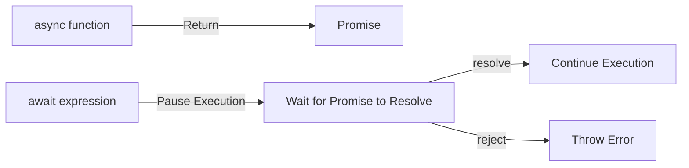
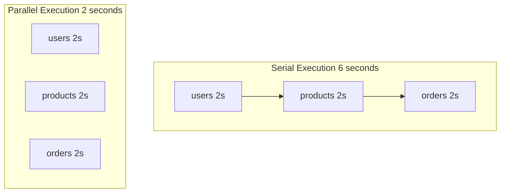

# 12.1.4 Viết bất đồng bộ như viết đồng bộ — Async/await Syntax: Async Programming Với Synchronous Style

### Câu hỏi nhìn thấu đáo

`async/await` là syntactic sugar của Promise, nó giúp code bất đồng bộ trông giống code đồng bộ, đọc như văn xuôi, debug mà không muốn chết.

### Giá trị cốt lõi

`async/await` là cách ưa thích hiện đại để lập trình bất đồng bộ JavaScript:

1. **Khả năng đọc tuyệt vời**: Đọc code từ trên xuống dưới, logic rõ ràng
2. **Xử lý lỗi đơn giản**: Dùng `try/catch` quen thuộc thay cho `.catch()`
3. **Debug dễ dàng**: Có thể đặt breakpoint như code đồng bộ
4. **Hoàn toàn tương thích Promise**: `async` function trả về Promise, `await` unwrap Promise

### Trả lại bản chất: Cơ chế bottom-level của async/await



**Hiểu chính xác**:
- `async` function **luôn** trả về Promise
- `await` sẽ **tạm dừng** thực thi function, cho đến Promise resolve
- Trong thời gian tạm dừng, event loop có thể thực thi các nhiệm vụ khác (non-blocking)

### Từ Promise tới async/await

```javascript
// Promise style
function getUserData(userId) {
    return getUser(userId)
        .then((user) => getOrders(user.id))
        .then((orders) => getProducts(orders[0].productId))
        .then((product) => {
            return { product };
        });
}

// async/await style (hoàn toàn tương đương)
async function getUserData(userId) {
    const user = await getUser(userId);
    const orders = await getOrders(user.id);
    const product = await getProducts(orders[0].productId);
    return { product };
}
```

Hai cách này hoàn toàn tương đương về functionality, nhưng version `async/await` rõ ràng dễ đọc hơn.

### Xử lý lỗi: Sự quay trở của try/catch

```javascript
async function fetchData() {
    try {
        const user = await getUser(userId);
        const orders = await getOrders(user.id);
        return { user, orders };
    } catch (error) {
        // Xử lý lỗi của bất kỳ bước nào
        console.error('Lấy dữ liệu thất bại:', error);
        throw error; // Tùy chọn: tiếp tục throw lên trên
    } finally {
        // Cleanup operation
        console.log('Request kết thúc');
    }
}
```

### Thực thi song song: Không lạm dụng await

**Lỗi phổ biến**: Thực thi serial các hoạt động mà có thể thực thi parallel

```javascript
// ❌ Thực thi serial, tổng thời gian = tổng thời gian các hoạt động
async function fetchAll() {
    const users = await fetch('/api/users');       // 2s
    const products = await fetch('/api/products'); // 2s
    const orders = await fetch('/api/orders');     // 2s
    // Tổng thời gian: 6s
}

// ✅ Thực thi parallel, tổng thời gian = thời gian hoạt động lâu nhất
async function fetchAll() {
    const [users, products, orders] = await Promise.all([
        fetch('/api/users'),      // 2s
        fetch('/api/products'),   // 2s ← parallel
        fetch('/api/orders')      // 2s
    ]);
    // Tổng thời gian: 2s
}
```



### Sử dụng async/await trong vòng lặp

```javascript
// ❌ Sai: forEach không chờ async callback
const ids = [1, 2, 3];
ids.forEach(async (id) => {
    const data = await fetchData(id);
    console.log(data);
});
console.log('Done'); // Dòng này sẽ thực thi trước!

// ✅ Đúng: Xử lý serial
for (const id of ids) {
    const data = await fetchData(id);
    console.log(data);
}
console.log('Done'); // Thực thi sau tất cả request

// ✅ Đúng: Xử lý parallel
const results = await Promise.all(
    ids.map((id) => fetchData(id))
);
console.log('Done');
```

### Top-level await

Trong ES module, có thể dùng `await` ở top level:

```javascript
// config.mjs
const response = await fetch('/api/config');
export const config = await response.json();

// app.mjs
import { config } from './config.mjs';
console.log(config); // Đã là dữ liệu đã parse
```

**Chú ý**: Top-level `await` chỉ dùng được trong ES module, không dùng được trong CommonJS hay inline script.

### Hướng dẫn hợp tác với AI

Khi hợp tác với AI viết code bất đồng bộ:

- **Mục tiêu cốt lõi**: Nói rõ với AI mối quan hệ phụ thuộc giữa các hoạt động — cái nào phải serial, cái nào có thể parallel.
- **Công thức định nghĩa nhu cầu**: `"Vui lòng triển khai một async function, trước lấy thông tin user, sau đó song song lấy danh sách order và danh sách wish list của user, cuối cùng merge và trả về."`
- **Từ khóa chính**: `async/await`、`Promise.all`、`sequential`、`parallel`、`try/catch`

**Điểm kiểm tra**:

1. Có `await` serial không cần thiết không? Có thể dùng `Promise.all` tối ưu không?
2. Xử lý lỗi có hoàn chỉnh không? Có Promise rejection không được bắt không?
3. `await` trong vòng lặp có đúng với dự kiến (serial vs parallel)?
4. Có hiểu đúng rằng `async` function trả về Promise không?

### Hướng dẫn tránh sai lầm

- **Không dùng `await` trong `forEach`**: `forEach` không chờ async callback hoàn thành. Dùng `for...of` hay `Promise.all` + `map`.
- **Nhớ `async` function trả về Promise**: Sau khi gọi `async` function, nếu không `await`, code sẽ tiếp tục thực thi mà không chờ kết quả.
- **Tránh lồng `await`**: Nếu thấy mình viết `await (await ...)`，có nghĩa là cấu trúc code có vấn đề.
- **Top-level await cần ES module**: Trong Node.js, cần dùng `.mjs` extension hay set `"type": "module"` trong `package.json`.
