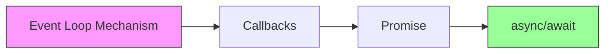

# 12.1 Tại sao JS có thể xử lý nhiều việc cùng lúc — Node Process và Event Loop: Callbacks/Promise/async-await

### Câu hỏi nhìn thấu đáo

JavaScript là ngôn ngữ **single-threaded**, nhưng có thể xử lý đồng thời các yêu cầu mạng, đọc/ghi file, tương tác người dùng — bí mật của tất cả điều này nằm trong **event loop**, "nhân viên quản lý nhiệm vụ" này.

### Giá trị cốt lõi

Hiểu được event loop là ranh giới tách biệt giữa "viết được code bất đồng bộ" và "có thể debug được async bug". Khi bạn gặp các vấn đề sau, event loop là công cụ chẩn đoán của bạn:

- Tại sao `setTimeout(fn, 0)` không thực thi ngay lập tức?
- Tại sao `Promise.then` thực thi trước `setTimeout`?
- Tại sao trang web "bị đơ"?
- Tại sao sau khi truy vấn database lại nhận được `undefined`?

### Hướng dẫn chương này

Phần này sẽ bắt đầu từ cơ chế bottom-level, dẫn bạn hiểu được quá trình phát triển của lập trình bất đồng bộ trong JavaScript:

1. **Event Loop Mechanism**: Hiểu được Call Stack, Event Queue, việc lập lịch của microtask và macrotask.
2. **Callback Functions**: Điểm bắt đầu của lập trình bất đồng bộ, và vấn đề "callback hell" mà nó gây ra.
3. **Promise**: Giải quyết vấn đề lồng nhau bằng cách gọi chuỗi, và giới thiệu xử lý lỗi thống nhất.
4. **async/await**: Làm cho code bất đồng bộ "trông giống như code đồng bộ", nâng cao khả năng đọc và bảo trì.

### Tại sao Vibe Coder phải hiểu những điều này?

Trong thời đại lập trình hỗ trợ bởi AI, bạn có thể để AI viết code bất đồng bộ cho bạn. Nhưng khi code gặp vấn đề, lời giải thích từ AI thường là "đọc từ sách vở" mà thôi. **Chỉ khi bạn thực sự hiểu event loop, bạn mới có thể nhận ra hướng đúng trong những gợi ý từ AI, thay vì chỉ chấp nhận một câu trả lời "có vẻ hợp lý".**

> Khi đối mặt với code bất đồng bộ do AI tạo, điểm kiểm tra cốt lõi của bạn là:
> - Thứ tự thực thi của code này có đúng với dự kiến không?
> - Có tồn tại điều kiện race không?
> - Lỗi có được bắt đúng cách không?
