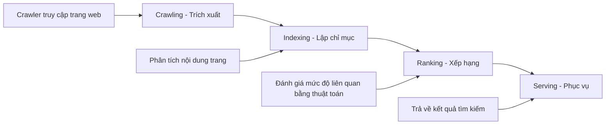
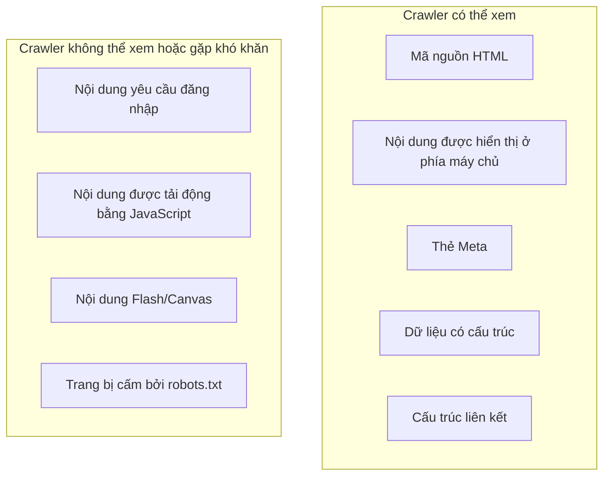

# 12.2.1 Công cụ tìm kiếm hoạt động như thế nào——Cơ bản SEO：Nguyên lý Crawler và Indexing

### Giải quyết vấn đề một câu

Công cụ tìm kiếm hoạt động thông qua ba bước："Crawling" để trích xuất trang web, "Indexing" để tổ chức nội dung, "Ranking" để quyết định thứ tự hiển thị——hiểu ba bước này, bạn đã nắm bắt được logic cơ bản của tối ưu hóa SEO.

### Khôi phục bản chất：Quy trình làm việc của công cụ tìm kiếm



#### 1. Giai đoạn Crawling

"Crawler" của công cụ tìm kiếm (như Googlebot, Baiduspider) là một chương trình tự động hóa, nó sẽ：

1. Bắt đầu từ các liên kết trên các trang đã biết, khám phá các trang mới
2. Yêu cầu nội dung HTML của trang
3. Phân tích HTML, trích xuất văn bản, liên kết, hình ảnh và thông tin khác
4. Thêm các liên kết mới được phát hiện vào hàng chờ để crawl

**Những điểm chính**：
- Crawler chủ yếu xem **mã nguồn HTML**, không phải trang được hiển thị
- Các crawler hiện đại (như Googlebot) có thể thực thi JavaScript, nhưng có độ trễ và hạn chế
- Crawler sẽ tuân theo các quy tắc trong `robots.txt`

#### 2. Giai đoạn Indexing

Nội dung được trích xuất sẽ được xử lý và lưu trữ trong "kho lập chỉ mục"：

- **Phân tích nội dung**：Trích xuất từ khóa, xác định chủ đề trang
- **Xử lý trùng lặp**：Xác định và lọc nội dung trùng lặp
- **Đánh giá chất lượng**：Xác định tính có thẩm quyền, tính độc lập của trang
- **Xây dựng mối quan hệ**：Hiểu mối quan hệ liên kết giữa các trang

#### 3. Giai đoạn Ranking

Khi người dùng tìm kiếm, công cụ tìm kiếm sẽ tìm các trang liên quan từ kho lập chỉ mục và xếp hạng theo hàng trăm yếu tố：

- **Tính liên quan của nội dung**：Mức độ khớp giữa nội dung trang và từ khóa tìm kiếm
- **Chất lượng trang**：Độ sâu của nội dung, tính độc lập, tần suất cập nhật
- **Trải nghiệm người dùng**：Tốc độ tải, thích ứng di động, trải nghiệm tương tác
- **Tín hiệu bên ngoài**：Liên kết từ các trang web khác (liên kết ngoài), chia sẻ trên mạng xã hội

### Trang web của bạn trong mắt Crawler



### robots.txt：\"Thỏa thuận quân tử\" với Crawler

`robots.txt` là tệp được đặt ở thư mục gốc trang web để cho biết crawler những nội dung nào có thể trích xuất：

```txt
# Cho phép tất cả các crawler truy cập tất cả nội dung
User-agent: *
Allow: /

# Cấm crawler truy cập giao diện quản lý
Disallow: /admin/

# Chỉ định vị trí sitemap
Sitemap: https://example.com/sitemap.xml
```

### Hướng dẫn hợp tác với AI

- **Ý định cốt lõi**：Cho phép AI giúp bạn tạo `robots.txt` hoặc kiểm tra xem cấu hình hiện có có hợp lý không.
- **Công thức định nghĩa yêu cầu**：`"Vui lòng giúp tôi tạo tệp robots.txt để cho phép công cụ tìm kiếm trích xuất tất cả các trang công khai, nhưng cấm trích xuất các thư mục /api/ và /admin/."`
- **Thuật ngữ chính**：`robots.txt`、`User-agent`、`Disallow`、`Sitemap`、`noindex`

### Hướng dẫn tránh sai lầm

- **Không chặn CSS và JS**：Các crawler hiện đại cần các tài nguyên này để hiển thị trang đúng cách.
- **Chú ý sự khác biệt giữa noindex và Disallow**：`Disallow` ngăn chặn trích xuất, `noindex` ngăn chặn lập chỉ mục. Các trang bị Disallow vẫn có thể được lập chỉ mục nếu có liên kết bên ngoài chỉ tới.
- **Kiểm tra trạng thái trích xuất thường xuyên**：Sử dụng Google Search Console hoặc công cụ Webmaster của Baidu để giám sát hành vi của crawler.

