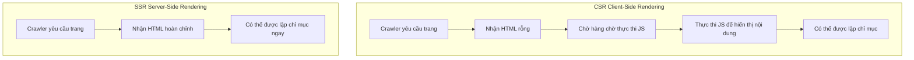

# 12.2.2 Lợi ích của SSR đối với SEO——Lợi thế SSR：Hiển thị trên màn hình và Thân thiện với SEO

### Giải quyết vấn đề một câu

SSR cho phép crawler công cụ tìm kiếm "nhìn thấy ngay" nội dung hoàn chỉnh của trang, thay vì xem một loạt thẻ trống chờ thực thi JavaScript.

### Tái cấu trúc nhận thức：Crawler không phải là trình duyệt

Mặc dù các crawler công cụ tìm kiếm hiện đại (như Google) đã có thể thực thi JavaScript, nhưng quá trình này có **độ trễ và không xác định**：

1. **Crawling hai giai đoạn**：Trước tiên lấy HTML, sau đó mới thực thi JS và xử lý lại
2. **Hàng chờ hiển thị**：Hiển thị JS cần xếp hàng chờ, có thể bị trì hoãn trong vài giờ thậm chí vài ngày
3. **Giới hạn tài nguyên**：Crawler có giới hạn về thời gian thực thi JS và tài nguyên
4. **Vấn đề về tương thích**：Một số tính năng JS có thể không được hỗ trợ đầy đủ

### Khôi phục bản chất：Sự khác biệt SEO giữa CSR và SSR



**HTML được CSR trả về**：

```html
<!DOCTYPE html>
<html>
<body>
  <div id="root"></div>
  <script src="/bundle.js"></script>
</body>
</html>
```

Crawler lần đầu tiên chỉ thấy một `<div>` trống.

**HTML được SSR trả về**：

```html
<!DOCTYPE html>
<html>
<body>
  <div id="root">
    <h1>Chào mừng đến blog của tôi</h1>
    <article>
      <h2>Cách học Next.js</h2>
      <p>Next.js là một khung React mạnh mẽ...</p>
    </article>
  </div>
</body>
</html>
```

Crawler có thể ngay lập tức thấy toàn bộ cấu trúc nội dung.

### Thực tiễn tối ưu hóa SEO trong Next.js

Next.js App Router mặc định sử dụng các thành phần máy chủ, vốn thân thiện với SEO：

```tsx
// app/blog/[slug]/page.tsx
import { Metadata } from 'next';

// Tạo động thông tin Meta
export async function generateMetadata({ params }): Promise<Metadata> {
  const post = await getPost(params.slug);
  return {
    title: post.title,
    description: post.excerpt,
    openGraph: {
      title: post.title,
      images: [post.coverImage],
    },
  };
}

// Hiển thị nội dung trang ở phía máy chủ
export default async function BlogPost({ params }) {
  const post = await getPost(params.slug);

  return (
    <article>
      <h1>{post.title}</h1>
      <div dangerouslySetInnerHTML={{ __html: post.content }} />
    </article>
  );
}
```

### Khi nào sử dụng SSR, khi nào sử dụng CSR？

| Kịch bản | Phương án được đề xuất | Lý do |
|------|----------|------|
| Blog, tin tức, trang sản phẩm | SSR/SSG | Cần được lập chỉ mục bởi công cụ tìm kiếm |
| Bảng điều khiển người dùng | CSR | Không cần SEO, yêu cầu đăng nhập |
| Trang sản phẩm thương mại điện tử | SSR + ISR | Cần SEO, nội dung cập nhật định kỳ |
| Trò chuyện thời gian thực | CSR | Động cao, không cần lập chỉ mục |

### Hướng dẫn hợp tác với AI

- **Ý định cốt lõi**：Cho phép AI giúp bạn xác định chiến lược hiển thị nào mà trang nên sử dụng và tạo mã tương ứng.
- **Công thức định nghĩa yêu cầu**：`"Đây là một trang bài viết blog cần thân thiện với SEO. Vui lòng sử dụng thành phần máy chủ của Next.js App Router để triển khai và bao gồm thẻ Meta động."`
- **Thuật ngữ chính**：`SSR`、`generateMetadata`、`thành phần máy chủ`、`tạo tĩnh (SSG)`、`ISR`

**Các điểm kiểm tra**：

1. Nội dung cốt lõi của trang được hiển thị ở phía máy chủ chứ？
2. Có được chỉ thị `'use client'` chỉ sử dụng trên các thành phần thực sự cần tương tác phía khách hàng không？
3. Có thẻ Meta động có chính xác phản ánh nội dung trang web không？

### Hướng dẫn tránh sai lầm

- **Không sử dụng quá mức `'use client'`**：Điều này sẽ biến thành phần thành hiển thị phía khách hàng, ảnh hưởng đến SEO.
- **Chú ý thời gian lấy dữ liệu**：Lấy dữ liệu trong các thành phần máy chủ, đảm bảo nội dung tồn tại khi hiển thị lần đầu tiên.
- **Kiểm tra từ quan điểm crawler**：Sử dụng công cụ "URL Inspection" của Google Search Console để xem trang trông như thế nào trong mắt crawler.

