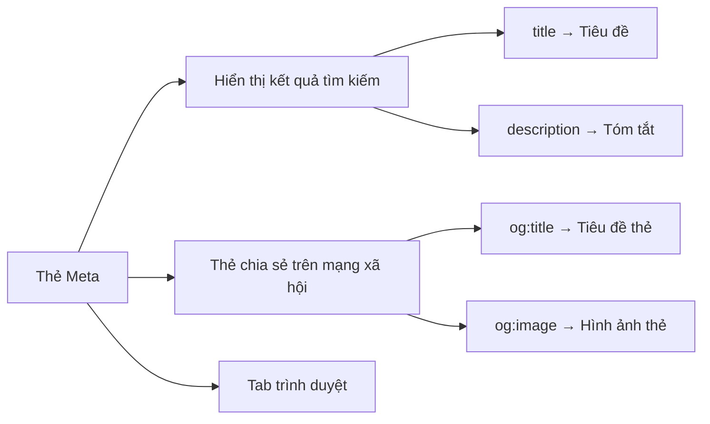

# 12.2.3 Chứng minh thư của trang web——Thẻ Meta：title/description/keywords

### Giải quyết vấn đề một câu

Thẻ Meta là "chứng minh thư" của trang web, nó cho công cụ tìm kiếm và nền tảng truyền thông xã hội biết "tôi là ai, tôi có gì", ảnh hưởng trực tiếp đến cách hiển thị kết quả tìm kiếm và tỷ lệ nhấp.

### Giá trị cốt lõi

Mặc dù thẻ Meta không ảnh hưởng trực tiếp đến trọng số xếp hạng, nhưng nó quyết định những gì người dùng thấy trong kết quả tìm kiếm：

1. **Thẻ Title**：Hiển thị ở vị trí tiêu đề của kết quả tìm kiếm, là nội dung người dùng nhìn thấy đầu tiên
2. **Thẻ Description**：Hiển thị dưới tiêu đề, ảnh hưởng đến việc người dùng có nhấp chuột hay không
3. **Thẻ Open Graph**：Kiểm soát hiệu ứng hiển thị khi chia sẻ trên mạng xã hội

### Khôi phục bản chất：Cách hoạt động của thẻ Meta



### Giải thích chi tiết các thẻ Meta cốt lõi

```html
<head>
  <!-- Thẻ Meta cơ bản -->
  <title>Cách học Next.js - Hướng dẫn Vibe Coding</title>
  <meta name="description" content="Học Next.js từ đầu, nắm vững các khái niệm cốt lõi như hiển thị phía máy chủ, App Router. Hướng dẫn nâng cao cho các nhà phát triển giao diện người dùng.">
  <meta name="keywords" content="Next.js,React,SSR,phát triển giao diện người dùng">

  <!-- Thẻ Open Graph (chia sẻ trên mạng xã hội) -->
  <meta property="og:title" content="Cách học Next.js">
  <meta property="og:description" content="Hướng dẫn hoàn chỉnh học Next.js từ đầu">
  <meta property="og:image" content="https://example.com/og-image.jpg">
  <meta property="og:type" content="article">

  <!-- Thẻ Twitter -->
  <meta name="twitter:card" content="summary_large_image">
  <meta name="twitter:title" content="Cách học Next.js">
  <meta name="twitter:image" content="https://example.com/twitter-image.jpg">
</head>
```

### Thực tiễn tốt nhất：Thẻ Title

| Yếu tố | Đề xuất | Ví dụ |
|------|------|------|
| Chiều dài | 50-60 ký tự (khoảng 25-30 ký tự tiếng Trung Quốc) | Thích hợp |
| Cấu trúc | Từ khóa cốt lõi - thông tin bổ sung - tên thương hiệu | `Hướng dẫn Next.js - Từ không đến một | Vibe Coding` |
| Tính duy nhất | Thẻ title của mỗi trang phải khác nhau | Không sử dụng cùng một tiêu đề cho tất cả các trang |
| Từ khóa | Từ khóa cốt lõi ở phía trước | Nên là `Hướng dẫn Next.js` chứ không phải `Hướng dẫn Next.js` |

### Thực tiễn tốt nhất：Thẻ Description

| Yếu tố | Đề xuất |
|------|------|
| Chiều dài | 120-160 ký tự (khoảng 60-80 ký tự tiếng Trung Quốc) |
| Nội dung | Tóm tắt ngắn gọn nội dung cốt lõi của trang, bao gồm 1-2 từ khóa |
| Lời kêu gọi hành động | Có thể bao gồm ngôn ngữ hướng dẫn, chẳng hạn như "tìm hiểu thêm", "bắt đầu học tập ngay" |
| Tính duy nhất | Mỗi trang nên có mô tả riêng |

### Quản lý thẻ Meta trong Next.js

```tsx
// app/layout.tsx - Meta toàn cầu mặc định
import { Metadata } from 'next';

export const metadata: Metadata = {
  title: {
    default: 'Hướng dẫn Vibe Coding',
    template: '%s | Vibe Coding', // Các trang con sẽ tự động áp dụng mẫu này
  },
  description: 'Học phát triển full-stack từ đầu',
  openGraph: {
    siteName: 'Vibe Coding',
    locale: 'vi_VN',
    type: 'website',
  },
};

// app/blog/[slug]/page.tsx - Meta trang động
export async function generateMetadata({ params }): Promise<Metadata> {
  const post = await getPost(params.slug);

  return {
    title: post.title, // Sẽ trở thành "tiêu đề bài viết | Vibe Coding"
    description: post.excerpt,
    openGraph: {
      title: post.title,
      description: post.excerpt,
      images: [
        {
          url: post.coverImage,
          width: 1200,
          height: 630,
          alt: post.title,
        },
      ],
    },
  };
}
```

### Hướng dẫn hợp tác với AI

- **Ý định cốt lõi**：Cho phép AI tạo thẻ Meta phù hợp cho một trang cụ thể.
- **Công thức định nghĩa yêu cầu**：`"Vui lòng tạo thẻ Meta thân thiện với SEO cho bài viết blog này về [chủ đề], bao gồm title, description và thẻ Open Graph. Từ khóa mục tiêu là [từ khóa]."`
- **Thuật ngữ chính**：`Metadata`、`generateMetadata`、`Open Graph`、`Twitter Card`

**Điểm kiểm tra**：

1. Tiêu đề có ngắn gọn và bao gồm từ khóa cốt lõi không？
2. Có mô tả chính xác tóm tắt nội dung trang web không？
3. Có đặt og:image và kích thước chính xác không (đề xuất 1200x630)？
4. Có phải mỗi trang đều có Meta riêng biệt không？

### Hướng dẫn tránh sai lầm

- **Không xếp chồng từ khóa**：Thẻ `keywords` đã bị hầu hết các công cụ tìm kiếm bỏ qua, xếp chồng từ khóa có thể được coi là gian lận.
- **Description không nên sao chép từ phần nội dung**：Nên là tóm tắt được viết kỹ lưỡng, không phải trích trực tiếp từ phần nội dung.
- **Chú ý các ký tự đặc biệt**：Các dấu ngoặc kép, dấu ngoặc nhọn cần phải được thoát chính xác.
- **Kiểm tra chia sẻ trên mạng xã hội**：Sử dụng Facebook Sharing Debugger hoặc Twitter Card Validator để kiểm tra hiệu ứng chia sẻ.

