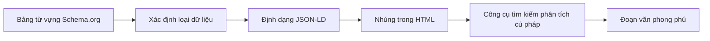

# 12.2.5 Giúp Crawler hiểu nội dung——Dữ liệu có cấu trúc：Schema.org và JSON-LD

### Giải quyết vấn đề một câu

Dữ liệu có cấu trúc là một loại "đánh dấu ngữ nghĩa", nó mô tả nội dung trang ở định dạng mà công cụ tìm kiếm có thể hiểu, từ đó cho phép trang web của bạn hiển thị các đoạn văn phong phú trong kết quả tìm kiếm, nhận được tỷ lệ nhấp cao hơn.

### Giá trị cốt lõi

Dữ liệu có cấu trúc có thể làm cho kết quả tìm kiếm trở nên "phong phú" hơn：

1. **Đoạn văn phong phú**：Hiển thị xếp hạng, giá cả, tác giả và thông tin bổ sung khác
2. **Bảng kiến thức**：Hiển thị thẻ thông tin chi tiết ở bên phải kết quả tìm kiếm
3. **Đoạn trích nổi bật**：Nội dung được hiển thị trực tiếp ở đầu kết quả tìm kiếm
4. **Tìm kiếm bằng giọng nói**：Dễ dàng được trợ lý giọng nói trích dẫn

### Khôi phục bản chất：Schema.org và JSON-LD

**Schema.org** là một bảng từ vựng được duy trì chung bởi các công cụ tìm kiếm như Google, Bing, Yahoo, xác định hàng trăm loại nội dung và thuộc tính.

**JSON-LD** là định dạng được đề xuất để nhúng dữ liệu có cấu trúc trong HTML, nó là một tập lệnh JSON được đặt trong thẻ `<script type="application/ld+json">`.



### Loại dữ liệu có cấu trúc phổ biến

#### Bài viết

```json
{
  "@context": "https://schema.org",
  "@type": "Article",
  "headline": "Cách học Next.js",
  "author": {
    "@type": "Person",
    "name": "Vibe Coder"
  },
  "datePublished": "2024-01-15",
  "dateModified": "2024-01-20",
  "image": "https://example.com/images/nextjs-cover.jpg",
  "publisher": {
    "@type": "Organization",
    "name": "Vibe Coding",
    "logo": {
      "@type": "ImageObject",
      "url": "https://example.com/logo.png"
    }
  }
}
```

#### Sản phẩm

```json
{
  "@context": "https://schema.org",
  "@type": "Product",
  "name": "Khóa học thực hành Next.js",
  "image": "https://example.com/course.jpg",
  "description": "Học Next.js full-stack từ đầu",
  "offers": {
    "@type": "Offer",
    "price": "99.00",
    "priceCurrency": "CNY",
    "availability": "https://schema.org/InStock"
  },
  "aggregateRating": {
    "@type": "AggregateRating",
    "ratingValue": "4.8",
    "reviewCount": "256"
  }
}
```

#### Câu hỏi thường gặp

```json
{
  "@context": "https://schema.org",
  "@type": "FAQPage",
  "mainEntity": [
    {
      "@type": "Question",
      "name": "Next.js là gì？",
      "acceptedAnswer": {
        "@type": "Answer",
        "text": "Next.js là một khung full-stack dựa trên React, hỗ trợ nhiều chế độ hiển thị như hiển thị ở phía máy chủ, tạo tĩnh, v.v."
      }
    }
  ]
}
```

### Thêm dữ liệu có cấu trúc trong Next.js

```tsx
// app/blog/[slug]/page.tsx
export default async function BlogPost({ params }) {
  const post = await getPost(params.slug);

  const jsonLd = {
    '@context': 'https://schema.org',
    '@type': 'Article',
    headline: post.title,
    author: {
      '@type': 'Person',
      name: post.author.name,
    },
    datePublished: post.publishedAt,
    dateModified: post.updatedAt,
    image: post.coverImage,
  };

  return (
    <>
      <script
        type="application/ld+json"
        dangerouslySetInnerHTML={{ __html: JSON.stringify(jsonLd) }}
      />
      <article>
        <h1>{post.title}</h1>
        {/* ... */}
      </article>
    </>
  );
}
```

### Xác minh dữ liệu có cấu trúc

Sử dụng công cụ của Google để xác minh dữ liệu có cấu trúc của bạn：

1. **Rich Results Test**：Kiểm tra xem có thể tạo các đoạn văn phong phú không
2. **Schema Markup Validator**：Xác minh xem cú pháp có chính xác không

### Hướng dẫn hợp tác với AI

- **Ý định cốt lõi**：Cho phép AI tạo dữ liệu có cấu trúc phù hợp cho loại trang cụ thể.
- **Công thức định nghĩa yêu cầu**：`"Vui lòng tạo dữ liệu có cấu trúc định dạng JSON-LD cho trang bài viết blog này, loại là Article, cần bao gồm tác giả, thời gian phát hành, hình ảnh bìa, v.v."`
- **Thuật ngữ chính**：`Schema.org`、`JSON-LD`、`@type`、`Rich Snippets`、`dữ liệu có cấu trúc`

**Điểm kiểm tra**：

1. `@context` và `@type` có chính xác không？
2. Có các trường bắt buộc đầy đủ không？
3. Dữ liệu có khớp với nội dung thực tế của trang web không？
4. Định dạng ngày tháng có chính xác không (ISO 8601)？

### Hướng dẫn tránh sai lầm

- **Dữ liệu phải khớp với nội dung trang**：Dữ liệu có cấu trúc giả mạo có thể dẫn đến hình phạt.
- **Không đánh dấu quá mức**：Chỉ đánh dấu nội dung cốt lõi của trang, không đánh dấu quảng cáo hoặc nội dung không liên quan.
- **Kiểm tra trước khi triển khai**：Sử dụng công cụ xác minh để đảm bảo không có lỗi cú pháp.
- **Chú ý thông báo cảnh báo**：Ngay cả khi xác minh thành công, hãy chú ý thông báo cảnh báo, chúng có thể ảnh hưởng đến việc hiển thị các đoạn văn phong phú.

