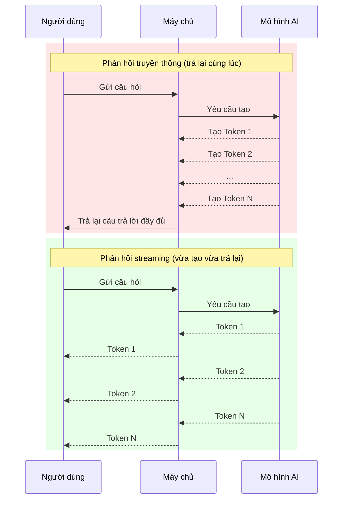

# 12.3.1 Mô hình cốt lõi của ứng dụng AI — Nguyên lý phản hồi streaming: Tại sao cần Streaming UI

### Một dòng để phá đề

Phản hồi streaming giúp câu trả lời của AI xuất hiện giống như "máy đánh chữ", từng ký tự một, chuyển đổi lo âu chờ đợi của người dùng thành trải nghiệm đọc, đây là mô hình tương tác cốt lõi của các ứng dụng AI hiện đại.

### Tái cấu trúc nhận thức: Tại sao chờ 5 giây cảm giác như 50 giây

Khi bạn đặt câu hỏi cho ChatGPT, mô hình thực tế đang **tạo ra câu trả lời từng Token một**. Các yêu cầu HTTP truyền thống sẽ chờ cho đến khi tất cả các Token được tạo xong mới trả lại, điều này có nghĩa là:

- Người dùng phải nhìn vào màn hình trống rỗng và chờ vài giây
- Nếu câu trả lời dài, thời gian chờ có thể vượt quá 10 giây
- Người dùng không thể xác định liệu yêu cầu có bị treo không

Cách tiếp cận phản hồi streaming là: **Vừa tạo, vừa trả lại**.

### Phục hồi bản chất: Phản hồi truyền thống vs phản hồi streaming



### Thực hiện kỹ thuật: Server-Sent Events

Phản hồi streaming thường được thực hiện dựa trên **Server-Sent Events (SSE)** hoặc **WebSocket**. Vercel AI SDK mặc định sử dụng SSE:

```javascript
// Định dạng được máy chủ gửi
data: {"content": "Xin"}
data: {"content": " chào"}
data: {"content": "!"}
data: [DONE]
```

Máy khách nhận thông qua `EventSource` hoặc `fetch` + `ReadableStream`:

```javascript
const response = await fetch('/api/chat', {
  method: 'POST',
  body: JSON.stringify({ message: 'Hello' }),
});

const reader = response.body.getReader();
const decoder = new TextDecoder();

while (true) {
  const { done, value } = await reader.read();
  if (done) break;

  const text = decoder.decode(value);
  console.log(text); // Đầu ra từng bước
}
```

### Bước ngoặc về trải nghiệm người dùng

| Chỉ số | Phản hồi truyền thống | Phản hồi streaming |
|------|----------|----------|
| Thời gian byte đầu tiên | 5-10 giây | < 1 giây |
| Thời gian chờ được cảm nhận | Dài | Hầu như không có |
| Khả năng ngắt | Không thể ngắt | Có thể dừng bất kỳ lúc nào |
| Phản hồi lỗi | Chỉ biết sau khi hết thời gian chờ | Nhận thức được theo thời gian thực |

### Thách thức của phản hồi streaming

Mặc dù phản hồi streaming mang lại trải nghiệm tốt hơn, nhưng nó cũng đặt ra một số thách thức kỹ thuật:

1. **Quản lý trạng thái**: Cần theo dõi các trạng thái như "đang tạo", "đã hoàn thành", "xảy ra lỗi"
2. **Xử lý lỗi**: Nếu truyền streaming gặp sự cố ở giữa, làm cách nào để khôi phục?
3. **Hiệu suất render**: Cập nhật DOM thường xuyên có thể gây lag
4. **Cơ chế hủy**: Làm cách nào để xử lý một cách tao nhã khi người dùng hủy ở giữa?

Vercel AI SDK cung cấp giải pháp cho tất cả những vấn đề này.

### Hướng dẫn hợp tác với AI

- **Ý định cốt lõi**: Để AI giúp bạn hiểu hoặc thực hiện cơ chế cơ bản của phản hồi streaming.
- **Công thức định nghĩa nhu cầu**: `"Vui lòng giải thích cách Server-Sent Events hoạt động và cung cấp một ví dụ cơ bản về thực hiện phản hồi AI streaming trong Next.js."`
- **Thuật ngữ chính**: `SSE`, `ReadableStream`, `TextDecoder`, `streaming`

### Hướng dẫn tránh lỗi

- **Đừng quên xử lý ngắt kết nối**: Khi mạng không ổn định, stream có thể đóng bất ngờ.
- **Chú ý quản lý bộ nhớ**: Phản hồi streaming trong thời gian dài có thể tích lũy nhiều dữ liệu.
- **Kiểm tra môi trường mạng yếu**: Phản hồi streaming có thể hoạt động bất thường trong môi trường mạng yếu.
