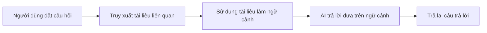

# 12.3.5 Kịch bản ứng dụng nâng cao — RAG và đa phương thức: Tạo Retrieval-Augmented Generation và hỗn hợp hình ảnh-văn bản

### Một dòng để phá đề

RAG cho phép AI "tra cứu tài liệu" trước khi trả lời câu hỏi, đa phương thức cho phép AI "xem hình ảnh nói chuyện" — hai công nghệ này mở rộng đáng kể ranh giới khả năng của ứng dụng AI.

### RAG: Retrieval-Augmented Generation

#### RAG là gì?



Ý tưởng cốt lõi của RAG là: **Tìm kiếm trước, trả lời sau**. Điều này giải quyết các vấn đề như kiến thức AI lỗi thời, không thể truy cập dữ liệu riêng, v.v.

#### Thực hiện cơ bản

```typescript
// app/api/chat/route.ts
import { openai } from '@ai-sdk/openai';
import { streamText } from 'ai';
import { searchDocuments } from '@/lib/search'; // Logik tìm kiếm của bạn

export async function POST(req: Request) {
  const { messages } = await req.json();

  // Lấy câu hỏi mới nhất từ người dùng
  const lastMessage = messages[messages.length - 1];

  // Truy xuất tài liệu liên quan
  const relevantDocs = await searchDocuments(lastMessage.content);

  // Xây dựng ngữ cảnh
  const context = relevantDocs
    .map((doc) => `---\n${doc.title}\n${doc.content}\n---`)
    .join('\n');

  const result = streamText({
    model: openai('gpt-4o'),
    system: `Bạn là một trợ lý kiến thức. Vui lòng trả lời câu hỏi của người dùng dựa trên tài liệu sau. Nếu tài liệu không có thông tin liên quan, hãy thành thật nói rằng bạn không biết.

Tài liệu tham khảo:
${context}`,
    messages,
  });

  return result.toDataStreamResponse();
}
```

#### Tìm kiếm vectơ

Thực hiện RAG tiên tiến hơn sẽ sử dụng cơ sở dữ liệu vectơ để tìm kiếm ngữ nghĩa:

```typescript
import { embed } from 'ai';
import { openai } from '@ai-sdk/openai';

// Tạo embedding cho văn bản
async function getEmbedding(text: string) {
  const { embedding } = await embed({
    model: openai.embedding('text-embedding-3-small'),
    value: text,
  });
  return embedding;
}

// Tìm kiếm trong cơ sở dữ liệu vectơ
async function semanticSearch(query: string) {
  const queryEmbedding = await getEmbedding(query);

  // Sử dụng Pinecone, Supabase Vector, v.v. để tìm kiếm độ tương tự
  const results = await vectorDB.search(queryEmbedding, { topK: 5 });

  return results;
}
```

### Đa phương thức: Hỗn hợp hình ảnh-văn bản

#### Gửi hình ảnh cho AI

```typescript
// app/api/vision/route.ts
import { openai } from '@ai-sdk/openai';
import { streamText } from 'ai';

export async function POST(req: Request) {
  const { messages } = await req.json();

  const result = streamText({
    model: openai('gpt-4o'), // Mô hình hỗ trợ thị giác
    messages: messages.map((m) => ({
      role: m.role,
      content: m.image
        ? [
            { type: 'text', text: m.content },
            { type: 'image', image: m.image }, // base64 hoặc URL
          ]
        : m.content,
    })),
  });

  return result.toDataStreamResponse();
}
```

#### Tải hình ảnh từ front-end

```tsx
'use client';

import { useChat } from 'ai/react';
import { useState } from 'react';

export default function VisionChat() {
  const { messages, append, isLoading } = useChat();
  const [input, setInput] = useState('');
  const [image, setImage] = useState<string | null>(null);

  const handleImageUpload = (e: React.ChangeEvent<HTMLInputElement>) => {
    const file = e.target.files?.[0];
    if (file) {
      const reader = new FileReader();
      reader.onloadend = () => {
        setImage(reader.result as string);
      };
      reader.readAsDataURL(file);
    }
  };

  const handleSubmit = () => {
    if (!input.trim() && !image) return;

    append({
      role: 'user',
      content: input,
      // Trường mở rộng, cần xử lý trên API
      data: { image },
    });

    setInput('');
    setImage(null);
  };

  return (
    <div>
      {/* Danh sách tin nhắn */}

      <div className="flex gap-2 p-4">
        <input
          type="file"
          accept="image/*"
          onChange={handleImageUpload}
          className="hidden"
          id="image-upload"
        />
        <label htmlFor="image-upload" className="cursor-pointer">
          📎
        </label>

        {image && (
          
        )}

        <input
          value={input}
          onChange={(e) => setInput(e.target.value)}
          placeholder="Mô tả hình ảnh này..."
          className="flex-1 p-2 border rounded"
        />

        <button onClick={handleSubmit} disabled={isLoading}>
          Gửi
        </button>
      </div>
    </div>
  );
}
```

### Hướng dẫn hợp tác với AI

- **Ý định cốt lõi**: Để AI giúp bạn thực hiện chức năng RAG hoặc đa phương thức.
- **Công thức định nghĩa nhu cầu**:
  - RAG: `"Vui lòng giúp tôi thực hiện hệ thống RAG dựa trên tìm kiếm vectơ, sử dụng Supabase làm cơ sở dữ liệu vectơ, người dùng có thể tải tài liệu PDF và hỏi các câu hỏi liên quan."`
  - Đa phương thức: `"Vui lòng giúp tôi thực hiện giao diện chat AI hỗ trợ tải hình ảnh, người dùng có thể tải hình ảnh và hỏi nội dung hình ảnh."`
- **Thuật ngữ chính**: `RAG`, `embedding`, `vector search`, `multimodal`, `vision`

### Hướng dẫn tránh lỗi

- **Chất lượng truy xuất RAG quyết định chất lượng câu trả lời**: Rác vào, rác ra.
- **Giới hạn kích thước hình ảnh**: Hình ảnh lớn sẽ tiêu thụ nhiều Token, nên nén trước khi tải lên.
- **Lựa chọn cơ sở dữ liệu vectơ**: Hãy cân nhắc cân bằng giữa chi phí, hiệu suất và dễ sử dụng.
- **Giới hạn cửa sổ ngữ cảnh**: Tài liệu được truy xuất không thể quá dài, nếu không sẽ vượt quá giới hạn mô hình.
