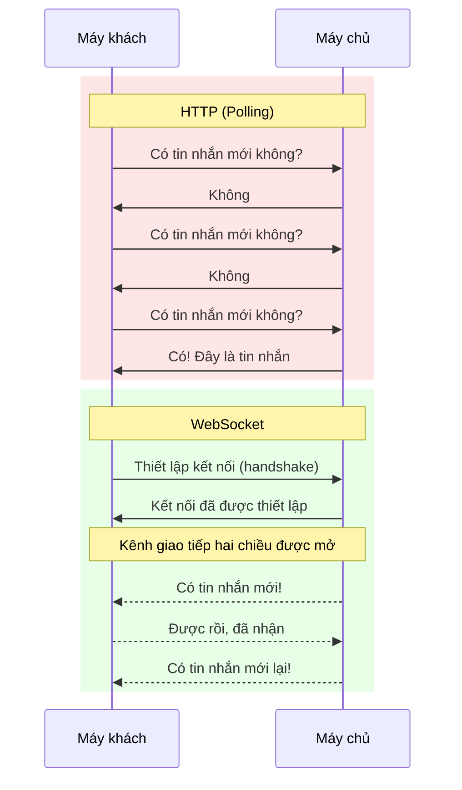

# 12.4.1 Tại sao cần giao tiếp thời gian thực——WebSocket vs HTTP: Lợi thế của kết nối dài hạn

### Nội dung chính trong một câu

HTTP là "bạn hỏi tôi trả lời", WebSocket là "giữ cuộc gọi"——cái sau cho phép máy chủ gửi thông báo cho bạn bất cứ lúc nào.

### Bản chất được khôi phục: Hai chế độ giao tiếp



### Vấn đề của HTTP polling

```javascript
// Polling: Hỏi mỗi giây một lần có tin nhắn mới không
setInterval(async () => {
  const response = await fetch('/api/messages');
  const messages = await response.json();
  updateUI(messages);
}, 1000);
```

Vấn đề:
- **Lãng phí tài nguyên**: Hầu hết các yêu cầu trả về "không có tin nhắn mới"
- **Độ trễ cao**: Trường hợp tồi tệ nhất, độ trễ = khoảng thời gian polling
- **Áp lực máy chủ**: 1000 người dùng × 1 lần mỗi giây = 1000 QPS

### Ưu điểm của WebSocket

```javascript
// WebSocket: Thiết lập một lần kết nối, tiếp tục nhận thông báo
const ws = new WebSocket('wss://example.com/socket');

ws.onmessage = (event) => {
  const message = JSON.parse(event.data);
  updateUI(message);
};

// Gửi thông báo cũng rất đơn giản
ws.send(JSON.stringify({ text: 'Hello!' }));
```

| Tính năng | HTTP Polling | WebSocket |
|------|----------|-----------|
| Cách kết nối | Kết nối mới mỗi lần yêu cầu | Kết nối kéo dài |
| Hướng giao tiếp | Một chiều (máy khách khởi tạo) | Hai chiều |
| Tính thời gian thực | Tùy thuộc vào khoảng polling | Mức mili giây |
| Tiêu thụ tài nguyên | Cao | Thấp |
| Đẩy từ máy chủ | Không hỗ trợ | Hỗ trợ gốc |

### Quá trình handshake WebSocket

Kết nối WebSocket bắt đầu từ nâng cấp HTTP:

```
// Yêu cầu của máy khách
GET /socket HTTP/1.1
Host: example.com
Upgrade: websocket
Connection: Upgrade
Sec-WebSocket-Key: dGhlIHNhbXBsZSBub25jZQ==
Sec-WebSocket-Version: 13

// Phản hồi của máy chủ
HTTP/1.1 101 Switching Protocols
Upgrade: websocket
Connection: Upgrade
Sec-WebSocket-Accept: s3pPLMBiTxaQ9kYGzzhZRbK+xOo=
```

Sau khi hoàn thành handshake, kết nối được nâng cấp từ HTTP thành WebSocket, cả hai bên có thể tự do gửi khung dữ liệu.

### Khi nào sử dụng WebSocket

| Tình huống | Giải pháp được khuyến nghị |
|------|----------|
| Nhắn tin tức thời, trò chuyện | WebSocket |
| Chỉnh sửa hợp tác thời gian thực | WebSocket |
| Giá cổ phiếu, tỷ số thể thao | WebSocket / SSE |
| Gửi biểu mẫu, gọi API | HTTP |
| Tải xuống tập tin | HTTP |
| Tuy vặn lấy dữ liệu (khoảng > 30s) | HTTP |

### Hướng dẫn hợp tác AI

- **Ý định cốt lõi**: Cho phép AI giúp bạn hiểu khi nào và cách sử dụng WebSocket.
- **Công thức xác định yêu cầu**: `"Vui lòng giải thích sự khác biệt giữa WebSocket và HTTP long polling, và chỉ rõ nên chọn giải pháp nào trong tình huống nào."`
- **Thuật ngữ chính**: `WebSocket`、`handshake`、`full-duplex`、`persistent connection`

### Hướng dẫn tránh hố tương tự

- **Không sử dụng WebSocket cho tất cả tình huống**: Các thao tác CRUD đơn giản nên sử dụng HTTP.
- **Chú ý giới hạn kết nối**: Trình duyệt có giới hạn số kết nối WebSocket cho mỗi tên miền.
- **Cân nhắc cân bằng tải**: Kết nối dài hạn của WebSocket có yêu cầu đặc biệt đối với cân bằng tải (cần sticky session).
