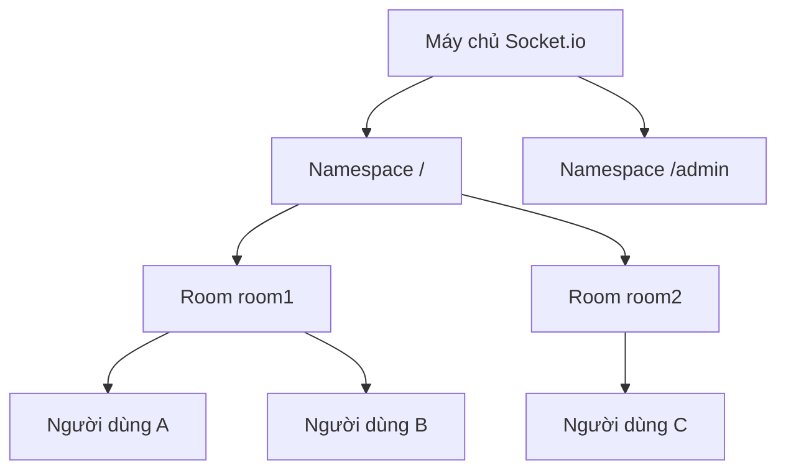

# 12.4.2 Thiết lập kết nối thời gian thực——Socket.io Cơ bản: Cấu hình phía máy chủ và máy khách

### Nội dung chính trong một câu

Socket.io là "phiên bản siêu cấp" của WebSocket——nó không chỉ bao bọc WebSocket, mà còn tự động xử lý fallback, reconnection và tương thích đa nền tảng.

### Tại sao chọn Socket.io

WebSocket gốc rất low-level, Socket.io cung cấp:

- **Fallback tự động**: Khi không hỗ trợ WebSocket, tự động sử dụng HTTP long polling
- **Reconnection tự động**: Sau khi ngắt kết nối, tự động cố gắng kết nối lại
- **Rooms và namespaces**: Dễ dàng quản lý nhóm người dùng
- **Cơ chế event**: Dựa trên tên event thay vì thông báo thô
- **Đa nền tảng**: Trình duyệt, Node.js, Python, Java đều có máy khách

### Bắt đầu nhanh chóng

#### Cài đặt phụ thuộc

```bash
pnpm add socket.io socket.io-client
```

#### Cấu hình phía máy chủ

```typescript
// server.ts
import { createServer } from 'http';
import { Server } from 'socket.io';

const httpServer = createServer();
const io = new Server(httpServer, {
  cors: {
    origin: 'http://localhost:3000',
    methods: ['GET', 'POST'],
  },
});

io.on('connection', (socket) => {
  console.log('Người dùng kết nối:', socket.id);

  // Lắng nghe event tùy chỉnh
  socket.on('message', (data) => {
    console.log('Nhận thông báo:', data);
    // Phát sóng cho tất cả mọi người (ngoại trừ người gửi)
    socket.broadcast.emit('message', data);
  });

  // Ngắt kết nối
  socket.on('disconnect', () => {
    console.log('Người dùng ngắt kết nối:', socket.id);
  });
});

httpServer.listen(3001, () => {
  console.log('Dịch vụ Socket.io chạy trên http://localhost:3001');
});
```

#### Cấu hình phía máy khách

```tsx
// Thành phần React
'use client';

import { useEffect, useState } from 'react';
import { io, Socket } from 'socket.io-client';

export default function Chat() {
  const [socket, setSocket] = useState<Socket | null>(null);
  const [messages, setMessages] = useState<string[]>([]);
  const [input, setInput] = useState('');

  useEffect(() => {
    const newSocket = io('http://localhost:3001');
    setSocket(newSocket);

    newSocket.on('message', (data: string) => {
      setMessages((prev) => [...prev, data]);
    });

    return () => {
      newSocket.close();
    };
  }, []);

  const sendMessage = () => {
    if (socket && input.trim()) {
      socket.emit('message', input);
      setMessages((prev) => [...prev, `Tôi: ${input}`]);
      setInput('');
    }
  };

  return (
    <div>
      <div>
        {messages.map((msg, i) => (
          <div key={i}>{msg}</div>
        ))}
      </div>
      <input
        value={input}
        onChange={(e) => setInput(e.target.value)}
        onKeyPress={(e) => e.key === 'Enter' && sendMessage()}
      />
      <button onClick={sendMessage}>Gửi</button>
    </div>
  );
}
```

### Tích hợp trong Next.js

Next.js sử dụng máy chủ tùy chỉnh để hỗ trợ Socket.io:

```typescript
// server.ts
import { createServer } from 'http';
import { parse } from 'url';
import next from 'next';
import { Server } from 'socket.io';

const dev = process.env.NODE_ENV !== 'production';
const app = next({ dev });
const handle = app.getRequestHandler();

app.prepare().then(() => {
  const server = createServer((req, res) => {
    const parsedUrl = parse(req.url!, true);
    handle(req, res, parsedUrl);
  });

  const io = new Server(server);

  io.on('connection', (socket) => {
    console.log('Kết nối thành công');
    // ... xử lý event
  });

  server.listen(3000, () => {
    console.log('> Sẵn sàng trên http://localhost:3000');
  });
});
```

### Các khái niệm cốt lõi của Socket.io



- **Namespace**: Cách ly kết nối của các chức năng khác nhau
- **Room**: Nhóm người dùng trong cùng một namespace
- **Socket**: Thể hiện kết nối của một người dùng

### Hướng dẫn hợp tác AI

- **Ý định cốt lõi**: Cho phép AI giúp bạn xây dựng dịch vụ Socket.io.
- **Công thức xác định yêu cầu**: `"Vui lòng giúp tôi tích hợp Socket.io vào dự án Next.js, thực hiện chức năng thông báo thời gian thực đơn giản."`
- **Thuật ngữ chính**: `emit`、`on`、`broadcast`、`room`、`namespace`

### Hướng dẫn tránh hố tương tự

- **Cấu hình CORS**: Khi gọi API từ domain khác, cần cấu hình CORS đúng, nếu không kết nối sẽ thất bại.
- **Tái sử dụng máy khách**: Không tạo kết nối socket mới mỗi lần render.
- **Dọn dẹp kết nối**: Hãy nhớ đóng kết nối socket khi component được unmount.
