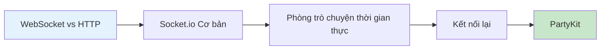

# 12.4 Thế giới thời gian thực vượt qua HTTP——WebSockets Giao tiếp thời gian thực: Trò chuyện trực tuyến và tính năng hợp tác

### Nội dung chính trong một câu

WebSocket là công nghệ cho phép máy chủ "chủ động" đẩy thông báo đến máy khách, là nền tảng cơ bản để xây dựng các ứng dụng thời gian thực như trò chuyện, hợp tác, trò chơi.

### Giá trị cốt lõi

HTTP truyền thống là mô hình "yêu cầu-phản hồi": máy khách hỏi, máy chủ mới trả lời. Nhưng nhiều tình huống cần máy chủ chủ động thông báo cho máy khách:

- **Nhắn tin tức thời**: Thông báo tin nhắn của WeChat, Slack
- **Chỉnh sửa hợp tác**: Đồng bộ hóa đa người của Google Docs, Figma
- **Dữ liệu thời gian thực**: Giá cổ phiếu, tỷ số thể thao
- **Trò chơi trực tuyến**: Đồng bộ hóa hành động người chơi

Sau khi thiết lập WebSocket, hai bên có thể gửi thông báo bất cứ lúc nào, thực hiện "giao tiếp hai chiều" thực sự.

### Hướng dẫn chương

1. **WebSocket vs HTTP**: Hiểu tại sao cần WebSocket
2. **Socket.io Cơ bản**: Xây dựng nhanh dịch vụ WebSocket
3. **Phòng trò chuyện thời gian thực**: Xây dựng chức năng phòng và phát sóng thông báo
4. **Kết nối lại**: Xử lý tình huống mạng không ổn định
5. **PartyKit**: Giải pháp giao tiếp thời gian thực cạnh biên hiện đại

### Tại sao Vibe Coder phải học điều này?

Tính năng thời gian thực đang trở thành "cơ sở hạ tầng" của trải nghiệm người dùng:

- Người dùng mong đợi nhìn thấy phản hồi "thời gian thực", thay vì làm tươi lại trang
- Các ứng dụng AI về bản chất cũng là giao tiếp thời gian thực thông qua đầu ra luồng
- Tính năng hợp tác là lực cạnh tranh khác biệt của sản phẩm SaaS

> **Hiểu biết then chốt**: WebSocket không khó học, khó là xử lý tốt các trường hợp đặc biệt (ngắt kết nối, kết nối lại, đồng bộ hóa trạng thái). Socket.io và PartyKit giúp bạn bao bọc rất nhiều độ phức tạp.
