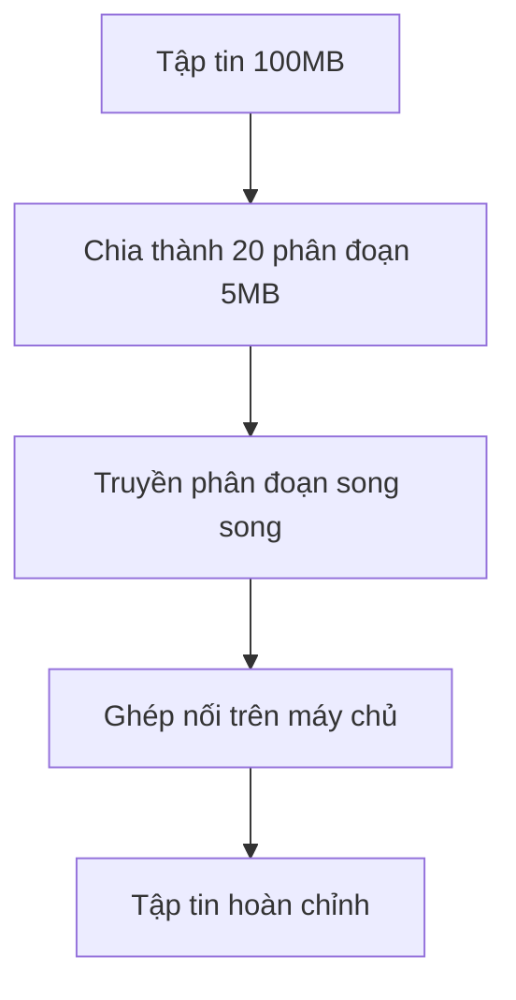

# 12.5.1 Tách tập tin để truyền — Nguyên lý tải lên phân đoạn: Chia nhỏ tập tin lớn và truyền song song

### Giải quyết vấn đề trong một câu

Tải lên phân đoạn là việc cắt tập tin lớn thành các khúc cấp định, truyền riêng biệt rồi ghép lại trên máy chủ — cách này nếu khúc nào bị lỗi cũng chỉ cần gửi lại khúc đó thôi.

### Khôi phục bản chất



### Thực hiện phân đoạn phía máy khách

```typescript
const CHUNK_SIZE = 5 * 1024 * 1024; // 5MB

interface Chunk {
  index: number;
  blob: Blob;
  start: number;
  end: number;
}

function createChunks(file: File): Chunk[] {
  const chunks: Chunk[] = [];
  let start = 0;
  let index = 0;

  while (start < file.size) {
    const end = Math.min(start + CHUNK_SIZE, file.size);
    chunks.push({
      index,
      blob: file.slice(start, end),
      start,
      end,
    });
    start = end;
    index++;
  }

  return chunks;
}

// Ví dụ sử dụng
const file = document.getElementById('file').files[0];
const chunks = createChunks(file);
console.log(`Kích thước tập tin: ${file.size}, số phân đoạn: ${chunks.length}`);
```

### Truyền song parallel

```typescript
async function uploadChunk(
  chunk: Chunk,
  fileId: string,
  onProgress?: (percent: number) => void
): Promise<void> {
  const formData = new FormData();
  formData.append('chunk', chunk.blob);
  formData.append('index', chunk.index.toString());
  formData.append('fileId', fileId);

  await fetch('/api/upload/chunk', {
    method: 'POST',
    body: formData,
  });
}

async function uploadFile(file: File) {
  // 1. Khởi tạo tải lên, lấy fileId
  const { fileId } = await fetch('/api/upload/init', {
    method: 'POST',
    body: JSON.stringify({ fileName: file.name, fileSize: file.size }),
    headers: { 'Content-Type': 'application/json' },
  }).then((r) => r.json());

  // 2. Tạo các phân đoạn
  const chunks = createChunks(file);

  // 3. Truyền song song (giới hạn số lượng yêu cầu đồng thời)
  const concurrency = 3;
  for (let i = 0; i < chunks.length; i += concurrency) {
    const batch = chunks.slice(i, i + concurrency);
    await Promise.all(batch.map((chunk) => uploadChunk(chunk, fileId)));
    console.log(`Đã tải lên ${Math.min(i + concurrency, chunks.length)} / ${chunks.length}`);
  }

  // 4. Thông báo cho máy chủ để ghép nối
  await fetch('/api/upload/merge', {
    method: 'POST',
    body: JSON.stringify({ fileId, totalChunks: chunks.length }),
    headers: { 'Content-Type': 'application/json' },
  });
}
```

### Xử lý phía máy chủ

```typescript
// app/api/upload/chunk/route.ts
import { writeFile, mkdir } from 'fs/promises';
import { join } from 'path';

export async function POST(req: Request) {
  const formData = await req.formData();
  const chunk = formData.get('chunk') as File;
  const index = formData.get('index') as string;
  const fileId = formData.get('fileId') as string;

  const chunkDir = join(process.cwd(), 'uploads', fileId);
  await mkdir(chunkDir, { recursive: true });

  const buffer = Buffer.from(await chunk.arrayBuffer());
  await writeFile(join(chunkDir, index), buffer);

  return Response.json({ success: true });
}

// app/api/upload/merge/route.ts
import { readdir, readFile, writeFile, rm } from 'fs/promises';
import { join } from 'path';

export async function POST(req: Request) {
  const { fileId, totalChunks } = await req.json();
  const chunkDir = join(process.cwd(), 'uploads', fileId);

  // Đọc và ghép các phân đoạn theo thứ tự
  const chunks: Buffer[] = [];
  for (let i = 0; i < totalChunks; i++) {
    const chunkPath = join(chunkDir, i.toString());
    chunks.push(await readFile(chunkPath));
  }

  const mergedBuffer = Buffer.concat(chunks);
  await writeFile(join(process.cwd(), 'uploads', `${fileId}.file`), mergedBuffer);

  // Xóa các phân đoạn tạm thời
  await rm(chunkDir, { recursive: true });

  return Response.json({ success: true });
}
```

### Hướng dẫn cộng tác với AI

- **Ý định cốt lõi**: Yêu cầu AI giúp bạn thực hiện tính năng tải lên phân đoạn.
- **Công thức định nghĩa yêu cầu**: `"Vui lòng giúp tôi thực hiện một component tải lên tập tin lớn với hỗ trợ phân đoạn, bao gồm logic phân đoạn phía máy khách và tiếp nhận + ghép nối phía máy chủ, sử dụng Next.js App Router."`
- **Thuật ngữ chính**: `phân đoạn (chunk)`, `truyền song parallel`, `ghép nối (merge)`, `Blob.slice()`

### Hướng dẫn tránh cạm bẫy

- **Lựa chọn kích thước phân đoạn**: Quá nhỏ sẽ tăng số lượng yêu cầu, quá lớn có thể bị timeout. Thường là 1-10MB.
- **Kiểm soát concurrency**: Đừng tải lên tất cả các phân đoạn cùng một lúc, nó sẽ làm trình duyệt lag.
- **Dọn sạch tập tin tạm thời**: Hãy nhớ xóa các phân đoạn tạm thời khi tải lên thất bại hoặc timeout.
