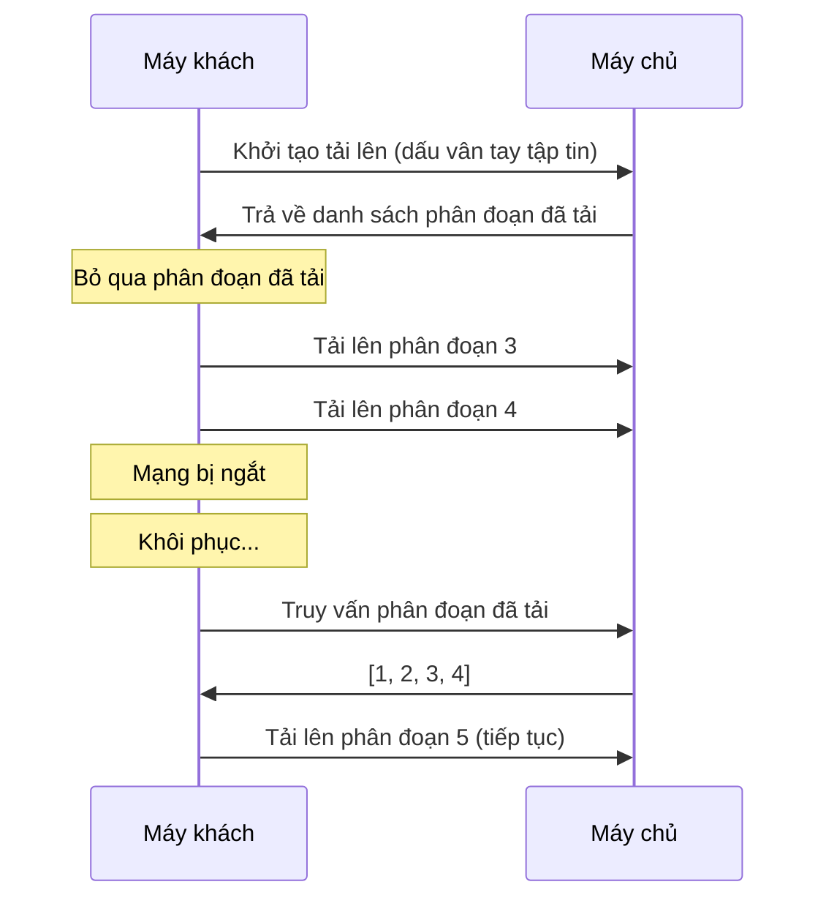

# 12.5.2 Mạng bị ngắt thì tiếp tục — Tiếp tục tải từ điểm dừng: Lưu trữ và khôi phục tiến độ tải lên

### Giải quyết vấn đề trong một câu

Cốt lõi của tiếp tục tải từ điểm dừng là "nhớ cái đã truyền" — máy khách ghi lại các phân đoạn đã tải lên, máy chủ ghi lại các phân đoạn đã nhận, khi tải lại sẽ bỏ qua phần đã hoàn tất.

### Khôi phục bản chất



### Tạo dấu vân tay tập tin

Tạo định danh duy nhất từ nội dung tập tin, các tập tin giống nhau sẽ nhận được dấu vân tay giống nhau:

```typescript
async function getFileFingerprint(file: File): Promise<string> {
  // Lấy mẫu đầu và cuối 2MB + giữa 2MB để tính hash
  const sliceSize = 2 * 1024 * 1024;
  const chunks = [
    file.slice(0, sliceSize),
    file.slice(Math.floor(file.size / 2) - sliceSize / 2, Math.floor(file.size / 2) + sliceSize / 2),
    file.slice(-sliceSize),
  ];

  const data = await Promise.all(chunks.map((c) => c.arrayBuffer()));
  const combined = new Uint8Array(data.reduce((acc, d) => acc + d.byteLength, 0));
  let offset = 0;
  data.forEach((d) => {
    combined.set(new Uint8Array(d), offset);
    offset += d.byteLength;
  });

  const hashBuffer = await crypto.subtle.digest('SHA-256', combined);
  const hashArray = Array.from(new Uint8Array(hashBuffer));
  return hashArray.map((b) => b.toString(16).padStart(2, '0')).join('');
}
```

### Thực hiện phía máy khách

```typescript
interface UploadState {
  fileId: string;
  uploadedChunks: number[];
  totalChunks: number;
}

class ResumableUploader {
  private storageKey(fingerprint: string) {
    return `upload_${fingerprint}`;
  }

  private saveState(fingerprint: string, state: UploadState) {
    localStorage.setItem(this.storageKey(fingerprint), JSON.stringify(state));
  }

  private loadState(fingerprint: string): UploadState | null {
    const data = localStorage.getItem(this.storageKey(fingerprint));
    return data ? JSON.parse(data) : null;
  }

  async upload(file: File, onProgress: (percent: number) => void) {
    const fingerprint = await getFileFingerprint(file);
    let state = this.loadState(fingerprint);

    // Kiểm tra trạng thái máy chủ
    if (state) {
      const serverState = await this.checkServerState(state.fileId);
      state.uploadedChunks = serverState.uploadedChunks;
    } else {
      // Tải lên mới
      const { fileId } = await this.initUpload(file, fingerprint);
      state = { fileId, uploadedChunks: [], totalChunks: 0 };
    }

    const chunks = createChunks(file);
    state.totalChunks = chunks.length;

    // Lọc các phân đoạn chưa tải lên
    const pendingChunks = chunks.filter((c) => !state!.uploadedChunks.includes(c.index));

    for (const chunk of pendingChunks) {
      await this.uploadChunk(chunk, state.fileId);
      state.uploadedChunks.push(chunk.index);
      this.saveState(fingerprint, state);
      onProgress((state.uploadedChunks.length / chunks.length) * 100);
    }

    // Xóa trạng thái cục bộ sau khi hoàn thành
    localStorage.removeItem(this.storageKey(fingerprint));
    await this.mergeChunks(state.fileId, chunks.length);
  }

  // ... các phương thức khác
}
```

### Thực hiện tải lên nhanh

Nếu dấu vân tay tập tin đã tồn tại, trả về tập tin đã tải lên:

```typescript
// Kiểm tra phía máy chủ
export async function POST(req: Request) {
  const { fingerprint, fileName, fileSize } = await req.json();

  // Kiểm tra xem tập tin giống nhau đã tồn tại chưa
  const existingFile = await db.file.findUnique({
    where: { fingerprint },
  });

  if (existingFile) {
    return Response.json({
      status: 'exists',
      fileUrl: existingFile.url,
    });
  }

  // Tạo task tải lên mới
  const fileId = crypto.randomUUID();
  await db.uploadTask.create({
    data: { fileId, fingerprint, fileName, fileSize },
  });

  return Response.json({ status: 'new', fileId });
}
```

### Hướng dẫn cộng tác với AI

- **Ý định cốt lõi**: Yêu cầu AI giúp bạn thực hiện tính năng tiếp tục tải từ điểm dừng.
- **Công thức định nghĩa yêu cầu**: `"Vui lòng giúp tôi thực hiện một component tải lên tập tin hỗ trợ tiếp tục tải từ điểm dừng và tải lên nhanh, sử dụng dấu vân tay tập tin để nhận dạng tập tin trùng lặp."`
- **Thuật ngữ chính**: `resumable upload`, `dấu vân tay tập tin (fingerprint)`, `tải lên nhanh`, `SHA-256`

### Hướng dẫn tránh cạm bẫy

- **Hiệu suất tính toán dấu vân tay**: Đừng tính hash cho toàn bộ tập tin lớn, lấy mẫu là đủ.
- **Dọn sạch bộ lưu trữ**: Định kỳ xóa các task tải lên hết hạn và tập tin tạm thời.
- **Kiểm soát concurrency**: Đừng cho phép nhiều máy khách tải lên cùng một tập tin cùng lúc.
