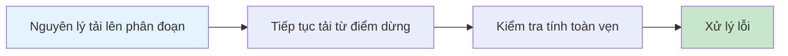

# 12.5 Cách tải lên các tập tin siêu lớn trong một nốt nhạc — Truyền tập tin phân đoạn: Tiếp tục tải từ điểm dừng/Kiểm tra tính toàn vẹn

### Giải quyết vấn đề trong một câu

Chiến lược cốt lõi của tải lên tập tin lớn là "chia nhỏ thành từng phần" — cắt tập tin thành các khúc nhỏ và truyền riêng biệt, nếu thất bại chỉ cần gửi lại khúc bị lỗi, đó chính là nguyên lý tiếp tục tải từ điểm dừng và tải lên nhanh.

### Giá trị cốt lõi

Những thách thức mà người dùng gặp phải khi tải lên tập tin lớn:

- **Mất kết nối mạng**: Tải 99% xong bất ngờ mất kết nối, phải bắt đầu lại từ đầu?
- **Vấn đề timeout**: Truyền vài GB dữ liệu trong một yêu cầu dễ bị timeout
- **Bộ nhớ tràn**: Tải toàn bộ tập tin lớn cùng một lúc sẽ làm đầy bộ nhớ của trình duyệt
- **Phản hồi tiến trình**: Người dùng cần biết tiến độ tải lên

Tải lên theo phân đoạn giải quyết tất cả những vấn đề này.

### Hướng dẫn chương này

1. **Nguyên lý tải lên phân đoạn**: Cắt tập tin lớn thành các khúc nhỏ và truyền song song
2. **Tiếp tục tải từ điểm dừng**: Ghi lại tiến độ, sau khi ngắt kết nối hãy tiếp tục
3. **Kiểm tra tính toàn vẹn**: Đảm bảo dữ liệu được truyền không bị hỏng
4. **Xử lý lỗi**: Cơ chế thử lại và phản hồi người dùng

### Tại sao Vibe Coder cần học điều này?

Tải lên tập tin là tính năng mà hầu như tất cả các ứng dụng đều cần:

- Ảnh đại diện người dùng, tài liệu đính kèm
- Tải lên nội dung của nền tảng video
- Dịch vụ lưu trữ đám mây
- Tải lên dữ liệu huấn luyện mô hình lớn

> **Cái nhìn sâu sắc chính**: Mặc dù các dịch vụ lưu trữ đám mây (như AWS S3, Cloudflare R2) cung cấp direct upload qua presigned URL, nhưng việc hiểu nguyên lý tải lên phân đoạn sẽ giúp bạn biết cách debug khi gặp vấn đề.
