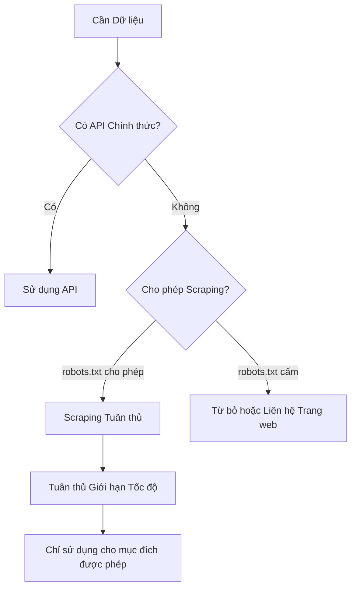

# 12.6.4 Thu thập Dữ liệu Hợp pháp——Scraper Tuân thủ: Ưu tiên API và Quy chuẩn Sử dụng Dữ liệu

### Một câu giải quyết vấn đề

Nguyên tắc đầu tiên của scraper tuân thủ là "ưu tiên API"——nếu có API chính thức, hãy luôn ưu tiên sử dụng API, chỉ xem xét scraping khi không có API.

### Chiến lược Ưu tiên API



### API của Các Nguồn Dữ liệu Phổ biến

| Nền tảng | API | Hạn chế |
|------|-----|------|
| Twitter/X | Twitter API | Cần tài khoản nhà phát triển, có giới hạn yêu cầu |
| GitHub | GitHub API | Có giới hạn tốc độ miễn phí |
| Reddit | Reddit API | Cần đăng ký ứng dụng |
| Wikipedia | MediaWiki API | Hầu như không giới hạn, nhưng phải tuân thủ nghi thức |
| Dữ liệu Thời tiết | OpenWeatherMap | Tầng miễn phí có giới hạn |

### Xem xét Pháp lý về Sử dụng Dữ liệu

| Loại Dữ liệu | Mức độ Rủi ro | Lưu ý |
|----------|----------|----------|
| Dữ liệu Thống kê Công khai | Thấp | Thường có thể sử dụng tự do |
| Nội dung Tạo bởi Người dùng | Trung bình | Có thể liên quan đến bản quyền |
| Thông tin Cá nhân | Cao | Được bảo vệ bởi luật riêng tư (GDPR, v.v.) |
| Dữ liệu Thương mại | Cao | Có thể liên quan đến bí mật thương mại |

### Danh sách Kiểm tra Tuân thủ Scraper

```typescript
interface ComplianceCheck {
  robotsTxtChecked: boolean;
  tosRead: boolean;
  apiAvailable: boolean;
  rateLimit: number;
  dataUsage: 'personal' | 'research' | 'commercial';
  personalDataCollected: boolean;
}

function assessCompliance(check: ComplianceCheck): string[] {
  const issues: string[] = [];

  if (!check.robotsTxtChecked) {
    issues.push('Vui lòng trước tiên kiểm tra robots.txt');
  }

  if (!check.tosRead) {
    issues.push('Vui lòng đọc điều khoản dịch vụ trang web');
  }

  if (check.apiAvailable) {
    issues.push('Khuyến nghị sử dụng API chính thức thay vì scraping');
  }

  if (check.rateLimit > 10) {
    issues.push('Tần suất yêu cầu có thể quá cao');
  }

  if (check.dataUsage === 'commercial' && check.personalDataCollected) {
    issues.push('Sử dụng thương mại dữ liệu cá nhân cần xem xét tuân thủ');
  }

  return issues;
}
```

### Lưu trữ và Sử dụng Dữ liệu

```typescript
interface ScrapedData {
  source: string;
  scrapedAt: Date;
  expiresAt: Date;
  license: string;
  personalData: boolean;
}

// Ghi lại nguồn dữ liệu và hạn chế sử dụng
function recordDataProvenance(data: unknown, source: string): ScrapedData {
  return {
    source,
    scrapedAt: new Date(),
    expiresAt: new Date(Date.now() + 30 * 24 * 60 * 60 * 1000), // Hết hạn sau 30 ngày
    license: 'source-specific',
    personalData: false,
  };
}

// Định kỳ xóa dữ liệu hết hạn
async function cleanExpiredData(db: Database) {
  await db.delete('scraped_data', {
    where: { expiresAt: { lt: new Date() } },
  });
}
```

### Hướng dẫn Hợp tác với AI

- **Ý định cốt lõi**: Để AI giúp bạn đánh giá tính tuân thủ của scraper.
- **Công thức định nghĩa yêu cầu**: `"Vui lòng giúp tôi đánh giá tính tuân thủ của việc scraping [trang web đích], bao gồm kiểm tra robots.txt, phân tích điều khoản dịch vụ và đề xuất sử dụng dữ liệu."`
- **Các thuật ngữ chính**: `API`、`Terms of Service (ToS)`、`GDPR`、`data provenance`

### Hướng dẫn Tránh Lỗi

- **Sử dụng Thương mại Cần Cẩn thận**: Rủi ro pháp lý cao hơn đối với việc thu thập dữ liệu cho mục đích thương mại.
- **Dữ liệu Cá nhân là Khu vực Cấm**: Thu thập dữ liệu cá nhân có thể vi phạm luật riêng tư như GDPR.
- **Lưu Giữ Bằng chứng**: Ghi lại bằng chứng bạn tuân thủ các quy tắc, để phòng trường hợp tranh chấp sau này.
- **Khi Có Nghi ngờ Hãy Hỏi**: Khi không chắc chắn, hãy liên hệ chủ sở hữu trang web để xin phép.
