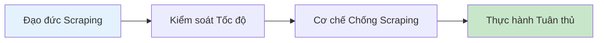

# 12.6 Làm thế nào để thu thập dữ liệu một cách thân thiện——Web Scraping: Tốc độ/robots/Chống Scraping Tổng quan

### Một câu giải quyết vấn đề

Web scraper là một con dao hai lưỡi——nếu sử dụng tốt là công cụ thu thập dữ liệu mạnh mẽ, nếu sử dụng sai có thể vi phạm luật pháp hoặc bị chặn. Chương này sẽ dạy bạn cách trở thành một "scraper lịch sự".

### Giá trị cốt lõi

Kỹ thuật scraping rất có giá trị trong các tình huống sau:

- **Phân tích dữ liệu**: Thu thập dữ liệu công khai để phân tích thị trường
- **Theo dõi đối thủ cạnh tranh**: Theo dõi thông tin sản phẩm của các đối thủ
- **Dịch vụ tập hợp**: Tích hợp dữ liệu từ nhiều nguồn
- **Huấn luyện AI**: Thu thập dữ liệu huấn luyện

Nhưng scraping cũng có thể gây ra các vấn đề:
- Tạo áp lực cho trang web đích
- Vi phạm điều khoản dịch vụ
- Vi phạm bản quyền hoặc quyền riêng tư
- Vi phạm luật pháp và quy định

### Hướng dẫn chương

1. **Đạo đức Scraping**: Hiểu robots.txt và điều khoản trang web
2. **Kiểm soát Tốc độ**: Kiểm soát tần suất yêu cầu, không tạo gánh nặng cho trang web đích
3. **Cơ chế Chống Scraping**: Hiểu các kỹ thuật chống scraping phổ biến
4. **Thực hành Tuân thủ**: Ưu tiên sử dụng API, tuân thủ các tiêu chuẩn sử dụng dữ liệu

### Tại sao Vibe Coder phải học điều này?

Hiểu kỹ thuật scraping có thể giúp bạn:

- Lấy dữ liệu công khai một cách hiệu quả để phân tích
- Hiểu cách bảo vệ trang web của bạn không bị lạm dụng
- Làm việc trong khuôn khổ pháp lý và đạo đức

> **Thông tin chi tiết**: Các nhà phát triển xuất sắc sẽ trước tiên tìm kiếm API chính thức, chỉ xem xét scraping khi không có API, và luôn tuân thủ robots.txt và điều khoản dịch vụ.
