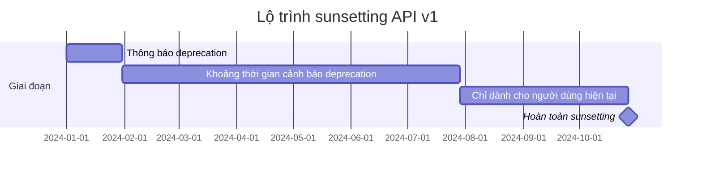

# 12.7.3 Tạm biệt một cách thanh lịch — Chuyển đổi suôn sẻ của tính năng sunsetting

### Một câu phá đề

Khóa của sunsetting tính năng là "cung cấp đủ thời gian cho người dùng di chuyển" — thường là 6-12 tháng deprecation period, kèm theo những nhắc nhở liên tục và hỗ trợ di chuyển.

### Lộ trình deprecation



### Tiêu đề phản hồi cảnh báo deprecation

```typescript
// Middleware thêm cảnh báo deprecation
export function deprecationMiddleware(
  handler: (req: Request) => Promise<Response>,
  deprecationInfo: {
    sunset: Date;
    alternative: string;
  }
) {
  return async (req: Request) => {
    const response = await handler(req);

    // Thêm các tiêu đề phản hồi deprecation tiêu chuẩn
    const headers = new Headers(response.headers);
    headers.set('Deprecation', 'true');
    headers.set('Sunset', deprecationInfo.sunset.toUTCString());
    headers.set('Link', `<${deprecationInfo.alternative}>; rel="successor-version"`);

    return new Response(response.body, {
      status: response.status,
      headers,
    });
  };
}

// Ví dụ sử dụng
export const GET = deprecationMiddleware(
  async () => Response.json({ users: [] }),
  {
    sunset: new Date('2024-12-31'),
    alternative: '/api/v2/users',
  }
);
```

### Nhật ký deprecation và theo dõi

```typescript
interface DeprecationUsage {
  endpoint: string;
  clientId?: string;
  timestamp: Date;
  userAgent: string;
}

async function logDeprecatedUsage(req: Request, endpoint: string) {
  const usage: DeprecationUsage = {
    endpoint,
    clientId: req.headers.get('X-Client-ID') || undefined,
    timestamp: new Date(),
    userAgent: req.headers.get('User-Agent') || 'unknown',
  };

  // Ghi nhật ký vào hệ thống theo dõi
  await analytics.track('deprecated_api_usage', usage);

  // Nếu lượng sử dụng vẫn cao, có thể cần kéo dài khoảng deprecation
  const stats = await analytics.getStats(endpoint, { days: 7 });
  if (stats.requests > 10000) {
    await alertTeam(`${endpoint} vẫn có lượng sử dụng cao, hãy xem xét kéo dài khoảng deprecation`);
  }
}
```

### Phân cấp tính năng dần dần

```typescript
interface FeatureStatus {
  enabled: boolean;
  deprecatedAt?: Date;
  sunsetAt?: Date;
  fallback?: string;
}

const features: Record<string, FeatureStatus> = {
  'legacy-search': {
    enabled: true,
    deprecatedAt: new Date('2024-01-01'),
    sunsetAt: new Date('2024-06-01'),
    fallback: 'new-search',
  },
};

function getFeatureStatus(feature: string): FeatureStatus {
  const status = features[feature];
  if (!status) return { enabled: false };

  const now = new Date();

  // Đã qua ngày sunsetting
  if (status.sunsetAt && now > status.sunsetAt) {
    return { enabled: false, fallback: status.fallback };
  }

  return status;
}

// Ví dụ sử dụng
async function search(query: string) {
  const status = getFeatureStatus('legacy-search');

  if (!status.enabled) {
    if (status.fallback) {
      return redirect(`/${status.fallback}?q=${query}`);
    }
    throw new Error('Tính năng đã bị sunsetting');
  }

  // Thực hiện tìm kiếm phiên bản cũ
  return legacySearch(query);
}
```

### Hướng dẫn hợp tác với AI

- **Ý định cốt lõi**: Để AI giúp bạn lập kế hoạch con đường sunsetting tính năng.
- **Công thức định nghĩa yêu cầu**: `"Vui lòng giúp tôi thiết kế một kế hoạch deprecation cho API v1, bao gồm lộ trình, cơ chế cảnh báo và hướng dẫn di chuyển."`
- **Các thuật ngữ chính**: `deprecation`, `sunset`, `migration`, `grace period`

### Hướng dẫn tránh lỗi

- **Khoảng deprecation phải đủ dài**: Tối thiểu 6 tháng, các API quan trọng có thể cần 12 tháng trở lên.
- **Theo dõi lượng sử dụng**: Đừng buộc sunsetting khi lượng sử dụng vẫn còn cao.
- **Cung cấp công cụ di chuyển**: Nếu có thể, cung cấp tập lệnh hoặc công cụ di chuyển tự động.
