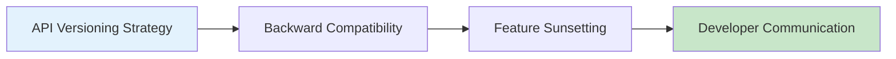

# 12.7 Nghệ thuật tắt chức năng — Phiên bản hóa và Nhật ký thay đổi: Khoảng thời gian tương thích và Lộ trình loại bỏ

### Một câu phá đề

Tắt chức năng khó hơn bật — vừa phải thúc đẩy người dùng di chuyển, vừa không được làm hỏng ứng dụng đang chạy của họ. Điều này cần có kế hoạch chu đáo và giao tiếp rõ ràng.

### Giá trị cốt lõi

Tại sao phải học "tắt một cách thanh lịch"?

- **Nợ kỹ thuật**: Chi phí bảo trì API cũ ngày càng tăng cao
- **Lỗ hổng bảo mật**: Các phiên bản cũ có thể chứa lỗ hổng bảo mật
- **Trải nghiệm người dùng**: Các chức năng cũ có thể cản trở sự phát triển sản phẩm
- **Hiệu quả phát triển**: Nhóm cần tập trung vào các tính năng mới

Nhưng tắt một cách thô bạo sẽ:
- Phá hỏng ứng dụng của người dùng
- Làm tổn hại độ tin cậy của thương hiệu
- Gây ra các khiếu nại từ khách hàng

### Hướng dẫn chương

1. **API Versioning Strategy**: Cách thiết kế API có thể phát triển được
2. **Backward Compatibility**: Tránh breaking changes
3. **Feature Sunsetting**: Phương pháp chuyển đổi suôn sẻ
4. **Developer Communication**: Cách thông báo cho người dùng về thay đổi

### Tại sao Vibe Coder phải học điều này?

Dù bạn là nhà cung cấp hay người sử dụng API:

- **Là nhà cung cấp**: Bạn cần biết cách phát triển API một cách an toàn
- **Là người sử dụng**: Bạn cần hiểu các cảnh báo deprecation và di chuyển kịp thời

> **Hiểu biết chính yếu**: Deprecation tốt nhất là người dùng không cảm nhận được — phiên bản mới xuất sắc đến mức người dùng tự nguyện di chuyển.
