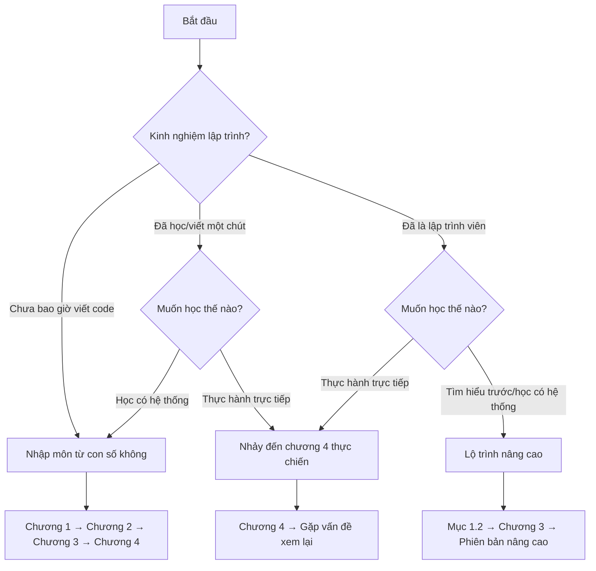

# Tìm đúng vị trí của bạn

## Hướng dẫn này dành cho ai

  

    
Người hoàn toàn mới

    
Chưa bao giờ tiếp xúc với lập trình, nhìn code là đau đầu? Thời đại đã thay đổi. AI giúp bạn xử lý phần phức tạp, bạn chỉ cần nói rõ điều mình muốn. Giống như nói với thợ trang trí "Tôi muốn phòng khách sáng sủa", bạn không cần tự xây tường hay đi dây điện.

  

  

    
Sinh viên khoa học xã hội/kinh tế

    
Bạn có thể nghĩ "lập trình là của những người học lý". Nhưng cốt lõi của Vibe Coding là diễn đạt, là nói rõ ý tưởng - đây chính là thế mạnh của bạn. Trong thời đại lập trình AI, lợi thế của sinh viên văn khoa lớn hơn nhiều so với tưởng tượng.

  

  

    
Sinh viên khoa học kỹ thuật

    
Đã biết viết code, tại sao vẫn phải học? Vì bạn đang chuyển từ "người sản xuất code" thành "người chỉ huy code". Kỹ năng cốt lõi đang dịch chuyển: từ "viết được" sang "nói rõ + phán đoán đúng sai".

  

  

    
Người đi làm

    
Muốn có một công cụ nhỏ, nhưng bộ phận IT lên lịch sau 3 tháng? Giờ bạn có thể tự làm - nhanh chóng tạo nguyên mẫu để kiểm chứng ý tưởng, phân tích dữ liệu bằng ngôn ngữ tự nhiên, viết script tự động hóa để thoát khỏi công việc lặp đi lặp lại.

  

  

    
Người khởi nghiệp

    
Sợ nhất là phát triển 3 tháng, kết quả không ai dùng. Vibe Coding giúp bạn làm nguyên mẫu có thể chạy được trong vài giờ, nhanh chóng test phản ứng thị trường, thử nghiệm với chi phí thấp.

  

## Sau khi học xong

  

    
Một tác phẩm do chính tay làm

    
Trang web hoặc công cụ nhỏ có thể chạy được, có thể chia sẻ cho người khác xem

  

  

    
Kỹ năng cơ bản hợp tác với AI

    
Diễn đạt ý tưởng, phân tách nhiệm vụ, hướng dẫn AI sửa lỗi

  

  

    
Tư duy sản phẩm khởi đầu

    
Khái niệm MVP, cân nhắc tính năng, viết yêu cầu mà AI có thể hiểu

  

  

    
Sự tự tin để tiếp tục khám phá

    
Có khả năng độc lập hoàn thành dự án tiếp theo

  

## Lộ trình học tập

Hướng dẫn này là phiên bản cơ bản của toàn bộ hệ thống:

Sau khi hoàn thành có thể vào phiên bản nâng cao, học công nghệ chuyên nghiệp và quy trình phát triển sản phẩm hoàn chỉnh.

## Bắt đầu từ đâu

| Nền tảng | Lộ trình đề xuất | Thời gian dự kiến |
|------|----------|----------|
| Hoàn toàn mới | Đọc theo thứ tự chương 1→2→3→4 | 4-8 giờ |
| Khoa học xã hội/kinh tế | Trọng tâm chương 3, 4 | 3-5 giờ |
| Khoa học kỹ thuật | Mục 1.2 → chương 3 → phiên bản nâng cao | 2-4 giờ |
| Người đi làm | Chương 2 → chương 4 | 3-4 giờ |

Không chắc chắn? Bắt đầu từ chương 1, nếu thấy quá cơ bản thì nhảy về sau.

---

[Vào chương 1: Thức tỉnh →](/Basic/01-awakening/)
