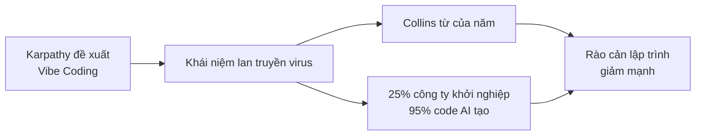

# 1.1.1 Năm 2025, thế giới lập trình đã diễn ra chuyện gì

## Một tweet gây ra cuộc cách mạng

Tháng 2/2025, cựu Giám đốc AI Tesla, đồng sáng lập OpenAI Andrej Karpathy đăng một tweet trên mạng xã hội.

Ông nói:

> "Có một cách lập trình mới, tôi gọi là 'vibe coding' (lập trình theo cảm giác). Bạn hoàn toàn đắm chìm trong cảm giác, đón nhận sự thay đổi theo cấp số nhân, thậm chí quên đi sự tồn tại của code."

Lý do tweet này gây ra thảo luận rộng rãi là - **Chúng ta đang bước vào một thời đại không cần "viết" code vẫn có thể "làm" phần mềm**.

## "Vibe Coding" trở thành từ hot của năm

Tháng 11/2025, từ điển Collins thông báo: **"Vibe Coding"** được bầu chọn là từ của năm.

Định nghĩa chính thức của từ này là:

> Một cách sử dụng trí tuệ nhân tạo, thông qua mô tả bằng ngôn ngữ tự nhiên để tạo ra code máy tính.

Nói cách khác, bạn không cần học ngôn ngữ lập trình gì, chỉ cần dùng ngôn ngữ tự nhiên nói với AI "Tôi muốn một XX", nó sẽ giúp bạn làm ra.

## Dữ liệu không nói dối

Dưới đây là dữ liệu liên quan:

::: info Phát hiện đáng kinh ngạc của Y Combinator
Tháng 3/2025, CEO của Y Combinator - vườn ươm khởi nghiệp nổi tiếng nhất thế giới Garry Tan tiết lộ:

**Trong lô công ty khởi nghiệp mới nhất, có 25% công ty báo cáo - 95% code của họ được AI tạo ra.**

Đây không phải các dự án nghiệp dư chơi chơi, mà là các công ty khởi nghiệp thực sự đang gọi vốn, đang tăng trưởng.
:::

Đáng ngạc nhiên hơn nữa, quy mô đội ngũ của những công ty này thường dưới 10 người, nhưng có thể làm ra sản phẩm trước đây cần vài chục người mới hoàn thành.

## Nhiều dữ liệu chứng minh hơn

Thêm dữ liệu ngành:

| Chỉ số | Dữ liệu |
|------|------|
| Nhà phát triển Mỹ sử dụng công cụ lập trình AI | 92% |
| Tỷ lệ code AI tạo ra trong toàn cầu | 41% |
| Tỷ lệ người dùng Vibe Coding không phải nhà phát triển | 63% |
| Tốc độ phát triển tăng sau khi dùng AI | Tối đa 55% |
| Dự báo quy mô thị trường (năm 2032) | Từ 4.9 tỷ → 30.1 tỷ USD |

*Nguồn dữ liệu: Thống kê Second Talent 2025, Báo cáo khảo sát Bubble*

Chú ý con số **63%** - hơn một nửa người dùng Vibe Coding hoàn toàn không phải lập trình viên. Họ là designer, product manager, người khởi nghiệp, thậm chí sinh viên văn khoa.

## Điều này có nghĩa là gì?

Hãy xâu chuỗi những điều này lại:

**Lập trình đang chuyển từ "kỹ năng chuyên môn" thành "công cụ phổ thông".**

::: tip Nhận thức cốt lõi
Giống như Excel khiến mọi người đều có thể xử lý dữ liệu, Word khiến mọi người đều có thể soạn thảo văn bản, các công cụ lập trình AI đang khiến mọi người đều có thể tạo ra phần mềm.
:::

## Tóm tắt

Năm 2025 là năm nguyên thuỷ của Vibe Coding. Karpathy đề xuất khái niệm, từ điển Collins ghi nhận là từ của năm, dữ liệu Y Combinator xác minh tác động thực tế của xu hướng này. Tiếp theo, chúng ta sẽ xem cuộc cách mạng này thay đổi vai trò của nhà phát triển như thế nào.
