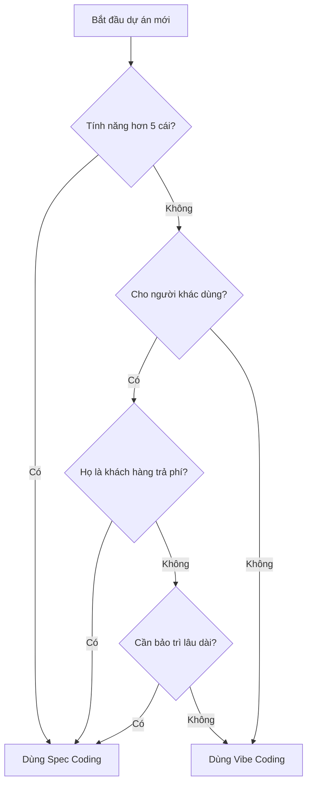

# 1.2.3 Vibe vs Spec: Khi nào dùng cái gì

Học xong Vibe Coding và Spec Coding, câu hỏi tiếp theo là: Dự án thực sự nên dùng cái nào?

Phần này cung cấp một khung ra quyết định đơn giản.

## Ba câu hỏi phán đoán nhanh

Trước khi bắt đầu một dự án, hãy tự hỏi ba câu hỏi:

| Câu hỏi | Dấu hiệu cần Spec |
|------|-----------------|
| **Số lượng tính năng** | Hơn 5 tính năng |
| **Người dùng** | Dùng cho khách hàng/team |
| **Thời gian** | Cần bảo trì lâu dài |

**Quy tắc phán đoán**: Nếu có 2 câu trả lời trở lên là "cần Spec", thì dùng Spec Coding; nếu không thì Vibe Coding là đủ.

## Lưu đồ ra quyết định

**Ghi nhớ đơn giản: Dự án nhỏ, tự dùng, ngắn hạn → Vibe; Dự án lớn, cho người khác, bảo trì lâu → Spec.**

## Sử dụng kết hợp: Thực tiễn tốt nhất

Trong công việc thực tế, bạn không cần chọn cái này hay cái kia. Nhiều khi, sử dụng kết hợp cho hiệu quả tốt nhất.

### Mô hình 1: Vibe khởi đầu, Spec hoàn thiện

**Tình huống phù hợp**: Bạn có một ý tưởng, không chắc có làm được hay không.

**Quy trình**:
1. Trước tiên dùng Vibe Coding làm nhanh nguyên mẫu tối thiểu
2. Sau khi xác minh ý tưởng khả thi, dừng viết code
3. Bổ sung tài liệu yêu cầu và danh sách nhiệm vụ
4. Phát triển tiếp theo dùng cách Spec Coding

**Lợi ích**: Không lãng phí thời gian viết tài liệu cho một ý tưởng không chắc chắn.

### Mô hình 2: Spec lập kế hoạch, Vibe thực thi

**Tình huống phù hợp**: Bạn rất rõ cần làm gì, chỉ cần AI giúp bạn thực hiện nhanh.

**Quy trình**:
1. Trước tiên dành 10 phút viết danh sách yêu cầu đơn giản
2. Chia danh sách thành các nhiệm vụ nhỏ
3. Mỗi nhiệm vụ nhỏ dùng Vibe Coding hoàn thành nhanh
4. Hoàn thành rồi kiểm tra có đúng yêu cầu không

**Lợi ích**: Vừa có hướng đi, vừa thực thi nhanh.

### Mô hình 3: Tiến hóa dần dần

**Tình huống phù hợp**: Dự án sẽ dần lớn dần, ban đầu không biết sẽ phát triển như thế nào.

**Quy trình**:
1. Phiên bản đầu: Vibe thuần túy, nhanh chóng lên sóng
2. Bắt đầu có phản hồi người dùng, tính năng nhiều hơn: Bổ sung tài liệu đơn giản
3. Người dùng càng lúc càng nhiều, cần ổn định: Chính thức dùng cách Spec quản lý

**Lợi ích**: Đầu tư theo nhu cầu, không thiết kế quá mức.

## Trường hợp thực tế

### Trường hợp 1: Làm một công cụ đồng hồ Pomodoro nhỏ

**Phân tích**:
- Tính năng: Đếm ngược + Bắt đầu/Tạm dừng + Nhắc nhở = 3 tính năng
- Người dùng: Bản thân
- Thời gian: Dùng vài tuần có thể đổi sang cái khác

**Quyết định**: Vibe Coding

**Ví dụ Prompt**:
> "Giúp tôi làm một trang web đồng hồ Pomodoro, đếm ngược 25 phút, có nút bắt đầu, tạm dừng, reset, hết giờ thì popup nhắc nhở."

### Trường hợp 2: Làm hệ thống báo cáo ngày nội bộ team

**Phân tích**:
- Tính năng: Viết báo cáo + Xem lịch sử + Lọc theo người + Lọc theo ngày + Xuất dữ liệu + Thống kê = 6 tính năng
- Người dùng: Team 10 người
- Thời gian: Sử dụng lâu dài

**Quyết định**: Spec Coding

**Bước đầu tiên**: Trước tiên viết tài liệu yêu cầu
> "Giúp tôi viết một tài liệu yêu cầu 'Hệ thống báo cáo ngày của team', bao gồm tổng quan sản phẩm, người dùng mục tiêu, tính năng cốt lõi (viết báo cáo, xem lịch sử, lọc theo người, lọc theo ngày, xuất dữ liệu, thống kê) và không làm gì."

### Trường hợp 3: Xác minh một ý tưởng khởi nghiệp

**Phân tích**:
- Ý tưởng: Một nền tảng giúp người ta kết nối bạn học cùng
- Không chắc có làm được không
- Không chắc có người dùng không

**Quyết định**: Trước tiên Vibe, sau đó xem tình hình

**Quy trình**:
1. Dùng Vibe Coding làm phiên bản đơn giản nhất (chỉ có điền form + xem kết quả ghép đôi)
2. Gửi cho 10 bạn bè dùng thử
3. Nếu phản hồi tốt, thì bổ sung tài liệu, làm phiên bản hoàn chỉnh

## Ghi nhớ một câu

> **Trước tiên bắt đầu, sau đó hoàn thiện.**

Đừng loay hoay quá lâu về "dùng Vibe hay Spec". Nếu phân vân, cứ Vibe trước đã; làm một lúc phát hiện loạn, thì dừng lại bổ sung tài liệu. Bản thân điều này cũng là một quá trình học tập. Không ai lần đầu tiên đã chọn đúng, điều quan trọng là **bắt đầu**.

## Danh sách kiểm tra nhanh

Trước khi bắt đầu dự án, dành 30 giây quét qua: Tính năng có hơn 5 cái không? Cho người khác dùng không? Cần bảo trì lâu dài không?

**Nếu có 2 câu trả lời trở lên là "có", gợi ý dùng Spec Coding; nếu không thì Vibe Coding là đủ.**

::: info Tóm tắt
- Dự án nhỏ, tự dùng, ngắn hạn → Vibe Coding
- Dự án lớn, cho người khác, lâu dài → Spec Coding
- Có thể sử dụng kết hợp: Vibe khởi đầu + Spec hoàn thiện là mô hình phổ biến
- Đừng loay hoay, trước tiên bắt đầu, làm rồi điều chỉnh
:::

Phần tiếp theo, chúng ta sẽ học một số [khái niệm cốt lõi](./1.2.4-other-concepts.md) cần biết trong lập trình AI: Prompt, Context, Token v.v.
