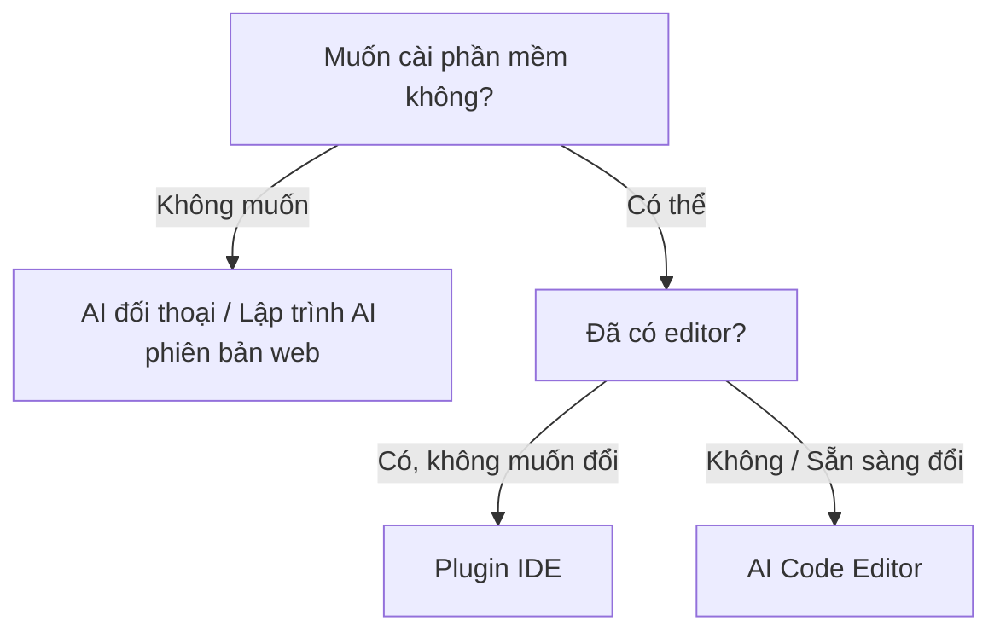

# 1.4.3 Chọn theo tình huống của bạn

Công cụ nhiều như vậy, chọn cái nào đây?

Đừng lo lắng. Phần này giúp bạn định vị nhanh chóng — dựa trên tình huống hiện tại của bạn, đưa ra gợi ý trực tiếp nhất.

## Định vị nhanh: Bạn thuộc tình huống nào?

### Tình huống A: Hoàn toàn zero kiến thức, muốn trải nghiệm trước

**Trạng thái của bạn**: Chưa bao giờ viết code, thậm chí còn hơi sợ kỹ thuật. Chỉ tò mò muốn thử.

**Công cụ khuyên dùng**:

| Loại | Công cụ loại |
|------|---------|
| Chat trải nghiệm trước | AI đối thoại (như Claude, 豆包) |
| Xem thành phẩm trực tiếp | Lập trình AI phiên bản web |

**Hai cách nhập môn**:

1. **Chat thử trước**: Mở bất kỳ AI đối thoại nào, nhập "Giúp tôi viết một trang web hiển thị thời gian hiện tại" — AI sẽ đưa code cho bạn.

2. **Xem thành phẩm trực tiếp**: Mở công cụ lập trình AI phiên bản web, nhập câu tương tự, trực tiếp nhìn thấy trang web có thể chạy.

**Bước đầu tiên**: Tham khảo [1.4.1](./1.4.1-env-setup.md) chọn một công cụ, nhập "Giúp tôi làm một trang web hiển thị thời gian hiện tại", 1-2 phút sau có thể nhìn thấy kết quả.

### Tình huống B: Muốn nhanh chóng làm ra thứ, xác minh một ý tưởng

**Trạng thái của bạn**: Có một ý tưởng nhỏ (ví dụ làm một công cụ nhỏ, website đơn giản), muốn nhanh chóng nhìn thấy thành quả.

**Công cụ khuyên dùng**: Lập trình AI phiên bản web

Từ mô tả đến lên mạng, có thể chỉ cần 10-30 phút. Dự án sinh ra có thể trực tiếp chia sẻ link cho người khác.

Công cụ cụ thể tham khảo [1.4.1 Lập trình AI phiên bản web](./1.4.1-env-setup.md#lập-trình-ai-phiên-bản-web-giải-pháp-tổng-hợp-zero-cài-đặt).

### Tình huống C: Đã dùng VS Code, muốn học sâu lập trình AI

**Trạng thái của bạn**: Có chút nền tảng lập trình (dù chỉ xem qua hướng dẫn), muốn học nghiêm túc phát triển hỗ trợ AI.

**Công cụ khuyên dùng**: AI Code Editor

**Tại sao chọn loại công cụ này**:
- Dựa trên VS Code, giao diện quen thuộc
- Có thể hiểu context của toàn bộ dự án
- Có khả năng Agent, có thể tự động xử lý tác vụ nhiều file

::: info Agent là gì?
Năng lực cốt lõi của lập trình AI 2025: AI không chỉ bổ sung code, còn có thể tự lập kế hoạch tác vụ, đọc nhiều file, thực thi lệnh — giống như có trợ lý giúp bạn làm việc, chứ không chỉ đưa gợi ý.
:::

Tham khảo bảng so sánh [1.4.1 AI Code Editor](./1.4.1-env-setup.md#ai-code-editor-công-cụ-chuyên-nghiệp-cài-đặt-độc-lập), chọn theo sở thích của bạn.

### Tình huống D: Chỉ muốn làm giao diện đẹp

**Trạng thái của bạn**: Cần làm một số component trang web đẹp, landing page, giao diện UI.

**Công cụ khuyên dùng**: Lập trình AI phiên bản web (chuyên về UI như v0.dev)

**Tình huống phù hợp**:
- Làm landing page sản phẩm
- Component trong design system
- Prototype cần bàn giao cho phát triển

### Tình huống E: Đã là developer, theo đuổi hiệu suất

**Trạng thái của bạn**: Đã biết viết code, muốn AI giúp bạn tăng hiệu suất.

**Công cụ khuyên dùng**:

| Tình huống | Công cụ loại |
|------|---------|
| Phát triển hàng ngày | AI Code Editor |
| Prototype nhanh | Lập trình AI phiên bản web |
| Hiệu suất terminal | Command Line Tool |

**Gợi ý kết hợp**: Dùng nhiều loại kết hợp, lấy điểm mạnh của từng loại.

### Tình huống F: Đã có editor, chỉ muốn thêm plugin AI

**Trạng thái của bạn**: Quen với VS Code hoặc JetBrains, không muốn đổi editor, chỉ muốn thêm trợ lý AI.

**Công cụ khuyên dùng**: Plugin IDE

**Tình huống phù hợp**:
- Đã có môi trường phát triển trưởng thành
- Team thống nhất dùng một IDE
- Không muốn học công cụ mới, chỉ muốn thêm khả năng AI

Công cụ cụ thể tham khảo [1.4.1 Plugin IDE](./1.4.1-env-setup.md#pluginextension-ide-thêm-ai-cho-editor-hiện-có).

## Cây quyết định chọn công cụ

Nếu vẫn chưa chắc chắn, đi theo quy trình này:

## Sai lầm thường gặp khi chọn

### Sai lầm 1: "Phải chọn công cụ tốt nhất"

**Sự thật**: Không có "tốt nhất", chỉ có "phù hợp".

Công cụ chỉ là phương tiện. Website bạn dùng Bolt.new làm ra, và dùng Cursor làm ra, người dùng hoàn toàn không phân biệt được.

### Sai lầm 2: "Miễn phí chắc chắn không tốt"

**Sự thật**: Hạn mức miễn phí năm 2025 đã rất hào phóng.

- Phiên bản miễn phí Claude.ai đủ trải nghiệm
- Phiên bản miễn phí Windsurf đủ học tập hàng ngày
- Hạn mức miễn phí Bolt.new có thể làm vài dự án nhỏ

Dùng miễn phí trước, thực sự không đủ mới trả tiền.

### Sai lầm 3: "Phải học hết tất cả công cụ"

**Sự thật**: Chọn một cái, dùng quen rồi mới đổi.

Năng lực cốt lõi của công cụ thông với nhau (năm năng lực lớn phần trước nói). Dùng quen một cái, đổi cái khác chỉ cần làm quen giao diện, không cần học lại.

## Tóm tắt phần này

| Tình huống của bạn | Khuyên loại |
|---------|---------|
| Không muốn cài phần mềm | AI đối thoại / Lập trình AI phiên bản web |
| Muốn cài phần mềm | AI Code Editor |
| Đã có editor không muốn đổi | Plugin IDE |
| Theo đuổi hiệu suất terminal | Command Line Tool |

Công cụ cụ thể vui lòng tham khảo [1.4.1 Toàn cảnh công cụ](./1.4.1-env-setup.md).

> **Gợi ý quan trọng nhất**: Đừng vắt óc quá lâu. Chọn một loại, đến 1.4.1 chọn một công cụ, bây giờ mở thử đi.

> Phần tiếp theo, chúng ta nói về "chiến lược công cụ" của tài liệu này — tại sao chúng tôi không gắn với công cụ cụ thể, và điều này nghĩa gì với bạn.
