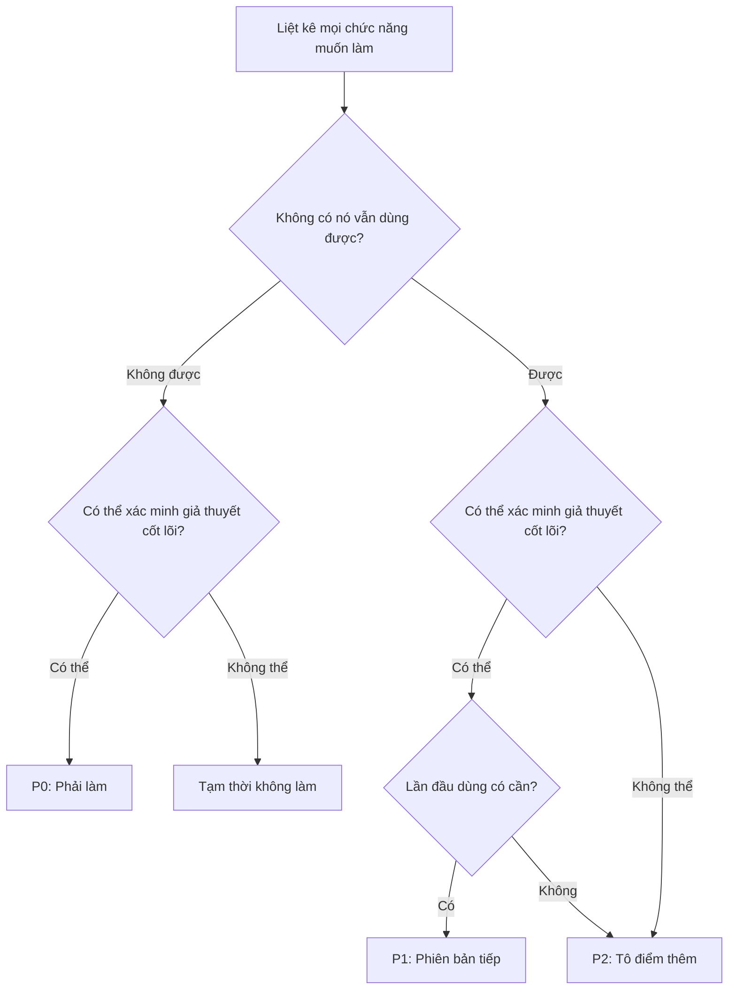

# 2.3.4 Cách Chặt từ 20 Chức năng xuống 3

Hiểu ý nghĩa của MVP rồi, câu hỏi tiếp theo là: Cụ thể làm phép trừ thế nào?

Phần này cung cấp một bộ phương pháp có thể thao tác.


## Ba Câu hỏi Linh hồn để Chặt Chức năng

Đối mặt với mỗi chức năng, hỏi bản thân ba câu hỏi này:

### Câu hỏi 1: Không có chức năng này, sản phẩm vẫn dùng được không?

Câu hỏi này giúp bạn phân biệt "chức năng cốt lõi" và "chức năng bổ sung".

**Tiêu chuẩn phán đoán**:
- Nếu câu trả lời là "được" → Chức năng này không phải cốt lõi
- Nếu câu trả lời là "không được" → Đây có thể là chức năng cốt lõi

**Ví dụ Danh sách Việc cần làm**:
| Chức năng | Không có nó vẫn dùng được? | Kết luận |
|-----|--------------|------|
| Thêm việc | Không được | Chức năng cốt lõi |
| Hoàn thành việc | Không được | Chức năng cốt lõi |
| Xem danh sách việc | Không được | Chức năng cốt lõi |
| Phân loại việc | Được (không phân loại trước cũng được) | Không cốt lõi |
| Dark mode | Được (không ảnh hưởng sử dụng) | Không cốt lõi |
| Báo cáo thống kê | Được (biết hoàn thành là đủ) | Không cốt lõi |


### Câu hỏi 2: Chức năng này có thể xác minh giả thuyết cốt lõi của tôi không?

Câu hỏi này giúp bạn tập trung vào chức năng xác minh giả thuyết.

**Tiêu chuẩn phán đoán**:
- Nếu câu trả lời là "có thể" → Cân nhắc giữ lại
- Nếu câu trả lời là "không thể" → Tạm thời không làm

**Ví dụ Danh sách Việc cần làm**:

Giả sử giả thuyết cốt lõi là: "Danh sách việc cực kỳ đơn giản dễ kiên trì hơn giấy nhớ"

| Chức năng | Có thể xác minh giả thuyết? | Lý do |
|-----|--------------|------|
| Thêm việc một phím | Có thể | Kiểm tra "cực kỳ đơn giản" có thực sự dễ dùng hơn không |
| Lịch đánh dấu | Không chắc | Có thể hữu ích, nhưng không phải chìa khóa xác minh "cực kỳ đơn giản" |
| Chia sẻ xã hội | Không thể | Đây là chức năng tăng trưởng, không phải xác minh |
| Hệ thống thành tựu | Không thể | Đây là chức năng giữ chân, xác minh giá trị cốt lõi trước đã |


### Câu hỏi 3: Người dùng lần đầu sử dụng có cần chức năng này không?

Câu hỏi này giúp bạn phân biệt "chức năng thu hút khách" và "chức năng giữ chân".

**Tiêu chuẩn phán đoán**:
- Lần đầu dùng đã cần → Có thể là P0
- Dùng một thời gian mới cần → Có thể là P1
- Tô điểm thêm → Có thể là P2

**Hiểu biết quan trọng**:
- Người dùng mới chỉ quan tâm "cái này có thể giúp tôi làm gì"
- Bảng xếp hạng, hệ thống thành tựu, chức năng xã hội là để người dùng "ở lại", không phải để họ "vào"
- Giai đoạn MVP nên tập trung vào để người dùng "vào và trải nghiệm giá trị cốt lõi"


## Khung Ưu tiên P0/P1/P2

Sau khi dùng ba câu hỏi sàng lọc, chia chức năng thành ba cấp:

| Ưu tiên | Định nghĩa | Hành động | Ví dụ |
|-------|------|------|------|
| **P0** | Không có thì không thể xác minh giá trị cốt lõi | Phải có trong MVP | Thêm việc, hoàn thành việc |
| **P1** | Quan trọng nhưng có thể lặp lại sau | Làm ở phiên bản V2 | Phân loại việc, chức năng nhắc nhở |
| **P2** | Tô điểm thêm | Có thời gian mới nói | Dark mode, báo cáo thống kê |

**Nguyên tắc**:
- Chức năng P0 không quá 3-5 cái
- Nếu P0 quá 5 cái, chứng tỏ bạn chưa nghĩ rõ giá trị cốt lõi là gì
- P1 và P2 viết ra nhưng tạm thời không làm, phòng quên cũng phòng cám dỗ


## Cây Quyết định Chặt Chức năng

Tổng hợp phương pháp trên thành một quy trình quyết định:




## Hỗ trợ AI: Để AI Giúp bạn Chặt Chức năng

Bạn có thể giao trực tiếp danh sách chức năng cho AI, để nó giúp bạn phân tích ưu tiên.

### Mẫu Prompt

```markdown
Tôi đang làm một dự án: [Mô tả dự án]

Người dùng mục tiêu là: [Mô tả người dùng]

Giả thuyết cốt lõi của tôi là: [Mô tả giả thuyết]

Tôi hiện tại dự định các chức năng này:
1. [Chức năng 1]
2. [Chức năng 2]
3. [Chức năng 3]
...

Hãy giúp tôi phân tích:
1. Đâu là chức năng cốt lõi P0 (không có thì không thể xác minh giả thuyết)
2. Đâu là chức năng P1 có thể lặp lại sau
3. Đâu là chức năng P2 tô điểm thêm có thể chặt trước

Hãy đưa ra lý do phân loại.
```

### Ví dụ: Dự án Danh sách Việc cần làm

```markdown
Tôi đang làm một dự án: Giúp người đi làm quản lý việc cần làm hàng ngày

Người dùng mục tiêu là: Người đi làm 25-35 tuổi, mỗi ngày có 5-10 việc cần quản lý

Giả thuyết cốt lõi của tôi là: Người ta không dùng công cụ danh sách việc phức tạp, là vì quá rắc rối;
Nếu có một công cụ cực kỳ đơn giản, họ sẽ sẵn lòng dùng hơn

Tôi hiện tại dự định các chức năng này:
1. Thêm việc
2. Hoàn thành việc (tích)
3. Xem việc hôm nay
4. Phân loại việc
5. Nhãn độ ưu tiên
6. Nhắc hạn chót
7. Việc lặp lại
8. Tách việc con
9. Chế độ xem lịch
10. Báo cáo thống kê
11. Đồng bộ nhiều thiết bị
12. Dark mode

Hãy giúp tôi phân tích ưu tiên.
```

### Phản hồi Có thể của AI

```
Dựa trên giả thuyết cốt lõi "cực kỳ đơn giản dễ kiên trì hơn" của bạn, phân tích của tôi như sau:

**P0 (Chức năng cốt lõi, phải có)**:
1. Thêm việc - Chức năng cơ bản nhất
2. Hoàn thành việc - Xác minh vòng lặp "dùng được"
3. Xem việc hôm nay - Biết hôm nay cần làm gì

Lý do: Ba chức năng này tạo thành vòng lặp tối thiểu, có thể xác minh người dùng có sẵn lòng dùng công cụ cực kỳ đơn giản không

**P1 (Phiên bản tiếp)**:
4. Nhắc hạn chót - Có giá trị, nhưng trước hết có thể nhớ thủ công
5. Phân loại việc - Việc nhiều rồi mới cần

**P2 (Tạm thời không làm)**:
6-12 tất cả. Lý do:
- Nhãn độ ưu tiên, việc con: Tăng độ phức tạp, mâu thuẫn với giả thuyết "cực kỳ đơn giản"
- Chế độ xem lịch, báo cáo thống kê: Là "chức năng cao cấp", không phải giá trị cốt lõi
- Đồng bộ nhiều thiết bị: Cần backend, tăng đáng kể độ phức tạp phát triển
- Dark mode: Thuần túy làm đẹp, không ảnh hưởng xác minh cốt lõi

Khuyến nghị MVP chỉ làm 3 chức năng đầu.
```


## Thực chiến Diễn tập: Làm Phép trừ cho Danh sách Việc cần làm

Hãy dùng bộ phương pháp này, làm một lần phép trừ hoàn chỉnh cho dự án của Tiểu Lý:

### Danh sách Chức năng Ban đầu (14 cái)

1. Phân loại việc
2. Nhãn độ ưu tiên
3. Nhắc hạn chót
4. Việc lặp lại
5. Tách việc con
6. Hệ thống tag
7. Chế độ xem lịch
8. Chế độ xem kanban
9. Báo cáo thống kê
10. Đồng bộ nhiều thiết bị
11. Cộng tác nhóm
12. Chức năng bình luận
13. Dark mode
14. Widget màn hình nền

### Giả thuyết Cốt lõi

> Người đi làm sẵn lòng dùng một công cụ cực kỳ đơn giản quản lý việc cần làm, vì nó dễ kiên trì hơn công cụ phức tạp.

### Áp dụng Ba Câu hỏi

| Chức năng | Q1: Không có vẫn dùng được? | Q2: Xác minh giả thuyết? | Q3: Lần đầu cần? | Ưu tiên |
|-----|--------------|--------------|--------------|-------|
| Thêm việc | Không được | Có thể | Có | **P0** |
| Hoàn thành việc | Không được | Có thể | Có | **P0** |
| Xem việc | Không được | Có thể | Có | **P0** |
| Phân loại việc | Được | Không chắc | Không chắc | P1 |
| Nhãn độ ưu tiên | Được | Không (tăng độ phức tạp) | Không | P2 |
| Nhắc hạn chót | Được | Một phần | Không chắc | P1 |
| Việc lặp lại | Được | Không | Không | P2 |
| Tách việc con | Được | Không | Không | P2 |
| Hệ thống tag | Được | Không | Không | P2 |
| Chế độ xem lịch | Được | Không | Không | P2 |
| Chế độ xem kanban | Được | Không | Không | P2 |
| Báo cáo thống kê | Được | Không | Không | P2 |
| Đồng bộ nhiều thiết bị | Được | Không | Không | P2 |
| Cộng tác nhóm | Được | Không | Không | P2 |
| Chức năng bình luận | Được | Không | Không | P2 |
| Dark mode | Được | Không | Không | P2 |
| Widget màn hình nền | Được | Không | Không | P2 |

### Kết luận

**P0 (MVP phải có)**: 3 cái
- Thêm việc
- Hoàn thành việc
- Xem việc hôm nay

**P1 (Phiên bản tiếp)**: 2 cái
- Phân loại việc
- Nhắc hạn chót

**P2 (Tạm không làm)**: 12 cái
- Tất cả còn lại

Từ 14 chức năng chặt xuống 3. Đây là phép trừ.


## Điểm Chính của Phần này

Bây giờ bạn đã nắm được phương pháp chặt chức năng cụ thể:

- Ba câu hỏi linh hồn giúp bạn nhanh chóng phán đoán ưu tiên chức năng
- Khung P0/P1/P2 giúp bạn tư duy có cấu trúc
- AI có thể hỗ trợ bạn phân tích ưu tiên
- Nguyên tắc cốt lõi: P0 không quá 3-5 cái

Tiếp theo, chúng ta học một công cụ bị đánh giá thấp khác: "Danh sách Không làm".
