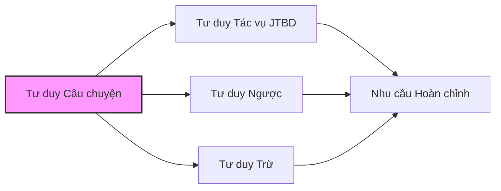

# 2.4 Tư duy Câu chuyện: Coi Người dùng như Nhân vật Chính

Trong các phần trước, chúng ta đã học cách dùng "góc nhìn tác vụ" suy nghĩ về nhu cầu, dùng "tư duy ngược" nhận biết rủi ro, dùng "tư duy trừ" tập trung vào cốt lõi.

Bây giờ, chúng ta sẽ học một phương pháp làm cho các công cụ này mạnh mẽ hơn: **Coi người dùng như nhân vật chính của câu chuyện**.

## Sau khi học xong phần này, bạn sẽ nắm được

- Hiểu tại sao "kể chuyện" hiệu quả hơn "liệt kê chức năng"
- Học cách dùng "phương pháp xây dựng ba chiều" tạo ra Persona người dùng lập thể
- Nắm vững công cụ trực quan hóa "User Journey Map"
- Có được mẫu "Prompt câu chuyện hóa" có thể sao chép trực tiếp

## Hiểu biết Cốt lõi của Phần này

> "Nếu bạn muốn người ta nhớ điều gì, hãy biến nó thành một câu chuyện."
> —— Tim Brown, CEO công ty thiết kế IDEO

Nghiên cứu của Đại học Stanford cho thấy: Khi thông tin được trình bày dưới dạng câu chuyện, tỷ lệ lưu giữ trong trí nhớ của mọi người cao gấp 22 lần so với dữ liệu thuần túy.

Điều này có nghĩa là gì?

- Khi bạn bảo AI "Làm một danh sách việc cần làm", AI chỉ có thể đoán bạn muốn gì
- Khi bạn kể "Tôi là một người đi làm mỗi ngày xử lý 10 việc, luôn sợ bỏ sót việc quan trọng", AI có thể hiểu chính xác nhu cầu của bạn

**Câu chuyện không phải kỹ thuật tu từ, mà là phương thức giao tiếp hiệu quả nhất.**

## Mối quan hệ giữa Tư duy Câu chuyện và Các công cụ Khác

Bạn có thể hỏi: Tư duy câu chuyện khác gì với các công cụ đã học trước đây?

Nói đơn giản:

| Công cụ Tư duy | Câu hỏi Cốt lõi Trả lời |
|---------|--------------|
| Tư duy Tác vụ | Người dùng muốn hoàn thành tác vụ gì? |
| Tư duy Ngược | Cái gì sẽ dẫn đến thất bại? |
| Tư duy Trừ | Chức năng nào có thể không làm? |
| **Tư duy Câu chuyện** | **Người dùng là ai? Họ đã trải qua điều gì?** |

Tư duy câu chuyện là "nền tảng" của các công cụ khác. Khi bạn thực sự hiểu người dùng là ai, đã trải qua những gì, thì tác vụ, rủi ro, ưu tiên đều sẽ trở nên rõ ràng hơn.

## Đây Không chỉ là Chuyện "Làm Sản phẩm"

Giống như các phần trước, tư duy câu chuyện áp dụng cho bất kỳ việc gì bạn muốn làm với AI:

| Việc Bạn muốn Làm | Vấn đề Tư duy Câu chuyện Giúp Giải quyết |
|-------------|---------------------|
| Làm một công cụ nhỏ | Giúp bạn chuyển từ "Tôi muốn chức năng gì" sang "Người dùng của tôi đã trải qua điều gì" |
| Báo cáo phân tích dữ liệu | Giúp bạn hiểu "Sếp đang nghĩ gì khi xem báo cáo này" |
| Script tự động hóa | Giúp bạn nhìn rõ "Toàn cảnh phía sau công việc lặp lại này" |
| Làm công cụ cho gia đình | Giúp bạn đứng ở "góc nhìn của bố mẹ 60 tuổi" suy nghĩ vấn đề |

Dù mục tiêu của bạn là gì, tư duy câu chuyện đều có thể giúp bạn hiểu sâu hơn "làm cho ai".

## Cấu trúc Phần này

Tiếp theo, chúng ta sẽ thông qua các nội dung sau đây giúp bạn nắm vững tư duy câu chuyện:

1. **Sản phẩm tức là Câu chuyện**: Hiểu cấu trúc cơ bản của câu chuyện, học cách dùng góc nhìn câu chuyện mô tả nhu cầu
2. **Persona Ba chiều**: Vượt qua "tuổi tác nghề nghiệp", xây dựng hình ảnh người dùng có xương có thịt
3. **User Journey Map**: Trực quan hóa câu chuyện, tìm ra điểm đau quan trọng nhất
4. **Prompt Câu chuyện hóa**: Dùng tư duy câu chuyện viết lệnh AI chính xác hơn
5. **Bài tập Thực chiến**: Áp dụng tư duy câu chuyện cho dự án của chính bạn
6. **Điểm Cốt lõi**: Mang đi các nguyên tắc có thể áp dụng ngay lập tức

Sẵn sàng chưa? Hãy bắt đầu từ "Câu chuyện tốt là gì".
