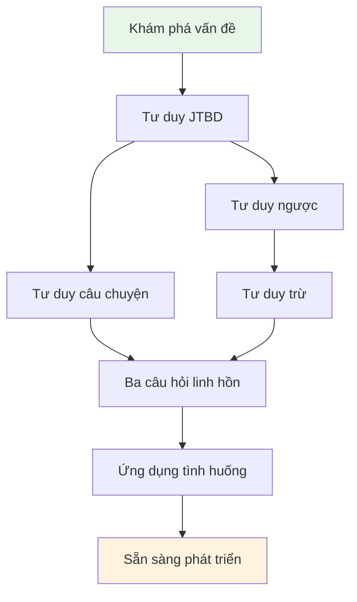

# 2.8 Tóm tắt Chương: Hộp công cụ tư duy của Quản lý Sản phẩm

Sau khi học phần này, bạn sẽ nắm vững:
- Mối quan hệ phối hợp giữa bảy mô hình tư duy
- Quy trình suy nghĩ hoàn chỉnh từ "có ý tưởng" đến "sẵn sàng phát triển"
- Một khung ra quyết định khởi động dự án có thể tái sử dụng

## Bảy mô hình không phải các công cụ riêng lẻ

Ở các phần trước, bạn đã học bảy mô hình tư duy. Nhưng chúng không phải là bảy công cụ độc lập, mà là một **chuỗi suy nghĩ hoàn chỉnh**.

| Giai đoạn | Mô hình được dùng | Câu hỏi cốt lõi |
|-----|-----------|---------|
| **Giai đoạn khám phá** | Khám phá vấn đề | Vấn đề nào đáng giải quyết? |
| **Giai đoạn định nghĩa** | Tư duy JTBD | Người dùng muốn hoàn thành nhiệm vụ gì? |
| **Giai đoạn tránh rủi ro** | Tư duy ngược | Điều gì sẽ dẫn đến thất bại? |
| **Giai đoạn tập trung** | Tư duy trừ | Phiên bản đầu tiên chỉ làm gì? |
| **Giai đoạn thấu hiểu** | Tư duy câu chuyện | Người dùng trải qua điều gì? |
| **Giai đoạn xác minh** | Ba câu hỏi linh hồn | Tôi đã suy nghĩ rõ ràng chưa? |
| **Giai đoạn thích nghi** | Ứng dụng tình huống | Tình huống này có yêu cầu đặc biệt gì? |

## Thứ tự sử dụng mô hình tư duy

### Bước một: Bắt đầu từ vấn đề, không phải từ tính năng

Điểm xuất phát của nhiều người là "Tôi muốn làm một xxx". Nhưng điểm xuất phát đúng là "Tôi phát hiện một vấn đề".

**Khám phá vấn đề** giúp bạn nhận biết vấn đề đáng giải quyết. **Tư duy JTBD** giúp bạn hiểu nhiệm vụ người dùng thực sự muốn hoàn thành, chứ không phải danh sách tính năng trong tưởng tượng của bạn.

### Bước hai: Nghĩ về thất bại trước, suy nghĩ về thành công sau

Sau khi có định nghĩa nhiệm vụ rõ ràng, đừng vội lập kế hoạch tính năng.

**Tư duy ngược** để bạn liệt kê trước "điều gì sẽ dẫn đến thất bại". Những yếu tố thất bại này sẽ chỉ ra một vấn đề chung: muốn làm quá nhiều.

**Tư duy trừ** giúp bạn cắt bỏ các tính năng không cần thiết, tập trung vào phiên bản tối thiểu có thể xác minh giả thuyết cốt lõi.

### Bước ba: Hiểu người dùng, xác minh ý tưởng

Sau khi xác định phạm vi tính năng, bạn cần xác nhận mình thực sự hiểu người dùng.

**Tư duy câu chuyện** để bạn coi người dùng như nhân vật chính của câu chuyện, hiểu hoàn cảnh và cảm xúc của họ.

**Ba câu hỏi linh hồn** là bước tự kiểm tra cuối cùng: Người dùng là ai? Điểm đau ở đâu? Tại sao chọn bạn?

### Bước bốn: Điều chỉnh theo tình huống

Các tình huống khác nhau có trọng tâm khác nhau.

**Ứng dụng tình huống** giúp bạn thích nghi mô hình tư duy chung vào tình huống cụ thể: phân tích dữ liệu, script tự động hóa, công cụ cá nhân, công cụ cho gia đình.

## Ví dụ xuyên suốt: Từ "Muốn làm danh sách công việc" đến "Sẵn sàng phát triển"

Hãy dùng dự án danh sách công việc của Tiểu Lý, để demo hoàn chỉnh cách sử dụng kết hợp bảy mô hình.

### Step 1: Khám phá vấn đề

Tiểu Lý là một nhân viên văn phòng mới. Anh phát hiện mình thường xuyên bỏ sót việc quan trọng, đã bị sếp phê bình nhiều lần.

Anh dùng "Nhật ký phiền toái" ghi lại một tuần:

| Ngày | Khoảnh khắc phiền toái | Tần suất | Mức độ đau đớn |
|-----|---------|-----|---------|
| Thứ Hai | Quên trả lời email khách hàng | 2-3 lần/tuần | 8 điểm |
| Thứ Tư | Nhớ nhầm thời gian họp | 1-2 lần/tháng | 6 điểm |
| Thứ Sáu | Quên viết báo cáo tuần | 1 lần/tuần | 7 điểm |

Dùng phương pháp đánh giá năm chiều để đánh giá vấn đề "bỏ sót nhiệm vụ":
- Tính lặp lại: 5 điểm (hầu như mỗi ngày đều có)
- Tính quy tắc: 4 điểm (có thể dùng checklist giải quyết)
- Tính xác minh: 5 điểm (tự dùng là có thể xác minh)
- Tính nhạy cảm: 5 điểm (không liên quan đến quyền riêng tư và tiền bạc)
- Tính khoan dung: 4 điểm (sai có thể điều chỉnh)

**Tổng điểm: 23 điểm, phù hợp để giải quyết bằng Vibe Coding.**

### Step 2: Tư duy JTBD

Tiểu Lý tự hỏi: Nhiệm vụ tôi thực sự muốn hoàn thành là gì?

Dùng template JTBD mô tả:

> Khi tôi bắt đầu công việc mỗi ngày, tôi muốn nhanh chóng ghi lại những việc cần làm hôm nay, để tôi không bỏ sót nhiệm vụ quan trọng, có thể yên tâm đầu tư vào công việc.

Ba tầng của nhiệm vụ:
- **Nhiệm vụ chức năng**: Ghi lại và xem danh sách công việc
- **Nhiệm vụ cảm xúc**: Giảm lo lắng, cảm thấy an tâm
- **Nhiệm vụ xã hội**: Thể hiện đáng tin cậy trước sếp và đồng nghiệp

### Step 3: Tư duy ngược

Tiểu Lý làm phân tích Pre-mortem: Giả sử ba tháng sau dự án thất bại, có thể là lý do gì?

| Nguyên nhân thất bại | Khả năng | Mức độ nghiêm trọng | Biện pháp phòng tránh |
|---------|-------|-------|---------|
| Tính năng quá nhiều, làm không xong | Cao | Cao | Phiên bản đầu chỉ làm 3 tính năng cốt lõi |
| Dùng phức tạp hơn sticky note | Trung bình | Cao | Thêm nhiệm vụ phải hoàn thành trong 3 giây |
| Làm xong tự mình cũng không dùng | Trung bình | Cao | Dùng checklist giấy một tuần trước để xác minh thói quen |
| Cần mở máy tính mới dùng được | Thấp | Trung bình | Làm web version trước, điện thoại cũng truy cập được |

### Step 4: Tư duy trừ

Dựa trên phân tích Pre-mortem, Tiểu Lý xác định phạm vi MVP:

**Giả thuyết cốt lõi**: Một danh sách công việc hàng ngày cực đơn giản, tốt hơn sticky note và memo điện thoại.

**Tiêu chuẩn xác minh**: Tự mình sử dụng liên tục 7 ngày, mỗi ngày đều dùng nó ghi và hoàn thành nhiệm vụ.

**Tính năng P0** (phải có):
1. Thêm nhiệm vụ
2. Hoàn thành nhiệm vụ (đánh dấu)
3. Xem nhiệm vụ hôm nay

**Danh sách không làm**:
- Không làm phân loại tag
- Không làm deadline
- Không làm nhắc nhở thông báo
- Không làm thống kê lịch sử

### Step 5: Tư duy câu chuyện

Tiểu Lý dùng chân dung ba chiều mô tả bản thân (với tư cách người dùng):

| Chiều kích | Nội dung |
|-----|------|
| **Thuộc tính bề mặt** | 25 tuổi, nhân viên mới, mỗi ngày xử lý 10-15 công việc lớn nhỏ |
| **Thói quen hành vi** | Đến công ty việc đầu tiên là xem email, dùng memo điện thoại ghi việc nhưng thường quên xem |
| **Động cơ sâu xa** | Sợ bỏ sót nhiệm vụ bị sếp phê bình, muốn trở thành người đáng tin cậy |

Điểm chạm quan trọng trong hành trình người dùng:
- Sáng đến công ty, mở máy tính
- Đột nhiên nghĩ ra một việc, cần ghi nhanh
- Trước khi tan làm, kiểm tra xem việc hôm nay đã hoàn thành hết chưa

### Step 6: Ba câu hỏi linh hồn

Tự kiểm tra cuối cùng:

| Câu hỏi | Câu trả lời | Trạng thái |
|-----|------|------|
| Người dùng là ai? | Chính tôi — một nhân viên mới sợ bỏ sót nhiệm vụ | 🟢 Rõ ràng |
| Điểm đau ở đâu? | Thường quên việc, bị phê bình, cảm thấy lo lắng | 🟢 Rõ ràng |
| Tại sao chọn tôi? | Công cụ hiện có hoặc quá phức tạp, hoặc dễ quên xem; tôi muốn làm một công cụ cực đơn giản mở ra là danh sách hôm nay | 🟢 Rõ ràng |

**Ba đèn xanh, có thể bắt đầu phát triển rồi.**

## Bảng tra cứu nhanh lựa chọn mô hình

Không biết nên dùng mô hình nào? Tham khảo bảng này:

| Bạn đang bối rối gì | Mô hình đề xuất sử dụng | Câu hỏi cốt lõi |
|---------|--------------|---------|
| Không biết làm dự án gì | Khám phá vấn đề | Cuộc sống của tôi có phiền toái nào xuất hiện lặp lại? |
| Muốn làm quá nhiều tính năng | Tư duy trừ | Giả thuyết phiên bản đầu tiên phải xác minh là gì? |
| Không chắc người dùng có cần không | Tư duy JTBD | Người dùng muốn hoàn thành nhiệm vụ gì? Bây giờ giải quyết thế nào? |
| Lo lắng làm xong không ai dùng | Tư duy ngược | Tình huống nào sẽ thất bại? Làm thế nào tránh? |
| Không biết người dùng trông như thế nào | Tư duy câu chuyện | Người dùng ở tình huống nào, mang cảm xúc gì khi sử dụng? |
| Không biết đã sẵn sàng chưa | Ba câu hỏi linh hồn | Người dùng là ai? Điểm đau ở đâu? Tại sao chọn tôi? |
| Tình huống đặc biệt, không biết điều chỉnh thế nào | Ứng dụng tình huống | Ràng buộc cốt lõi của tình huống này là gì? |

## Điểm chính phần này

✓ **Bảy mô hình là một chuỗi suy nghĩ**: Khám phá vấn đề→JTBD→Ngược→Trừ→Câu chuyện→Ba câu hỏi linh hồn→Ứng dụng tình huống, mỗi khâu giải quyết vấn đề khác nhau.

✓ **Không cần mỗi lần đều đi hết toàn bộ quy trình**: Dự án đơn giản có thể bỏ qua một số bước, nhưng Ba câu hỏi linh hồn là kiểm tra đáy cuối cùng.

✓ **Giá trị của mô hình nằm ở sử dụng tích hợp**: Dùng riêng lẻ bất kỳ mô hình nào cũng không đủ, kết hợp lại mới tạo thành suy nghĩ hoàn chỉnh.

Tiếp theo, chúng tôi sẽ cung cấp một danh sách kiểm tra trước phát triển có thể sử dụng trực tiếp, giúp bạn nhanh chóng đánh giá xem đã sẵn sàng bắt đầu phát triển chưa.
