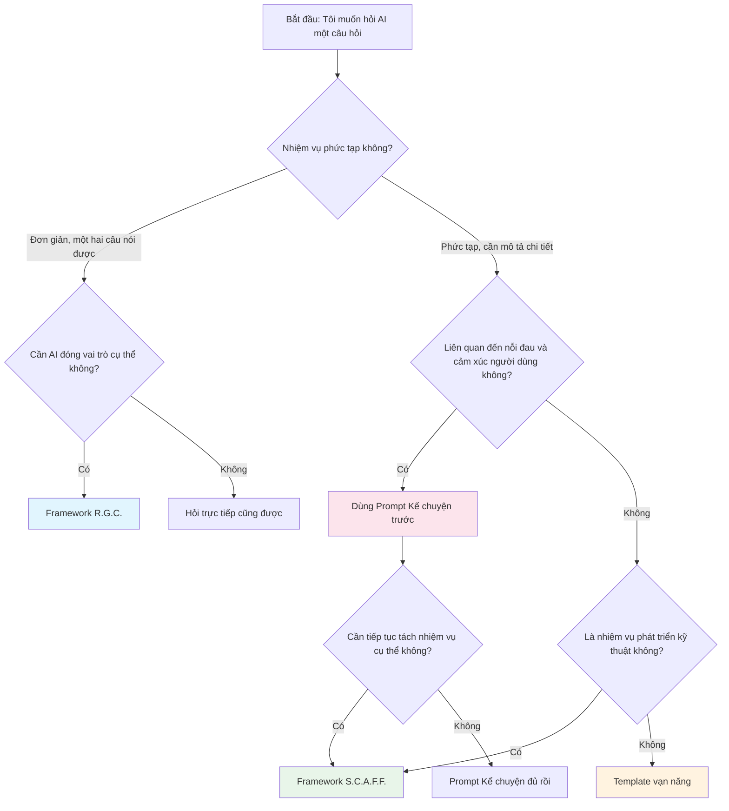

# 3.2.5 Hướng dẫn lựa chọn Framework

## Sau khi học xong phần này, bạn sẽ nắm được

- Nhanh chóng lựa chọn framework phù hợp dựa trên loại nhiệm vụ
- Hiểu mối quan hệ giữa các framework
- Có được danh sách kiểm tra nhanh trước khi đặt câu hỏi
- Biết khi nào nên chuyển từ framework này sang framework khác


## Bảng tra cứu nhanh framework

| Tình huống | Framework khuyến nghị | Lý do |
|-----|---------|------|
| Cần biểu đạt nỗi đau và cảm xúc người dùng | Prompt Kể chuyện (Chương 2) | Cộng hưởng cảm xúc mạnh hơn, AI hiểu "tại sao" |
| Nhiệm vụ phát triển kỹ thuật phức tạp | S.C.A.F.F. | Cấu trúc đầy đủ, ràng buộc rõ ràng |
| Câu hỏi nhanh đơn giản | R.G.C. | Ngắn gọn hiệu quả, giảm nhập liệu |
| Không chắc dùng framework nào | Template vạn năng | Phủ rộng, không dễ sai |
| Review code, refactor | R.G.C. | Bản thân code đã cung cấp ngữ cảnh |
| Mô tả nhu cầu, thiết kế sản phẩm | Kể chuyện + S.C.A.F.F. | Kể chuyện trước, rồi tách nhiệm vụ |
| Phân tích dữ liệu, tạo báo cáo | Template vạn năng | Loại nhiệm vụ đa dạng, tính chung cao |
| Học khái niệm, tìm giải thích | R.G.C. | Đơn giản trực tiếp |


## Sơ đồ quy trình ra quyết định



**Phiên bản quyết định đơn giản**:

1. **Nhiệm vụ đơn giản** → R.G.C.
2. **Nhiệm vụ phức tạp + phát triển kỹ thuật** → S.C.A.F.F.
3. **Nhiệm vụ phức tạp + không kỹ thuật** → Template vạn năng
4. **Cần biểu đạt câu chuyện người dùng** → Prompt Kể chuyện
5. **Không chắc** → Template vạn năng


## Sơ đồ mối quan hệ framework

Bốn framework không thay thế lẫn nhau, mà bổ sung cho nhau:

```
┌─────────────────────────────────────────────────────────┐
│                     Template vạn năng                     │
│        (Chung nhất, phủ rộng, dùng được mọi thứ)          │
│  ┌─────────────────────┐  ┌─────────────────────┐      │
│  │    S.C.A.F.F.       │  │  Prompt Kể chuyện    │      │
│  │(Chuyên phát triển KT)│  │ (Chuyên giao tiếp CX)│      │
│  │                     │  │                     │      │
│  │  ┌─────────────┐    │  │                     │      │
│  │  │   R.G.C.    │    │  │                     │      │
│  │  │(Phiên bản gọn)│   │  │                     │      │
│  │  └─────────────┘    │  │                     │      │
│  └─────────────────────┘  └─────────────────────┘      │
└─────────────────────────────────────────────────────────┘
```

- **R.G.C.** là phiên bản rút gọn của **S.C.A.F.F.**
- **S.C.A.F.F.** và **Prompt Kể chuyện** là quan hệ song song, mỗi cái có trọng tâm riêng
- **Template vạn năng** là tập hợp lớn nhất, dùng được mọi tình huống


## Danh sách kiểm tra trước khi hỏi

Trước khi nhấn nút gửi, hãy kiểm tra nhanh:

### Kiểm tra cơ bản (bắt buộc)

- [ ] **Nhiệm vụ có rõ ràng không**: AI có hiểu bạn muốn nó làm gì không?
- [ ] **Bối cảnh có đầy đủ không**: AI có đủ thông tin để đưa ra đánh giá đúng không?
- [ ] **Ràng buộc có rõ ràng không**: AI có biết không nên làm gì không?

### Kiểm tra nâng cao (khuyến nghị)

- [ ] **Vai trò đã chỉ định chưa**: AI nên trả lời với danh tính gì?
- [ ] **Định dạng đã nói chưa**: Bạn mong đợi hình thức đầu ra thế nào?
- [ ] **Có cần ví dụ không**: Cho ví dụ có rõ hơn không?

### Kiểm tra suy ngẫm (tùy chọn)

- [ ] **Có nói quá nhiều không**: Có phải một lúc yêu cầu quá nhiều không?
- [ ] **Có nói quá ít không**: Có bỏ sót thông tin quan trọng không?
- [ ] **Ranh giới có rõ ràng không**: AI có thể "thêm thắt" tự ý không?


## Tín hiệu chuyển framework

Khi bạn dùng một framework nào đó hỏi, đầu ra AI không lý tưởng, có thể là vấn đề lựa chọn hoặc điền framework:

| Vấn đề đầu ra AI | Nguyên nhân có thể | Hướng điều chỉnh |
|-----------|---------|---------|
| Phương án kỹ thuật không khớp với dự án | Thiếu bối cảnh dự án | Bổ sung Situation |
| Phạm vi chức năng không phù hợp kỳ vọng | Mô tả nhiệm vụ không rõ | Viết lại Challenge/Goal |
| Độ phức tạp code không phù hợp | Không nói mức độ người dùng | Thêm Audience |
| Định dạng đầu ra lộn xộn | Không chỉ định định dạng | Thêm Format |
| AI "thêm thắt" quá nhiều | Ràng buộc không đủ | Bổ sung Constraints/Foundations |
| Trả lời quá kỹ thuật | Vấn đề thiết lập vai trò | Điều chỉnh Role |
| Không hiểu nỗi đau cốt lõi | Thiếu bối cảnh câu chuyện | Chuyển sang Prompt Kể chuyện |


## Gợi ý thực chiến

### Dành cho người mới học

Lúc mới bắt đầu, khuyến nghị **điền theo framework nghiêm ngặt**, dù cảm thấy một số mục "thừa".

Lý do:
1. Framework giúp bạn kiểm tra có bỏ sót thông tin quan trọng không
2. Xây dựng thói quen tư duy có cấu trúc
3. Khi đầu ra không lý tưởng, có framework để đối chiếu kiểm tra

### Dành cho người có kinh nghiệm

Sau khi thành thạo, có thể **linh hoạt rút gọn** theo nhiệm vụ:

- Nhiệm vụ đơn giản: R.G.C. hoặc thậm chí hỏi trực tiếp
- Nhiệm vụ phức tạp: Framework đầy đủ
- Nhiệm vụ lặp lại: Điều chỉnh nhỏ dựa trên prompt trước đó

**Nguyên tắc cốt lõi**: Framework là công cụ, không phải quy tắc. Để nó giúp bạn, chứ không phải ràng buộc bạn.


## Ôn lại chương này

Chúc mừng bạn đã hoàn thành phần học "Framework Prompt có cấu trúc". Bây giờ bạn đã nắm được:

| Công cụ | Công dụng | Yếu tố cốt lõi |
|-----|------|---------|
| S.C.A.F.F. | Nhiệm vụ kỹ thuật phức tạp | Situation, Challenge, Audience, Format, Foundations |
| R.G.C. | Câu hỏi nhanh đơn giản | Role, Goal, Constraints |
| Template vạn năng | Tình huống chung | Vai trò, Bối cảnh, Nhiệm vụ, Yêu cầu, Ràng buộc, Định dạng, Ví dụ |
| Prompt Kể chuyện | Biểu đạt nỗi đau người dùng | Danh tính, Hiện trạng, Nỗi đau, Kỳ vọng |


## Dự báo phần tiếp theo

Framework có cấu trúc giải quyết vấn đề "tổ chức thông tin thế nào". Nhưng đôi khi chỉ có cấu trúc vẫn chưa đủ — bạn cần một số **kỹ thuật đặc biệt** để lý luận của AI sâu hơn, đầu ra chính xác hơn.

Phần tiếp theo "3.3 Kỹ thuật Prompt nâng cao", chúng ta sẽ học:

- **Zero-shot**: Nghệ thuật hỏi trực tiếp
- **Few-shot**: Dùng ví dụ dạy AI
- **Chain of Thought**: Để AI "suy nghĩ" rồi mới trả lời
- **Tree of Thoughts**: Khám phá nhiều con đường lý luận
- **Self-Critique**: Để AI tự kiểm tra

Những kỹ thuật này có thể **kết hợp sử dụng** với framework có cấu trúc, nâng cao hơn nữa chất lượng đầu ra của AI.

Sẵn sàng chưa? Chúng ta bắt đầu phần tiếp theo.
